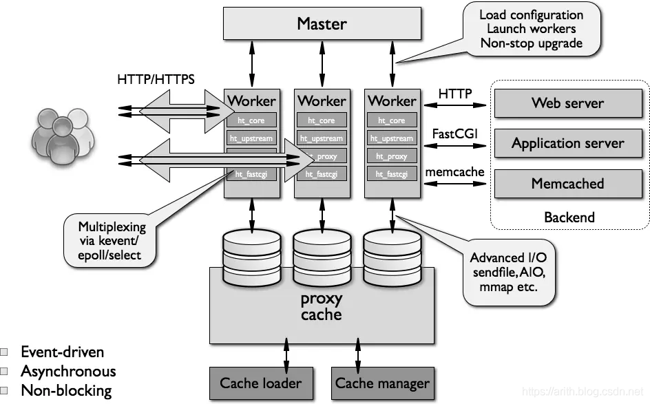
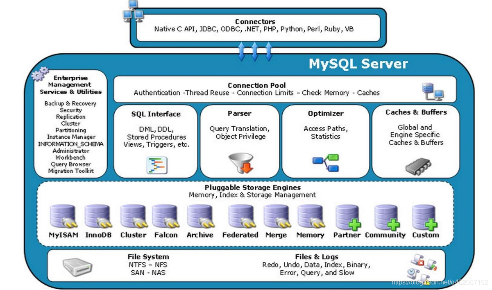
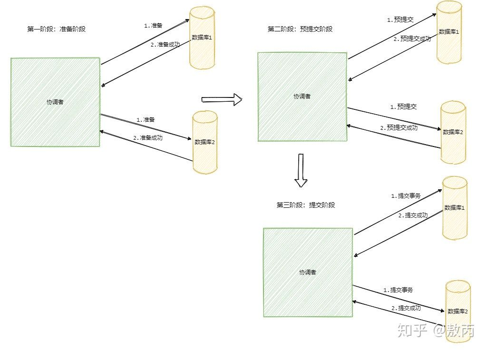

[TOC]

# PHP常见面试题

## PHP基础

### 面向对象

类：现实世界世界中的实体在计算机中的反映, 将属性和对应的操作封装在一起并抽象

对象: 类是对象的抽象, 对象是类的实例

##### 面向对象特征:

抽象, 继承 , 封装, 多态

##### 关键词:

final abstract interface extends implements public protected private use trait this parent static

##### 接口与抽象类:

接口: 只能包含常量和抽象方法, 多实现

抽象类: 可以包含属性,抽象及普通方法, 单继承

trait: trait => use traitA,traitB { traitB::fun insteadof traitA }; 

##### 重写与重载:

重写: 参数列表必须完全相同, 重新实现具体逻辑

重载: 不同的参数列表和类型 => PHP重载是指通过**魔术方法**动态地"创建"属性和类方法

##### 延迟静态绑定

*static*在实际运行时计算的, 不仅限于静态方法的调用

##### 魔术方法

```php
构造析构: __constract() __desturct()
方法调用: __call() __callStatic() __invoke()
属性调用: __get()  __set() __isset() __unset()
其他:  __toString()  __clone()  __sleep()__weekup()(键名)  __serialize()和__unserialize()(键值对)			
```

##### 对象比较

== 表示 对象的属性值是否相等;  === 比表是否是同一个实例

#####  对象和引用

符号映射表, $a => `*object` => Object, 变量相等时,$a和$b的内容都是 `*object`, 而`*object`指向的是Object

普通引用: $a => *zend_string => "hello", $b => *zend_string => "hello"

##### 协变与逆变

协变: 使子类比父类方法能返回更具体的类型； 

逆变: 使子类比父类方法参数类型能接受更模糊的类型。

返回值更严格(协变), 参数宽松(逆变)

#####  命名空间

为了解决命名冲突问题而定义的的变量/对象的所属范围

##### 错误级别

- E_ERROR 致命的错误。会中断程序的执行
- E_WARNING 警告。不会中断程序 (include warning, undefined fun/val)
- E_NOTICE 通知，运行时通知。表示脚本遇到可能会表现为错误的情况

##### 错误与异常

- Throwable
  - Error
    - TypeError
    - ParseError
    - DivisionByZeroError
  - Exception
    - PDOException

##### try-catch->finally

1. 如果在 try 或 catch 里遇到 return，仍然会执行 finally 里的代码。 
2. 遇到 return 语句时，会先执行 finally 再返回结果。 
3. 如果 finally 里也包含了 return 语句，将**返回 finally** 里的值。

> 优先执行finally再return, 并优先return返回finally的值

##### 正则

概念一：按单字符匹配 `[0-9][a-z]`
概念二：匹配优先和不匹配优先
概念三：贪婪模式与非贪婪模式`*?` `+?`
概念四：环视（断言/零宽断言）

```sh
(?<=exp) 匹配前面是exp的数据 
(?<!exp) 匹配前面不是exp的数据 
(?=exp) 匹配后面是exp的数据 
(?!exp) 匹配后面不是exp的数据

(?!B)[A-Z] 指的是[A-Z]范围里，排除B的意思
```

示例:

```sh
(?<=B)AAA 源串：BAAA 结果：AAA
(?<!B)AAA 源串：CAAA 结果：AAA
AAA(?=B) 源串：AAAB 结果：AAA
AAA(?!B) 源串：AAAC 结果：AAA
```

概念五：平衡组
概念六：模式修饰符: i:忽略大小写  s:.匹配换行


## PHP高级

##### 变量内部实现

```c
typedef struct _zval_struct     zval;

typedef union _zend_value {
    zend_long         lval;    //int整形
    double            dval;    //浮点型
    zend_refcounted  *counted;
    zend_string      *str;     //string字符串
    zend_array       *arr;     //array数组
    zend_object      *obj;     //object对象
    zend_resource    *res;     //resource资源类型
    zend_reference   *ref;     //引用类型，通过&$var_name定义的
    zend_ast_ref     *ast;     //下面几个都是内核使用的value
    zval             *zv;
    void             *ptr;
    zend_class_entry *ce;
    zend_function    *func;
    struct {
        uint32_t w1;
        uint32_t w2;
    } ww;
} zend_value;

struct _zval_struct {
    zend_value        value; //变量实际的value
    union {
        struct {
            ZEND_ENDIAN_LOHI_4( //这个是为了兼容大小字节序，小字节序就是下面的顺序，大字节序则下面4个顺序翻转
                zend_uchar    type,         //变量类型
                zend_uchar    type_flags,  //类型掩码，不同的类型会有不同的几种属性，内存管理会用到
                zend_uchar    const_flags,
                zend_uchar    reserved)     //call info，zend执行流程会用到
        } v;
        uint32_t type_info; //上面4个值的组合值，可以直接根据type_info取到4个对应位置的值
    } u1;
    union {
        uint32_t     var_flags;
        uint32_t     next;                 //哈希表中解决哈希冲突时用到
        uint32_t     cache_slot;           /* literal cache slot */
        uint32_t     lineno;               /* line number (for ast nodes) */
        uint32_t     num_args;             /* arguments number for EX(This) */
        uint32_t     fe_pos;               /* foreach position */
        uint32_t     fe_iter_idx;          /* foreach iterator index */
    } u2; //一些辅助值
};
```


#####  PHP的四层体系

1. application(cgi, cli, fast-cgi) 
2. spai 
3. extensions(php-api,extension) 
4. zend(词法->语法->AST->opcode->exec)

##### 弱类型

zend_value是一个union, 由u1.v.type决定类型, 由此实现了弱类型。

##### 作用域

任意时刻PHP都可以看到两个符号表(symbol_table和active_symbol_table)，其中前者用来维护全局变量。后者是一个指针，指向当前活动的变量符号表，通过这样的方式实现全局、局部变量的区分。

##### 生命周期

  在模块初始化前，首先调用sapi_startup(sapi_module），对sapi_model进行初始化工作，通过调用sapi_model的startup函数（模块启动调用的函数），CLI调用php_cli_startup函数，该函数又调用了php_module_startup函数，也就是对应的模块初始化

   CLI模式生命周期：


    php_module_startup  模块初始化阶段（注册内部扩展、加载外部扩展、启动附加的PHP扩展、启动各个模块、禁用php.ini里面的禁用函数和类）
    
    php_request_startup  请求初始化阶段 （初始化输出handler的栈，并把OG(FLAGS置为使用)、调用zend_activate(初始化GC、初始化编译器、初始化执行器、初始化扫描器)、对信号进行处理、设置超时时间、初始化相关全局变量）
    
    php_execute_script    脚本执行阶段（读取的PHP代码进行解析，先词法解析并使词法分析指针指向第一个位置，解析成token，然后语法解析，生成抽象语法树，然后通过对抽象语法树进行遍历生成opcode，opcode在虚拟机上执行得到对应的结果）
    
    php_request_shutdown 请求关闭阶段（调用各个模块中注册的关闭函数和析构函数、将输出缓冲器重内容输出、调用所有扩展注册的钩子rshutdown函数、销毁request相关的全局变量、关闭编译器和执行器、还原ini配置）（完成这些工作，fpm模式会循环等待请求到来）
    
    php_module_shutdown 模块关闭阶段（调用sapi_flush() 然后进行销毁所有模块、全局变量、关闭扩展、销毁ini对应的HashTable、关闭ini config、关闭内存管理器、关闭输出output、析构垃圾回收）
```php
fcgi_accept_request: 对请求的接受,进入循环，实际上调用的是accept，阻塞等待请求，如果有请求进来，会被换起，进入php_request_startup，初始化请求。为了防止多个进程对accept进行抢占出现惊群现象，增加了锁机制，但是在Linux的2.6内核上，阻塞版accept不存在惊群现象了
```

##### hash冲突解决

1. 开放地址法
2. 再hash
3. 链表法


### Laravel

##### 生命周期

注册自动加载，创建app，获取Kernel，

Kernel处理请求： 配置加载，注册异常，ServiceProvider ，

返回结果，terminate

##### 依赖注入

##### 容器

### Swoole

##### 协程


### PHP-FPM

##### cgi, fast-cgi, php-fpm

cgi是公共网关接口, 是Web 服务器与CGI程序间传输数据的标准, 单进程模式, 进程由Web服务器管理: fork-and-execute

fastcgi是快速通用网关接口, 是CGI的升级版, 进程由FastCGI进程管理器管理: manager => worker(accept)

##### php-fpm

fpm是一种多进程模型，它由一个master和多个worker进程组成。master进程启动时创建一个socket，但不会接收、处理请求，而是fork出多个worker子进程完成请求的接收及处理。master管理worker的启停

##### 配置进程数量

1. static, 固定
2. dynamic, pm.start_servers和pm.max_children间动态调整
3. ondemand 进程在有需求时才产生, 配合max_children

##### 最大请求数

 pm.max_requests = 10240; 避免内存泄露

## Linux


## Nginx

##### Nginx架构



1. nginx为一个master进程+多个worker进程
2. master进程主要用来管理worker进程
3. woker进程主要用来监听处理网络事件

##### 定义

Nginx是一个 轻量级/高性能Web 服务器和反向代理服务器

并发量： 处理 2-3 万并发连接数，官方数据5万并发

##### Nginx与Apache的区别

Apache 是同步阻塞多进程/多线程模型，一个连接对应一个进程/线程

Nginx是异步非阻塞的多进程模型，一个进程可以处理多个连接请求


##### **fastcgi 与 cgi**

cgi： fork 一个新进程来运行外部 c 程序

fastcgi： web 服务器直接把内容传递给这个进程，接受返回

##### 常用配置

```ini
worker_processes  8; # worker进程个数
events {  # 事件区块
	worker_connections  65535;  # 单个工作进程可以允许同时建立外部连接的数量 (“进程最大可打开文件数”)
}
error_log, access_log, log_format

fastcgi_buffers 4 64k;  # 指定本地需要多大的缓冲区来缓冲fastcgi应答请求
fastcgi的connect/send/read超时timeout时间

http {  # HTTP区块
	server {  # 第一个Server区块,虚拟主机站点
		listen       80; # 监听端口
        server_name  rrc.test.jiedaibao.com; # 允许域名
        root  /data/release/rrc/web; # 项目根目录
        index  index.php index.html index.htm; # 访问根文件
        
        location / {   # 路由处理，匹配规则： =精确匹配，~正则匹配，~*不区分大小写，!不匹配，^$开头结尾
        	# ...
        }
	}
}
```

##### 正向代理与反向代理：

正向代理：客户端通过代理访问不同的网站

反向代理：客户端访问某一个网站服务，网站根据自己的机器做一个代理入口

一个是客户端的“代理”，一个是服务端的“代理”

##### 负载均衡

- LVS ：是基于四层的转发。
- Nginx ：可以做七层的转发。引入 TCP 插件之后可以做四层转发

四层： 只能做端口的转发

七层：而基于 URL 的、基于目录的这种转发 LVS 就做不了，需要Nginx

##### Nginx如何处理Http请求

master读取配置，启动worker，worker竞争accept事件，转给对应模块处理

##### 负载均衡策略

1. 轮询(加权)（默认）round_robin

2. IP 哈希 ip_hash

3. 最少连接 least_conn (比较每个后端的conns/weight)

##### Nginx限流策略

一是控制速率，二是控制并发连接数

控制速率(令牌桶)：正常限流(limit_req)：rate=10r/s，超过则拒绝，burst=20 nodelay，

连接数：单个ip最大连接数

## MySQL

##### 数据三范式：

1NF：所有字段值都是不可分解的原子值（地址中的省市区）

2NF：每一列都和主键**完全相关**，而不能只与主键的部分相关  (A,B)  A=>C

3NF：每一列数据都和主键**直接相关**，而不能间接相关。A=>B=>C

##### 查询语句分类:

1. 数据定义语言（DDL）define
2. 数据查询语言（DQL）query
3. 数据操作语言（DML）manage
4. 数据控制语言（DCL）control  (grant privileges)

##### 事务的特性：

ACID,原子性(Atomicity)、一致性(Correspondence)、隔离性(Isolation)、持久性(Durability)。

##### 索引：

索引是排好序的数据结构，用来引导数据的查询路径，加快查询

##### 索引类型：

从存储结构上来划分： B+Tree, Hash, full-index全文索引, R-Tree

从应用层次来分：主键索引, 普通索引，唯一索引，联合索引

##### 索引分类：

聚簇索引：主索引叶子结点存放的是行数据，二级索引的叶子结点存的是主键索引的引用

非聚簇索引：主索引和二级索引一致，叶子结点存的是数据行的指针

##### 索引底层实现：

Hash => hash算法

B+Tree => 多路平衡查找树

##### 索引覆盖：

一个索引包含（覆盖）所有需要查询字段的值，被称之为"覆盖索引"。

##### 索引下推：

对索引中包含的字段**先做判断**再查表数据，过滤掉不符合条件的记录，减少回表字数。一般是用于左前缀匹配的后面的列上

##### 索引状态：

possible_keys，key，key_len

##### 索引联接类型(type)

| type            | 简介         | 说明                             | 示例                                                |
| --------------- | ------------ | -------------------------------- | --------------------------------------------------- |
| system          | 表单行       | 该表只有一行（= 系统表）         |                                                     |
| const           | 数据单行     | 该表最多有一个匹配行             | `PRIMARY KEY`或 `UNIQUE`索引的所有部分              |
| eq_ref          | 单行连接     | 该表的唯一键去join其他表         | `PRIMARY KEY`或 `UNIQUE`索引的所有部分去连接(join=) |
| ref/ref_or_null | 多行连接     | 该表的`唯一键的部分`去join其他表 | `PRIMARY KEY范围`或 `UNIQUE`索引的部分去连接        |
| fulltext        | 全文索引     |                                  |                                                     |
| index_merge     | 索引合并     | 单独使用索引查询再合并           | `WHERE (key1=10 OR key2=20) AND non_key=30;`        |
| unique_subquery | 唯一键子查询 |                                  | `where id in (select id from table)`                |
| index_subquery  | 普通键子查询 |                                  | `where key in (select key from table)`              |
| range           | 范围查询     |                                  |                                                     |
| index           | 索引树扫描   |                                  |                                                     |
| ALL             | 全表扫描     |                                  |                                                     |

> 参见MySQL[官方连接]("https://dev.mysql.com/doc/refman/5.7/en/explain-output.html#explain_type")

##### 索引查询Extra

| Extra                 | 说明                       |      |
| --------------------- | -------------------------- | ---- |
| Using temporary       | 临时表(中间结果集)         |      |
| Using filesort        | 文件排序                   |      |
| Using where           | 普通where,先查出数据再过滤 |      |
| Using index           | 索引覆盖                   |      |
| Using index condition | 索引下推                   |      |

##### 索引失效：

 !=, 函数及运算，not, OR不同字段,  不符合左前缀，类型不一致，区分度, MySQL优化掉

##### 创建索引注意点：

not null, 数据离散，联合索引，类型一致(str列不能用int去查), 最多5个

##### MySQL结构



##### 查询模型

基于成本的查询

```mysql
mysql> show variables like '%optimizer_switch%'\G
*************************** 1. row ***************************
Variable_name: optimizer_switch
        Value: index_merge=on,index_condition_pushdown=on
```

##### 事务隔离级别

1. Read uncommitted 读未提交 => 产生脏读

2. Read committed 读提交 => 不可重复读
3. Repeatable read 可重复读  => 解决了幻读
4. Serializable 串行化

##### 脏读

读取到未提交的数据, 然后被回滚了, 会产生**脏读**

##### 不可重复读

读取到了别人提交的事务, 产生了不可重复读

##### 幻读

读取到了之前没有读取到的行 => 间隙锁

##### MVCC多版本并发控制

通过版本号，避免同一数据在不同事务间的竞争, 实现了读写不互斥

select快照读, update当前读, ReadView, 解决了读写互斥问题

与MVCC相对的，是基于锁的并发控制，Lock-Based Concurrency Control

#####  锁

乐观锁: 更新数据不加锁,更新后判断是否冲突   => 加版本字段(up_version)

悲观锁: 每次操作时都要锁定数据,防止被占用

共享锁(读锁): lock in share mode

排他锁(写锁): for update


## Redis


## 消息队列

#### 定义

消息队列就是一个使用队列来通信的组件。

#### 作用

异步处理、服务解耦、流量控制

##### 异步处理

同步变异步，减少等待时长

##### 服务解耦

解耦各系统之间的强依赖

##### 流量控制

削峰错谷

#### 消息队列两种模型

##### 队列模型

可以有多个生产者消费者，但是每条消息只能被一个消费者消费

##### 发布/订阅模型

**为了解决一条消息能被多个消费者消费的问题**，该模型是将消息发往一个`Topic`即主题中，所有订阅了这个 `Topic` 的订阅者(队列/分区)都能消费这条消息。

##### 对比

`RabbitMQ` 采用队列模型，`RocketMQ`和`Kafka` 采用发布/订阅模型。

死信队列

超过固定时长未被消费的会被放入死信队列


##### 面试题

- 如何保证消息不丢失？
- 如何处理重复消息？
- 如何保证消息的有序性？
- 如何处理消息堆积？

##### 消息不丢失

三阶段：生产者，broker，消费者

##### 重复消息

**消息重复是不可避免的**，

1. 幂等：前置判断，update status where status 
2. 去重:  纪录消息唯一键，通过消息最长存活时间去清理

##### 消息的有序性

有序性分：**全局有序和部分有序**。

全局有序：只能一个生产者，一个topic，一个队列，一个消费者单线程消费

部分有序：把消息通过发往固定的队列中，每个队列对应一个单线程处理的消费者。

##### 处理消息堆积

原因: **生产者的生产速度与消费者的消费速度不匹配**

方案：

1. 先定位消费慢的原因：消息重复，冗余
2. 调整消费者速率和增加消费者


## 网络安全

## 计算机网络

##### TCP的拥塞控制

慢开始(指数)+拥塞避免算法(线性)

##### TCP的流量控制

流量控制就是让发送方的发送速率不要太快, 让接收方来得及接受: 利用滑动窗口机制, 累积确认后,才开始继续传


## 系统架构

#### 分布式事务

一阶段提交：commit直接在本地提交

##### 两阶段提交：

两阶段提交，**二阶段提交是一种强一致性设计**

引入一个事务协调者的角色来协调管理各参与者，两阶段：准备（投票,锁定资源）和提交两个阶段

准备失败时，所有参与者回滚；提交失败时，不断重试

协调者故障时，通过选举等操作选出一个新协调者来顶替。

>  2PC 是一种**尽量保证强一致性**的分布式事务，因此它是**同步阻塞**的，而同步阻塞就导致长久的资源锁定问题，**总体而言效率低**，并且存在**单点故障**问题，在极端条件下存在**数据不一致**的风险。

##### 三阶段提交：

3PC 包含了三个阶段，分别是**准备阶段、预提交阶段和提交阶段**，对应的英文就是：`CanCommit、PreCommit 和 DoCommit`。

准备阶段协调者只是询问参与者的自身状况, 而预提交阶段就是和 2PC 的准备阶段一样


3PC 的引入是为了解决提交阶段 2PC 协调者和某参与者都挂了之后新选举的协调者不知道当前应该提交还是回滚的问题。

新协调者来的时候发现有一个参与者处于预提交或者提交阶段，那么表明已经经过了所有参与者的确认了，所以此时执行的就是提交命令。



**而 TCC 是业务层面的分布式事务**， 对应`Try - Confirm - Cancel`。

client向事务管理器发起事务，

client根据事务ID，向各服务调用try(执行事务)

client向事务管理器提交/回滚事务

事务管理器根据事务ID向各事务执行提交或者回滚

#### 分布式系统

##### 1.CAP原则

答：分布式系统有三大特性，一致性，可用性和分区容忍性。

##### 2. 分布式一致性协议raft

raft一致性协议有两大核心：选主和复制日志。

##### 3. 一致性哈希算法

##### 分布式锁、分布式缓存

#### RPC

RPC：远程调用。通过RPC框架，使得我们可以像调用本地方法一样地调用远程机器上的方法：

1、本地调用某个函数方法

2、本地机器的RPC框架把这个调用信息封装起来（调用的函数、入参等），序列化(json、xml等)后，通过网络传输发送给远程服务器

3、远程服务器收到调用请求后，远程机器的RPC框架反序列化获得调用信息，并根据调用信息定位到实际要执行的方法，执行完这个方法后，序列化执行结果，通过网络传输把执行结果发送回本地机器

4、本地机器的RPC框架反序列化出执行结果，函数return这个结果

##### 协议：TCP/HTTP

##### REST

REST通常以业务为导向，**将业务对象上执行的操作映射到HTTP动词**，格式非常简单，可以使用浏览器进行扩展和传输，通过JSON数据完成客户端和服务端之间的消息通信，直接支持请求/响应方式的通信。不需要中间的代理，简化了系统的架构，不同系统之间只需要对JSON进行解析和序列化即可完成数据的传递。

其他技术问题

项目经历遇到的实际问题

##### 设计模式

Laravel中的设计模式

1. 工厂模式: 数据库连接管理器: 根据不同的类型,返回对应驱动的连接 

2. 观察者模式: 事件的监听: 注册事件和响应时间 (attach,detach,notify)

3. 门面模式:Facade门面

4. 装饰器模式: 日志格式封装

5. 原型模式: 复制大对象
6. 代理模式: 保护目标对象, 隐藏细节
7. 策略模式: 使用map映射对象,减少if-else使用
8. 适配器模式: 定义统一的Target, 继承类并实现Target, 便于扩展类
9. 桥接模式: 某些类具有两个或多个维度的变化, 通过setImplementor()指定不同维度的具体对象,达到桥接而不是继承的关系

##### 设计模式原则

| 设计原则     | 一句话归纳                                                   | 目的                       |
| ------------ | ------------------------------------------------------------ | -------------------------- |
| 开闭原则     | 对扩展开放，对修改关闭                                       | 降低维护带来的新风险       |
| 依赖倒置原则 | 高层类不应该依赖低层，二者都应该依赖于抽象, 抽象不依赖于具体,具体依赖抽象 | 更利于扩展                 |
| 单一职责原则 | 一个类只干一件事，实现类要单一                               | 便于理解，提高代码的可读性 |
| 接口隔离原则 | 一个接口只干一件事，接口要精简单一                           | 功能解耦，高聚合、低耦合   |
| 迪米特法则   | 一个类应该保持对其它类的最少的了解                           | 减少代码臃肿               |
| 里氏替换原则 | 不要破坏继承体系，子类重写方法不应该影响父类方法含义         | 防止继承泛滥               |
| 合成复用原则 | 尽量使用组合或者聚合关系实现代码复用，少使用继承             | 降低代码耦合               |

##### 单点登录

统一由**认证中心**发放**授权令牌**, 各系统令牌到认证中心实现认证

(我们也有使用, ioa)

####  架构和设计

数据库结构设计
主从复制
分库分表: 水平切分(路由+union), 垂直切分(join), 表分区 => range/hash
双主互备
数据库中间件

##### 分布式系统一致性

强一致性: ACID

若一致性: 最终一致性

方案:

1. 单数据库事务
2. 多数据库事务 => TCC(分布式事务, 三阶段协议)
3. 事务型消息队列+定时补偿机制(回调)


常见MySQL面试题

善于使用 exists, not in, if,sum,case

```sql

select 
	case
		when score>80 then '优秀',
		when score<80 and score > 60 then '及格',
		else '不及格'
	end as level
from t_score;


```


1. 查询发帖量前10的用户姓名

```sql
users(id, name)
posts(id, user_id, contents)

select count(1) as cnt 
from posts
group by user_id
order by cnt desc limit 10;
```

2. 数据表平铺

```sql
year   month amount
1991   1     1.1
1991   2     1.2
1991   3     1.3
1991   4     1.4
1992   1     2.1
1992   2     2.2
1992   3     2.3
1992   4     2.4

查成这样一个结果
year m1   m2   m3   m4
1991 1.1 1.2 1.3 1.4
1992 2.1 2.2 2.3 2.4 


select year,
(select amount from aaa m where month=1 and year=aaa.year) as m1
(select amount from   aaa m where month=2   and m.year=aaa.year) as m2,
(select amount from   aaa m where month=3   and m.year=aaa.year) as m3,
(select amount from   aaa m where month=4   and m.year=aaa.year) as m4
from aaa group by year
```

## 总则

### 回答思路

1. 定义：描述，定位，本质
2. 对比：与其他定义的区别，两者本身的区别
3. 应用：结合实际项目