[TOC]

# 计算机组成原理

## 1 计算机概论

1. 发展简史
2. 计算机的分类
3. 计算机的体系结构
4. 层次与编程语言
5. 计算机的计算单位
6. 字符与编码集

### 1.1 发展简史

#### 1.1.1 计算机发展的四个阶段

##### (1) 电子管计算机

第二次世界大战,解密情报, ENIAC

特点:
1. 集成度小,空间大
2. 功耗高,运行速度慢
3. 操作复杂,更换程序需要接线

##### (2) 晶体管计算机

发明了晶体管
特点:

1. 集成相对大,空间小
2. 功耗小一些,运行速度快一些
3. 操作简单一些,交互更加方便,有显示器

##### (3)  集成电路计算机

集成电路(IC)发现
特点:

1. 集成度更高,空间更小
2. 功耗更低
3. 运行速度更快

意义:
计算机开始进入普通消费者领域
**操作系统**的诞生(system360) 

##### (4) 超大规模集成电路计算机

特点:
1. 一个芯片集成上百万晶体管,
2. 速度更快,体积更小,价格更低,运行速度更快
3. 用途更丰富: 文字,图片,表格,音视频


#### 1.1.2 微型计算机发展史

单核CPU -> 多核CPU

频率不断增加,核心数越多

### 1.2 计算机的分类

1. 超级计算机
    探月
2. 大型计算机
    银行
3. 服务器
    网站服务器
4. 工作站
    剪辑工作站
5. 微型计算机
    个人电脑

### 1.3 计算机的体系结构

逻辑电路体系结构:
实时读取存储进行计算
程序专为特定逻辑进行接线设计

#### 1.3.1 冯洛伊曼体系
简介: 将程序指令和数据以二进制方式一起存储,执行时,顺序地从主存中取指令执行的计算机设计概念结构,以**运算器**为中心

构成:

1. 存储器
2. 控制器
3. 运算器
4. 输入设备
5. 输出设备

示意图:

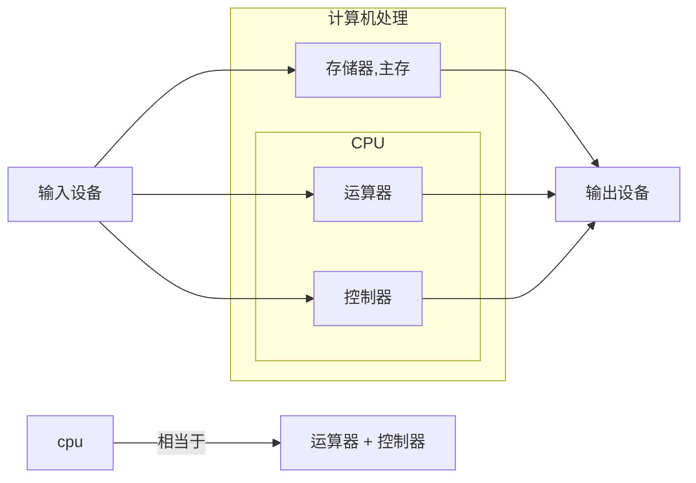

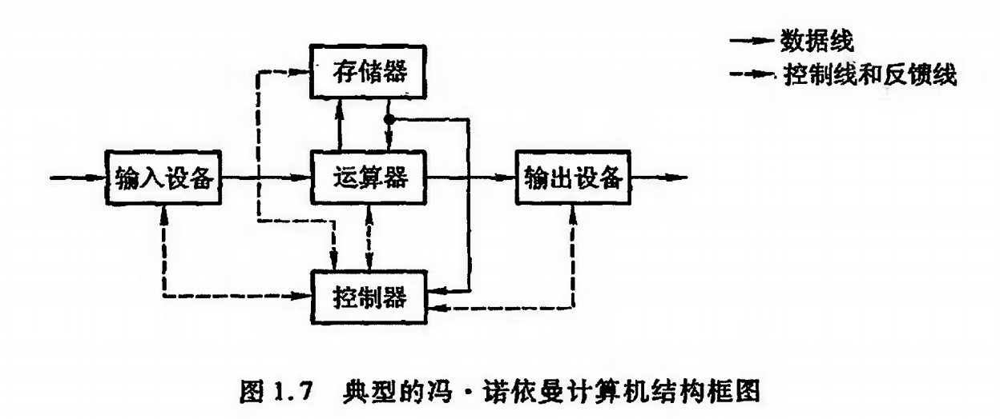

说明: 以运算器为中心

```bash
             存储器    
输入设备 =>   [运算器]   =>  输出设备
             [控制器]

cpu = 运算器 + 控制器
```

冯洛伊曼瓶颈:
CPU和存储器之间的问题无法调和: cpu经常空转等待数据传输

现代计算机结构:

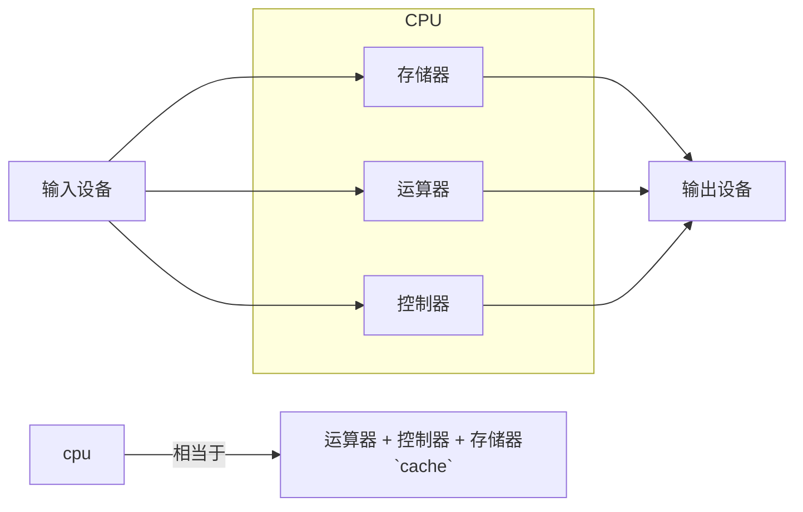

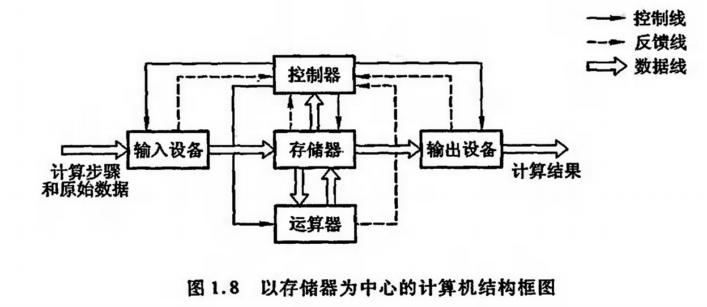

示意图:

```bash
             [存储器]    
输入设备 =>   [运算器]   =>  输出设备
             [控制器]

cpu = 运算器 + 控制器 + 存储器(高速缓存)

```
解决: 通过高速缓存,解耦CPU与存储器,解决了冯洛伊曼瓶颈问题
特点: 以存储器为核心

### 1.4 计算机的层次与编程语言

#### 程序翻译与程序解释
高级语言 翻译成 机器语言的形式

1. 由解释器一条一条顺序翻译成二进制指令执行  => 解释型
2. 一次性编译成机器指令,然后由机器执行 => 编译型

解释:
解释型语言
php python

翻译+解析:
java c#

2. 计算机的层次与编程语言

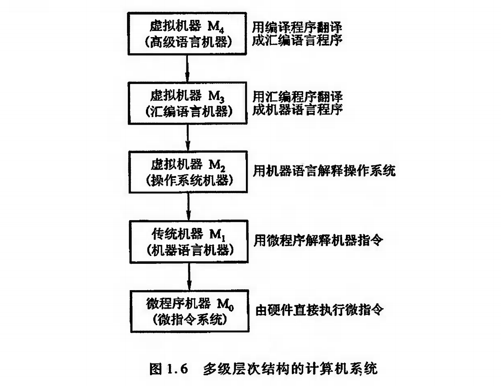

### 1.5 计算机的计算单位

容量单位:

1/0 计算机识别的最小单元: 1bit
8个0/1为一组, 1Byte 1字节
1Byte = 8bit

ZB => PB => TB => GB => MB => KB => B
1GB = 1024MB

硬盘商一般用10进制位来表示容量
1GB = 1000MB

网络速度:
宽带: 100Mbps 
意为: 100Mbit/s 
100Mbps = 100/8(MByte/s) = 12.5MB/s

CPU速度:
CPU时钟频率:
单位: Hz(赫兹)  

Hz为频率单位, 10Hz表示: 10次/s
CPU频率表示每秒高低电平变化的次数

2GHz = 2 * (1000)^3 次/s

### 1.6 计算机的字符与编码集

字符与编码集:
ASCII码: 2^8  65:A  97:a  数字:0-9(48)

中文编码集:
GB2312

GBK: 向下兼容GB2312,兼容ISO

Unicode

## 组成

1. 总线
概述: 不同设备之间的沟通桥梁
USB   Universal Serial Bus: 通用串行总线

总线的仲裁:
解决总线使用权冲突问题

方法:
(1) 链式查询: 从1->N,依次授权
缺点:优先级低的设备难以获得总线的使用权
(2) 计数器: 计数值及紧邻的下一个优先获得使用权
(3) 独立请求: 根据优先级分配使用权

3. 输入输出设备

接口设计
数据线 状态线 命令线 设备选择线

CPU与设备通信
前提: CPU比IO设备的速度快10~100倍以上,且CPU有很多任务需要做

中断: 
含义: 当IO设备就绪时,向CPU发送中断信号
解释: 提供低速设备异步通知CPU的方式 , 使CPU可以高速运转的同时兼顾低速设备的响应

DMA: Direct Memory Access (直接存储访问)
DMA直连CPU的主存与IO设备
在需要与IO设备通信时,由DMA进行,不需要CPU的参与

示意图
```bash
CPU -> 主存 -> DMA -> IO设备 
```

2. 存储器

分类
半导体存储器: 内存,U盘,固态硬盘
磁存储器: 磁带,机械硬盘

存取方式
随机存储器: RAM(随机存取)  
串行存储器: 按顺序查找
只读存储器: 只读存储(ROM)

读写速度: 5400r/min   7200r/min
存储容量: 2T  4T
位价: CNY/bit 每bit需要多少元

层次结构:
缓存: CPU寄存器+CPU三级缓存
主存: 运行内存(RAM)
辅存: 硬盘,U盘,光盘

  |------------------|
CPU <=> 高速缓存 <=> 主存 <=> 辅存

缓存-主存层次

局部性原理: (相邻原理)
CPU访问存储器时,所存取的数据趋向于一小段连续的区域

主存-辅存层次: 局部性原理
解决主存容量不足和不能保存的问题

### 主存储器

主存: RAM(Random Access Memory)  随机存取存储器
内存使用电容存储数据,必须隔一段时间刷新一次,断电后电子消失,数据丢失

寻址范围:
32位: 2^32 = 4G
64位: 2^64

### 辅存储器

磁道 扇区 磁头方向

磁头算法:
先来先服务算法(按顺序)
最短寻道时间算法(根据当前位置的下2位是否临近来决定左还是右移动)
扫描算法,电梯算法(从左向右,再从右向左)
循环扫描算法:(一直从左向右)


3. CPU
高速缓存
字: 存放在一个存储单元的二进制代码组合 (字符串,指令)
字块: 连续的一组存储单元,一组字

1字 = 32bit
1字块 = B字
M * B * 32 = 容量

字的地址:  字块的地址+字在字块的地址(块内地址)

cache与内存结构类似

Cache指标:
命中率:  cpu访问cache的次数占(cache+memory)的次数的比例
访问效率: 命中率的时间加权比值

cache缓存替换策略
随机算法
先进先出: 看作队列, 淘汰掉最开始存入的
最不经常使用算法: 优先淘汰最不经常使用的字块

机器指令
形式,操作类型,寻址方式

CPU控制器
控制计算机的运行

程序计数器: 当前需要执行的指令地址
时序发生器: CPU根据时序脉冲来进行推动流程
指令译码器: 翻译地址对应指令和数据
各种寄存器: 从缓存和内存中取出来的指令
总线

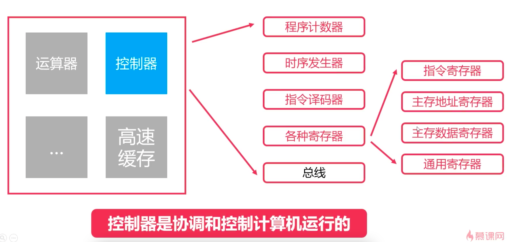

运算器:
数据缓冲器: 输入/输出缓存(计算结果)
ALU: 算术逻辑单元(+-x÷)
状态字寄存器: (正负,条件码)
通用寄存器: 存放数据和指令
总线

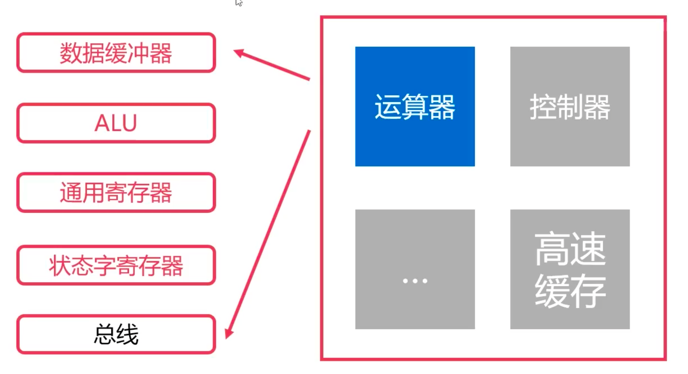


计算机指令执行过程

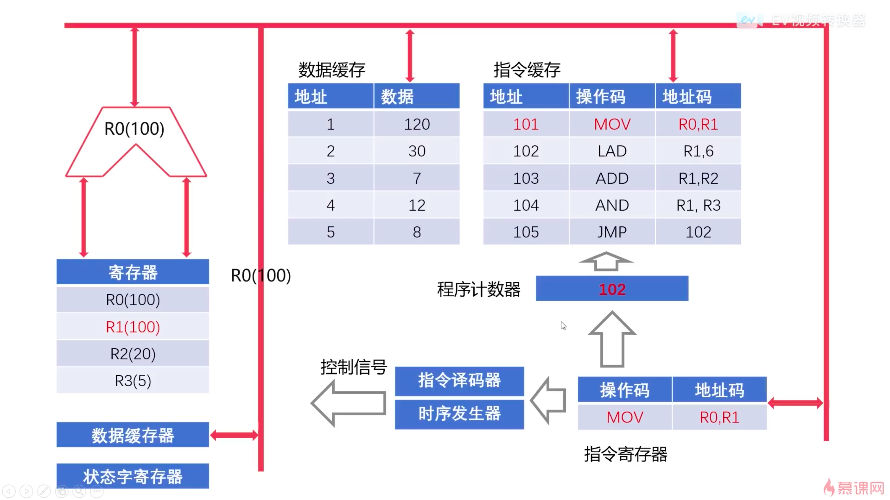


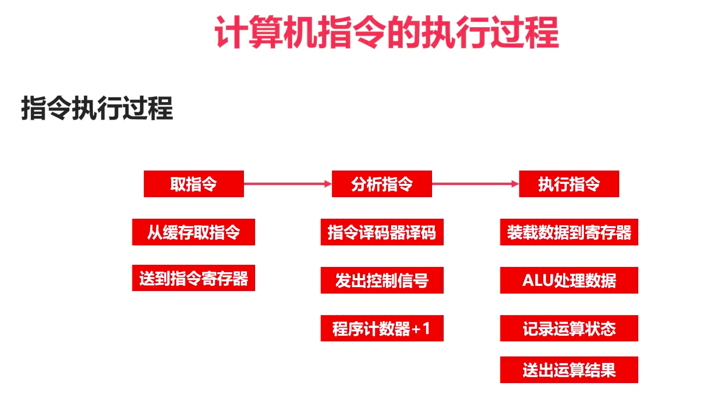


CPU结构:

一句话总结:

高速缓存: CPU从内存中存取数据,由高速缓存做中转缓存

控制器: 从高速缓存/内存中通过地址取指令/数据, 并进行记位,推动和译码,然后向运算器发送指令

运算器:借助缓冲和寄存,通过ALU完成运算和输出


## 计算

### 进制运算基本知识

#### 概述

进制是一种计数方式 , 通过进位表示权重指数,用有限的数字表达无限的数据
60进制: 分钟->小时 
2/8/16进制: 计算机, 二进制显得表示起来比较长,所以书写上以16进制简化书写

二进制: 1024 => 0b10000000000
八进制: 1024 => 0o2000
十六进制: 1024 => 0x400

#### 二进制运算基础

进制转换

转化为10进制: 加权求和法
转化为k进制: 除k取余法(整数)  乘k取整法(小数)

### 二进制的数据表示方法

#### 符号位

原码表示法: 0/1表示正负,符号位在最首尾

#### 补码

补码表示法: 正数补码等于本身,负数补码(基本位,不含符号位)等于高一位相减 (原码+补码=2^N)  (原码x不包含符号位) 200000 - x

#### 反码

反码表示法: 正数反码等于本身,负数反码(基本位,不含符号位)等于补码减一(原码+补码=111111)  (原码x不包含符号位)

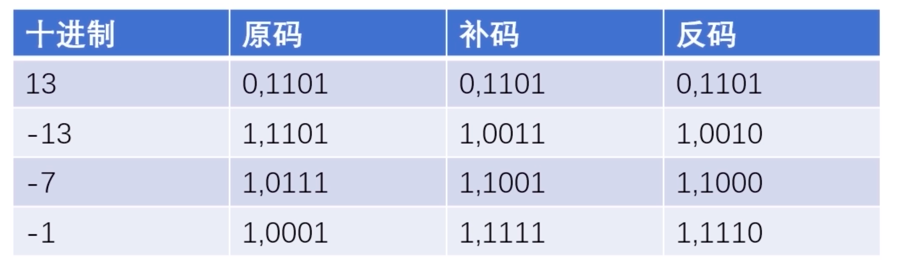

反码等于=符号位不变,基本位按位取反

补码等于=符号位不变,基本位按位取反,再加1 (反码+1)

#### 小数

与整数规律一致

### 二进制数据的运算

#### 定点数

#### 浮点数

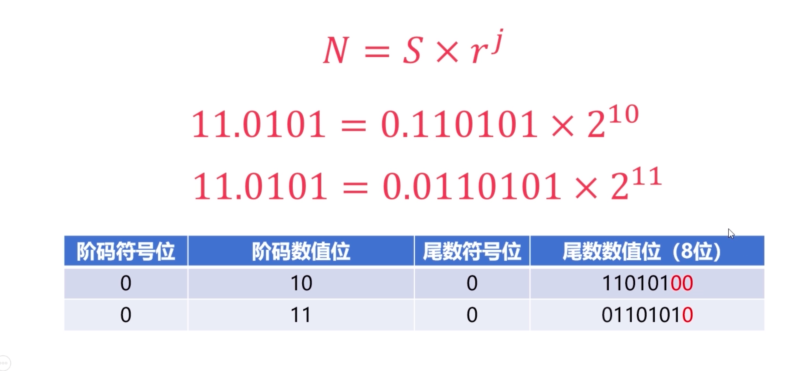

 0.xxxx * 2^n     xxxx

#### 定点数运算

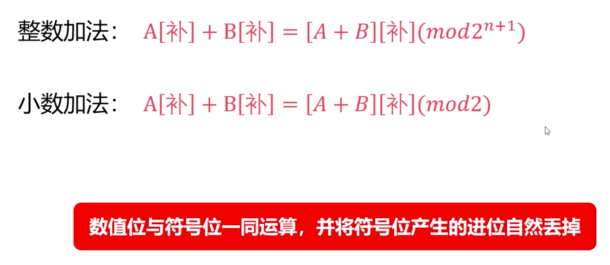

溢出判断: 双符号位判断法

A-B = A + (-B)

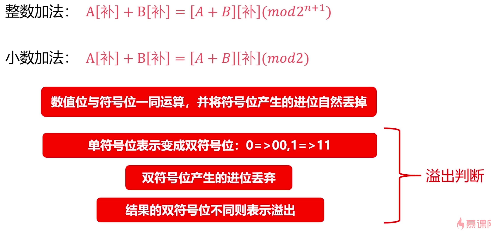

#### 浮点数运算

对阶: 小阶看齐大阶(尾部舍弃->精度丢失)

尾数规格化.

溢出判断


## 组成原理实践

### 双向链表


### 置换算法

### 先进先出算法

### 最近最少使用算法

Least Recently Used，即最近最久未使用的意思, 双向链表,一端push,另一端pop

### 最不经常使用算法

Least Frequently Used，即最少访问算法, 频率双向链表,
