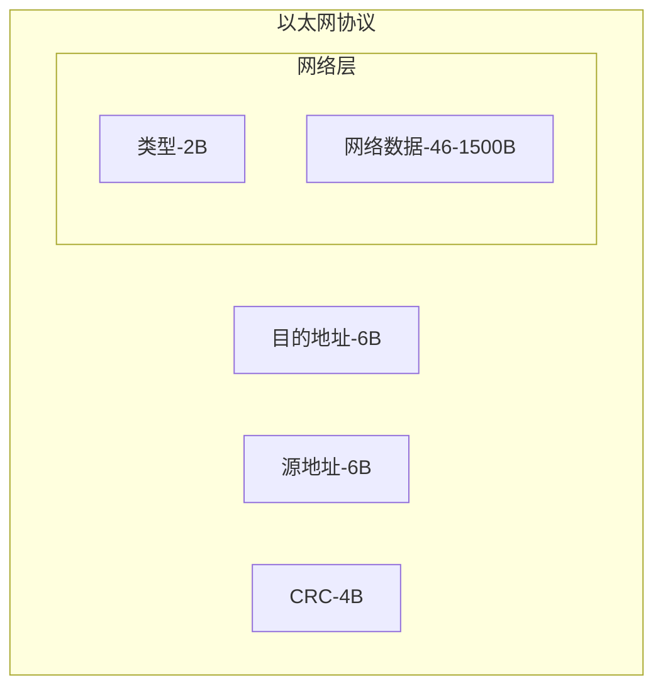
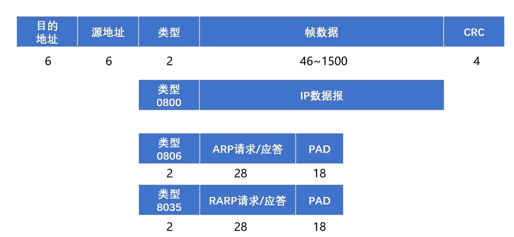

[TOC]

## 数据链路层

### 概述

#### 定义

帧是数据链路层传输数据的基本单位, 发送端在数据两端插入标记位,封装成帧

#### 作用

1. 封装成帧 (加入起始结束标记位,封装成帧)

2. 透明传输 (数据中的标记位需要转义处理,对上层透明)

3. 差错检测 (校验数据出错,出错则直接丢弃,由上层决定是否重传)

   奇偶校验码: 

   循环冗余校验码(CRC): 

#### 示例:

主要有网卡(网络适配器)、网桥和交换机; 使相邻的两个设备可以通信,用来接收帧、寻找通向目的地址的端口、发送帧

能分辨出帧中的源MAC地址和目的MAC地址，可以在任意两个相邻端口间建立临时交换路径**转发数据帧**

#### 最大传输单元

最大传输单元(MTU): Maxinum Transmission Unit, 规定了数据帧的最大数据长度,数据帧一般1500Byte, 太大太小都会影响数据传输速率

路径MTU, 木桶短板效应, 两端传输的最大MTU由链路中最小的MTU决定

### 以太网协议(Ethernet,数据链路层)

#### 定义:

以太网协议是一种应用于数据链路层的协议,用来完成相邻设备的数据帧传输

#### 示例:

MAC地址:(物理设备的硬件地址,身份证) ether 08:00:27:9e:e5:28

#### MAC地址表:

MAC到硬件接口的映射, 在以太网协议(Ethernet)中,用来寻找目的地址的端口,发送数据帧

