[TOC]

## 网络层

### 概述

#### 定义:

让源端的数据能够以最佳路径透明地通过通信子网中的多个转接节点到达目的端

#### 作用:

具体功能包括: 分组分片与重组,寻址和路由选择, 流量和拥塞控制,  IP分配,子网划分和管理

示例: 网关,路由器

### 虚拟互联网络

定义: 虚拟互连网络的意思就是互连起来的各种物理网络的异构性本来是客观存在的，但是我们利用IP协议就可以把这些性能各异的网络**在网络层看起来好像是一个统一的网络**。这种使用IP协议的虚拟互连网络可简称为IP网

IP协议解决了在虚拟网络中数据报传输路径的问题

### IP协议

#### 概述

##### IP地址种类和用途

IP用途：标记某个主机所在的位置
种  类：分类编址（早期设计，存在缺陷）和无分类编址（用来代替分类编制）

##### 表示方法

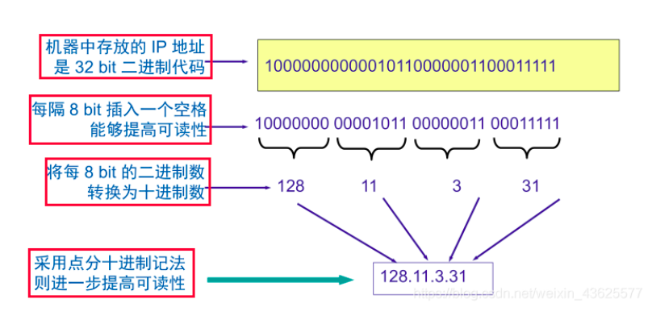

IP地址: 192.128.1.1  => 点分十进制

IP协议:

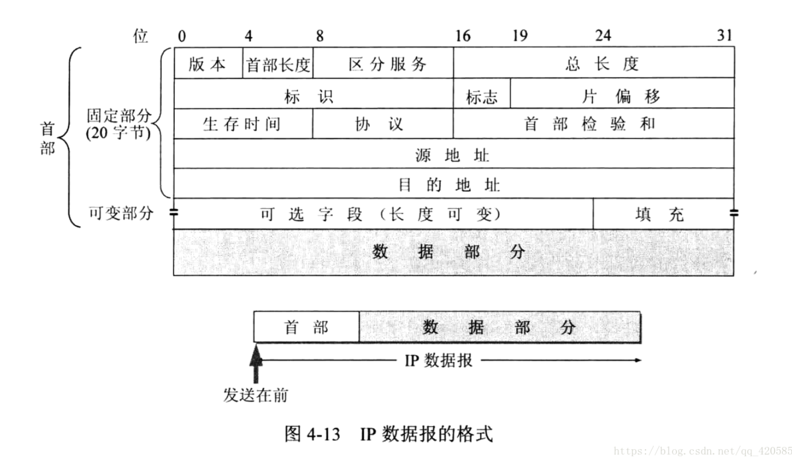

```sh
版本: ip协议的版本, ipv4/ipv6, 4字节
首部长度: ip首部的长度 多少行(32bit)  最大15(行)x32=60Byte
服务类型(区分服务):xxx
总长度: 该ip数据包的总长度, 最大2^16=65535bit, ip首部+ip数据
标志: 标记是否可以分片
片偏移: 如果传输时,允许分片,此处纪录数据的偏移
TTL(time to live): 数据报在网络中的寿命, 最大值:2^8-1=255, 限制ip报文在有限次传输之后到达目的地或者被丢弃
协议: 8bit,上层协议的类型,TCP,UDP...
首部校验和: 循环冗余校验,校验首部是否出错,出错则直接丢弃
源IP地址: 发送者IP地址(32bit)
目的IP地址: 目的地IP地址(32bit)
```

ip数据报头部原文:

```shell
-----------------原数据------------------------
[01000101    00000000    00000000    01000100]
[00001010    10001001    00000000    00000000]
[00000001    00010001    00000000    00000000]
[11000000    10101000    00011111    01000010]
[11100000    00000000    00000000    11111101]
----------------------------------------------

-----------------解析后------------------------
[01000101    00000000    00000000    01000100]
[4 |5row     srv_type           ip_len:68    ]

[00001010    10001001    00000000    00000000]
[       标识              标志|   片偏移       ]

[00000001    00010001    00000000    00000000]
[生存时间:1   上层协议:17       首部校验和       ]

[11000000    10101000    00011111    01000010]
[     192         168          31          66]

[11100000    00000000    00000000    11111101]
[     224           0           0         253]
----------------------------------------------
```


#### IP协议转发流程

MAC地址表 => 路由表

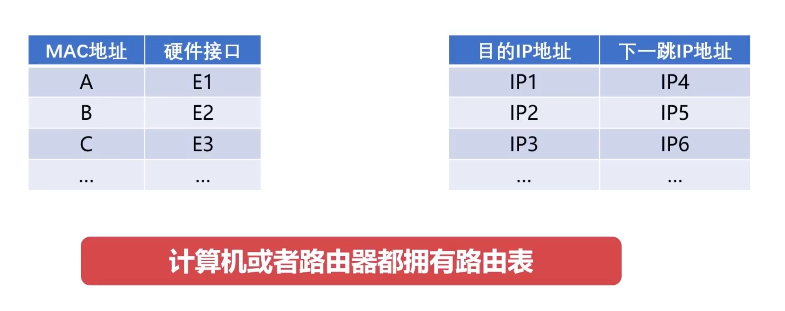

路由器中根据IP地址识别下一跳

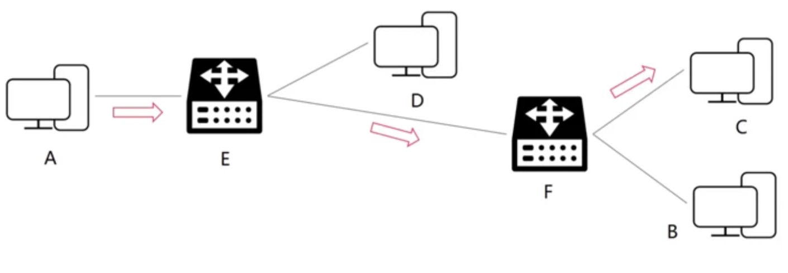

```sh
A网卡: [MAC(A)+MAC(E) + IP(A)+IP(C)]   => 
E: [MAC(A)+MAC(E) + IP(A)+IP(C)]  =>  
		[IP(A)+IP(C)] (网络层) => 查路由表得F => [MAC(E)+MAC(F) + IP(A)+IP(C)] =>
F: [MAC(E)+MAC(F) + IP(A)+IP(C)]  =>  
		[IP(A)+IP(C)] (网络层) => 查路由表得B => [MAC(F)+MAC(B) + IP(A)+IP(C)] =>
B: [MAC(F)+MAC(B) + IP(A)+IP(C)] => [IP(A)+IP(C)](网络层) ~ B网卡
```

> 每一跳的MAC地址都在发生改变,IP地址不会变

### ARP协议与RARP协议

#### 概述

ARP(Address resolution Protocol) , 地址解析协议, 将网络层32位**IP地址**转换为数据链路层48位**MAC地址**


ARP缓存表,广播IP地址,只有是IP地址的才应答, 维护IP地址->MAC地址的映射,且定期更新

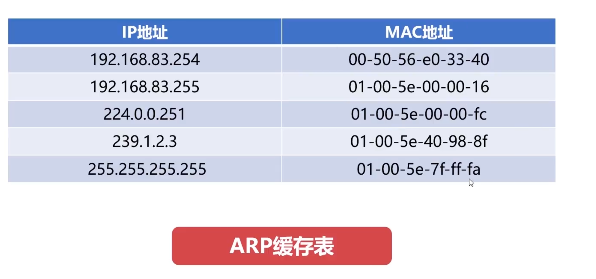

#### APR广播的数据报格式:

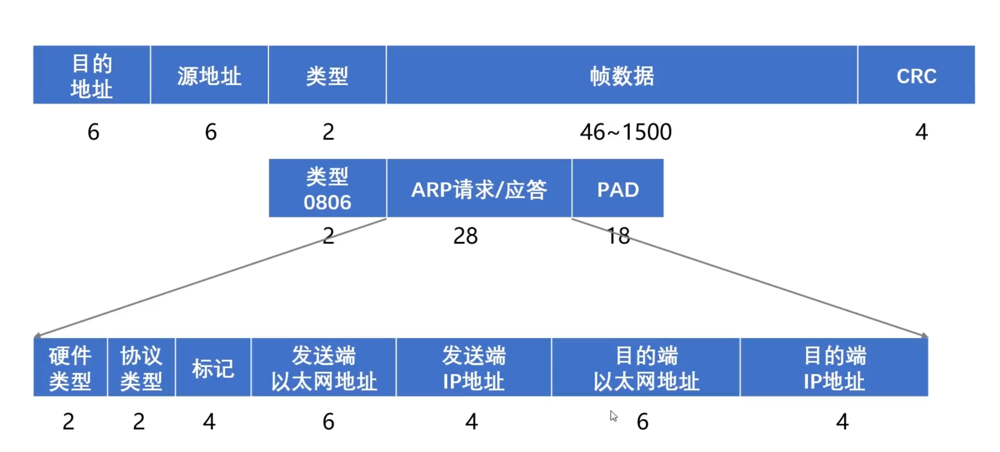

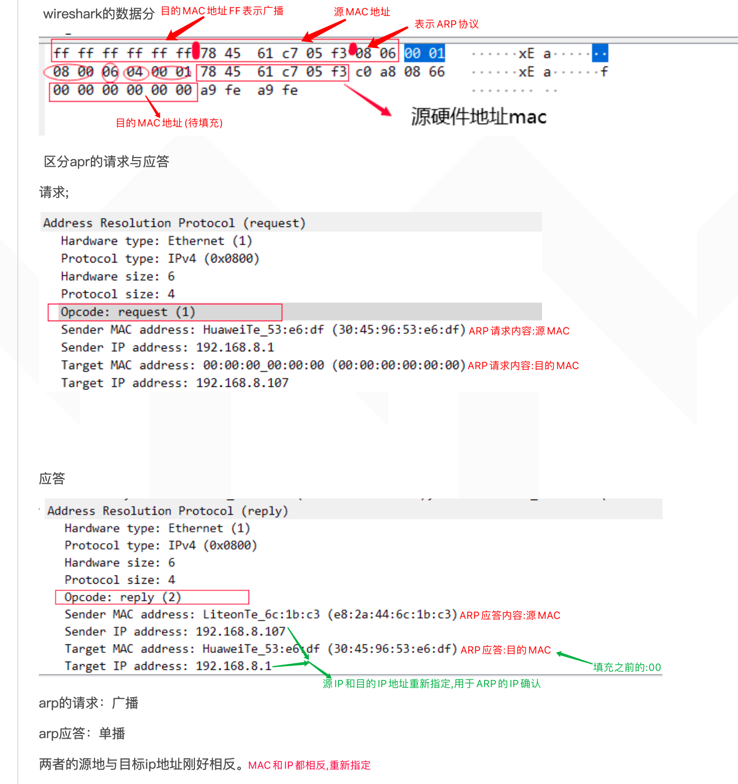

#### RARP协议

RARP：反向地址转换协议（RARP：Reverse Address Resolution Protocol） 反向地址解析协议（RARP）允许局域网的物理机器通过MAD地址从网关服务器的 ARP 表或者缓存上请求其 IP 地址。

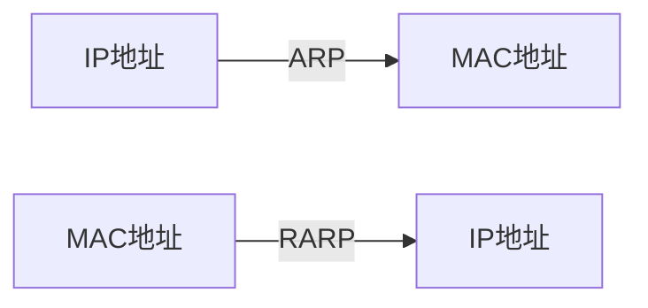
```mermaid
graph LR

A[IP地址] -- ARP --> B[MAC地址]
MAC地址 -- RARP --> IP地址
```

### IP地址的子网划分

#### IP地址分类

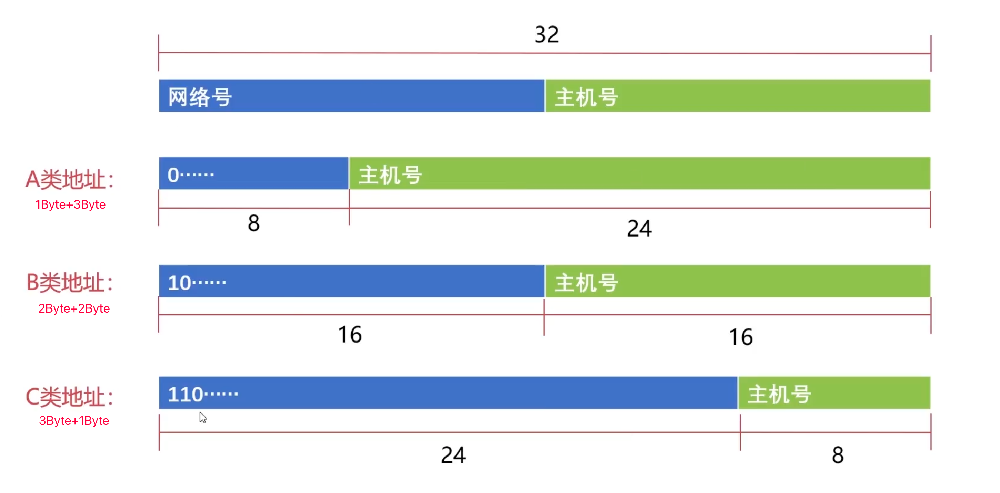

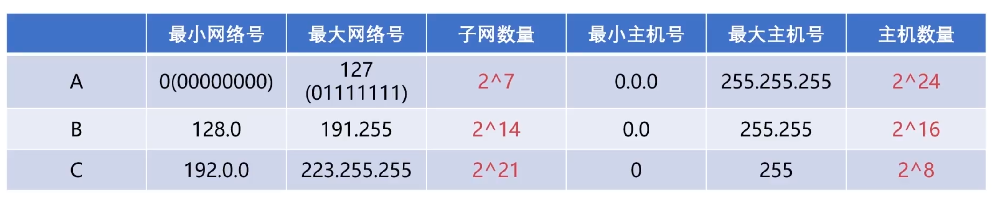

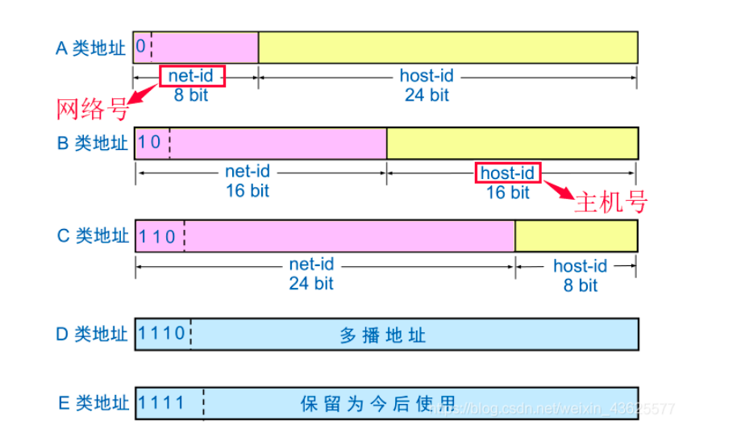

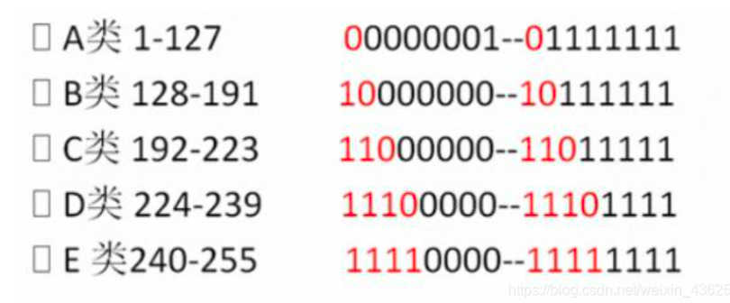

由上图可以看出IP地址由两部分组成，即网络地址和主机地址。网络地址表示其属于互联网的哪一个网络，主机地址表示其属于该网络中的哪一台主机。二者是主从关系。

特殊网络号(网络ID):

网络号后全0不能使用, 根据网络段首位由几个1来确定是几类地址

特殊主机号(主机ID):

1.  全0主机号: 表示当前整个网段,不能分配给特定主机
2.  全1(指bit位)主机号: 表示广播地址, 向当前网段的所有主机发消息

> 示例: 1.2.3.4 => 网段: 1.0.0.0   广播:1.255.255.255, 特殊主机号都不允许分配给具体主机

#### IP子网划分

##### 定义:

子网划分是通过借用IP地址的若干位主机地址来充当子网地址（从左面第一位不是网络号的位开始借，而且借位必须是连续的不能跳跃），从而将原网络划分为若干子网而实现的。划分子网时，随着子网地址借用主机位数的增多，子网的数目随之增加，而每个子网中的可用主机数逐渐减少。

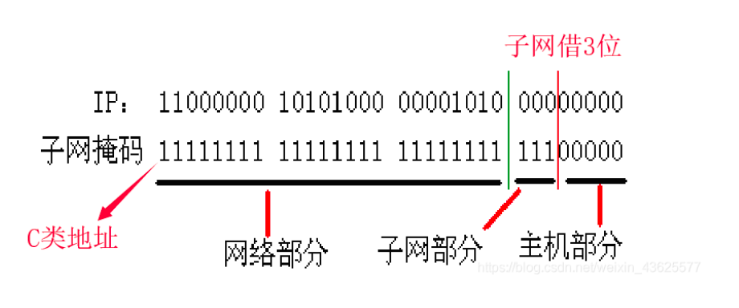

##### 意义: 

> 节约IP地址，避免浪费。

IP地址由网络号和主机号组成, B类地址中,每个网络可连接的主机数高达65534, 一个网络一般不会有这么大,不会直接连接管理这么多主机,也不利于广播和传输管理, 所以需要**将一个网络划分为多个子网络**进行独立地管理; 这么多的主机在单一的网络下，地址空间在实际应用中利用率很低, 从而也节约了IP地址资源

##### 子网掩码

|         | 首部      | 地址范围              | 十进制范围 | 默认子网掩码  |
| ------- | --------- | --------------------- | ---------- | ------------- |
| A类地址 | 0xxx xxxx | 0000 0000 ~ 0111 1111 | 1~127      | 255.0.0.0     |
| B类地址 | 10xx xxxx | 1000 0000 ~ 1011 1111 | 128~191    | 255.255.0.0   |
| C类地址 | 110x xxxx | 1100 0000 ~ 1101 1111 | 192~223    | 255.255.255.0 |
| D类地址 | 1110 xxxx | 1110 0000 ~ 1110 1111 | 224~239    |               |
| E类地址 | 1111 xxxx | 1111 0000 ~ 1111 1111 | 240~255    |               |

通过定义和配置子网掩码, 从主机号借位来表示网络号,从而划分子网

将IP地址与子网掩码求AND逻辑运算,即可得该IP所属的网络号(即所属的子网)

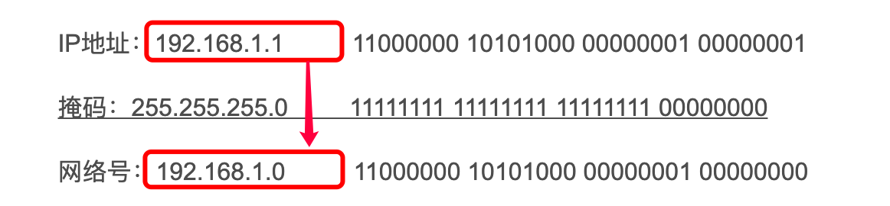

#### 无分类地址CIDR

定义: CIDR主要是一个按位的、基于前缀的，用于解释IP地址的标准, 它通过把多个地址块组合到一个路由表表项而使得路由更加方便, 这些地址块叫做CIDR地址块

意义: 

1. 消除了ABC类地址和子网划分的概念
2. 路由表简化(聚合, 可以多级分配管理), 有效利用地址空间

IP地址={网络号+子网号+主机号}    => IP地址={网络前缀+主机号}

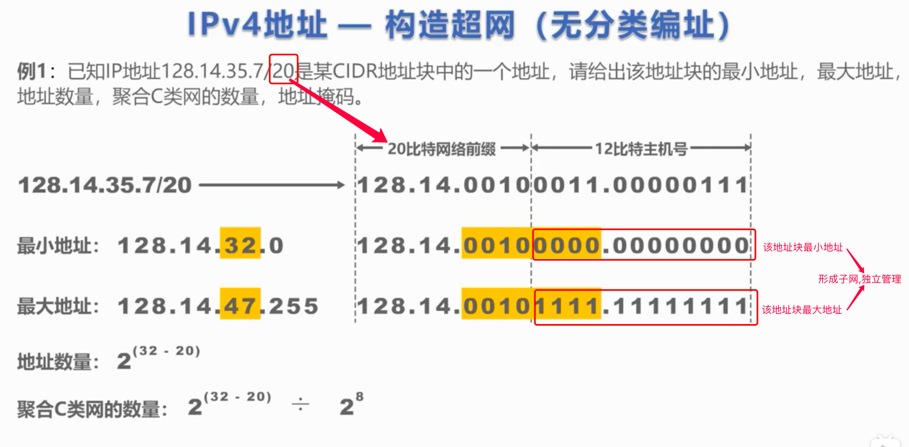

### 网络地址转换NAT技术

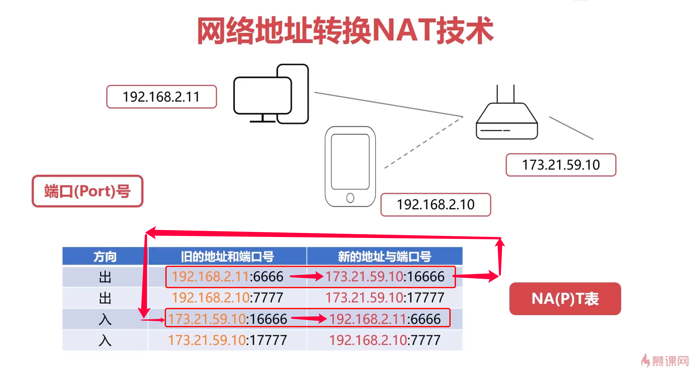


#### 简介

NAPT（Network Address Port Translation），即网络地址端口转换，可将多个内部地址映射为一个合法公网地址，但以不同的协议端口号与不同的内部地址相对应，也就是与之间的转换

> 由一个公网IP来对局域网的设备做代理,通过替换端口来识别映射不同的设备请求

#### 作用:

NAT不仅能解决IP地址不足的问题，而且还能够有效地避免来自网络外部的攻击，隐藏并保护网络内部的计算机。

### ICMP协议

#### 概述

##### 简介:

ICMP（Internet Control Message Protocol）Internet控制报文协议, 用于在IP主机、路由器之间传递控制消息。控制消息是指网络通不通、主机是否可达、路由是否可用等网络本身的消息。

##### 格式:

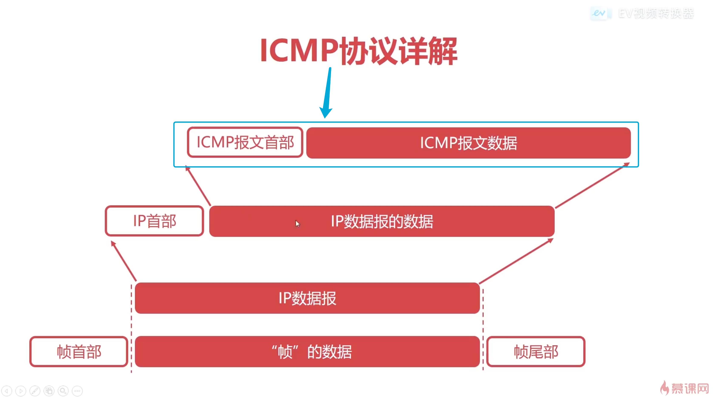


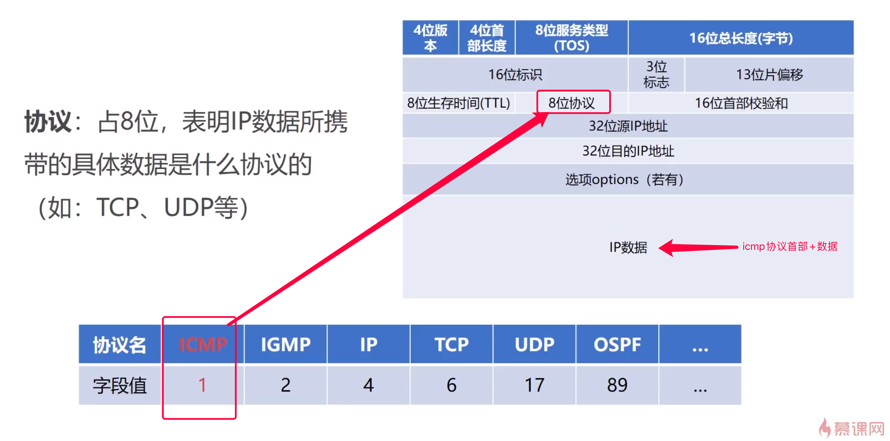

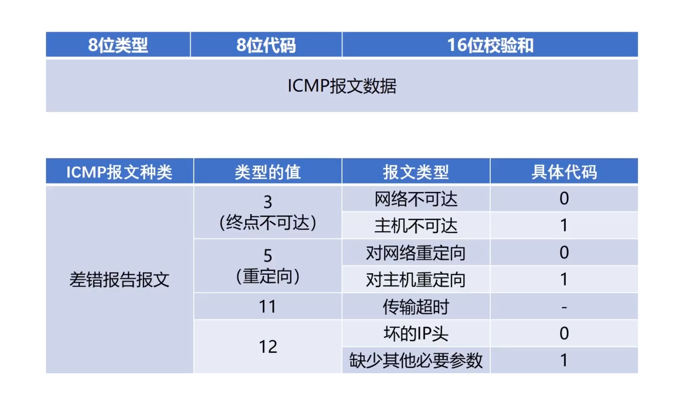

#### 应用

##### ping (ICMP询问报文)

ping  (发送ICMP协议报文, 询问报文)

Ping 本地 -> 网关 -> 外网

##### traceroute  (n*ttl -> ICMP差错报告报文[终点不可达])


tracepath github.com

通过不断增加TTL的值, 来获取应答报文,纪录其IP地址,从而描绘出访问路径

> arp -e 查看ARP映射表 (IP -> MAC)

### 网关协议

#### 内部网关协议RIP

##### 距离矢量算法

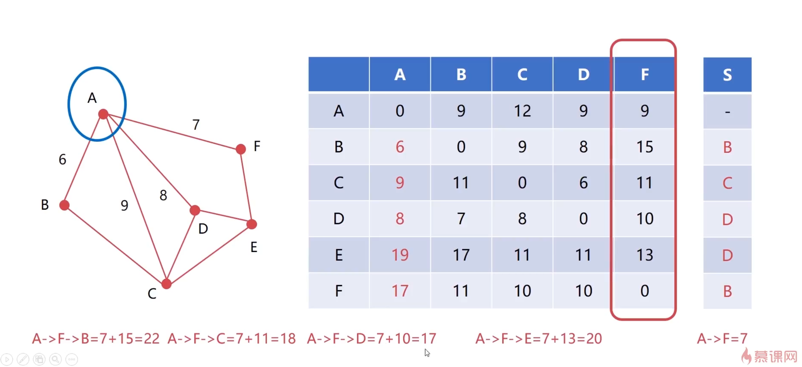

##### 描述:

它以网络中的每个路由器为索引，表中列出了当前已知的路由器到每个目标路由器的最佳距离

每个节点维护到其他节点的距离, 然后根据其他节点上的距离表,来算当前节点,通过其他节点到再下一跳节点的距离,如果小,则更新当前节点到下一跳的最佳路径为经过"其他节点"

##### 定义

RIP(Routing Information Protocol,路由信息协议）是一种分布式的基于距离向量的路由选择协议; RIP协议主要用于一个AS(自治系统)内的**路由信息的传递**，每30s发送一次路由信息更新。

##### RIP协议过程

1. 对当前路由表没有的结点, 直接插入到当前路由表, (更新距离和下一跳)
   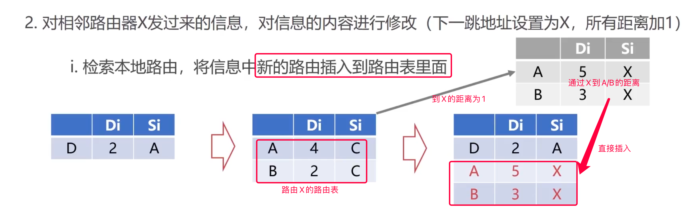

2. 对当前路由表已存在的结点, 如果下一跳为当前发来信息的路由,则以当前发来的信息为准,根据其信息替换 (更新距离和下一跳)
   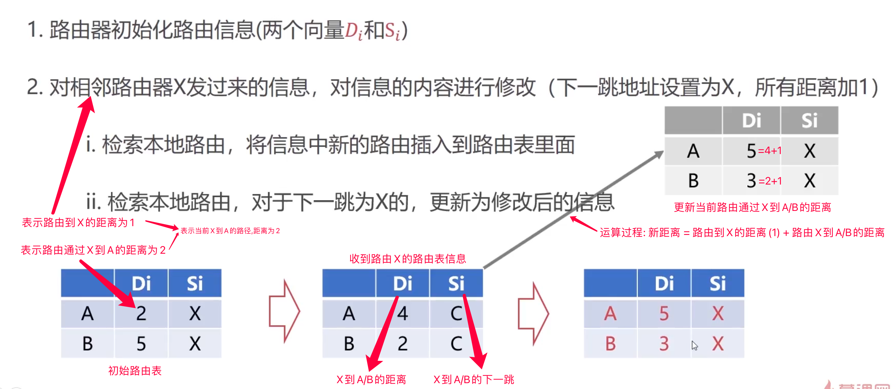

3. 对当前路由表已存在的结点, 如果下一跳不是当前发来信息的路由,则计算取最小距离来更新 (更新距离和下一跳) 即根据距离矢量算法更新

   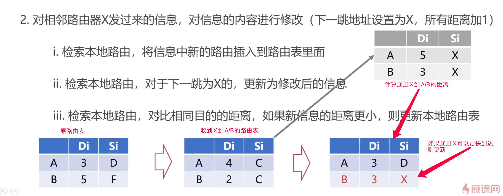

4. 如果3min未收到来自相邻路由结点的信息, 则把相邻路由设置为不可达(16跳)


##### RIP协议优缺点

优点: 实现简单,开销小

缺点: 

1. 随意相信相邻结点, 视野不够: 造成故障信息传递慢, 当一个结点故障后,需要连续通信至距离=16才会发现不可达

2. 限制了网络的规模,大于16跳就视为不可达,限制了网络结点跳数

#### 内部网关协议OSPF协议

##### **Dijkstra**算法

1. 初始化集合S, U, (S为顶点集合, U为其他点的集合)

2. 如果U不为空, 则对到A的距离进行排序,并取出距离A的最近的一个顶点D

   1. 将顶点D插入S集合,
   2. 更新通过D到达U集合所有顶点的距离, (如果距离小则更新)
   3. 重复2步骤

3. 直到U集合为空,算法完成

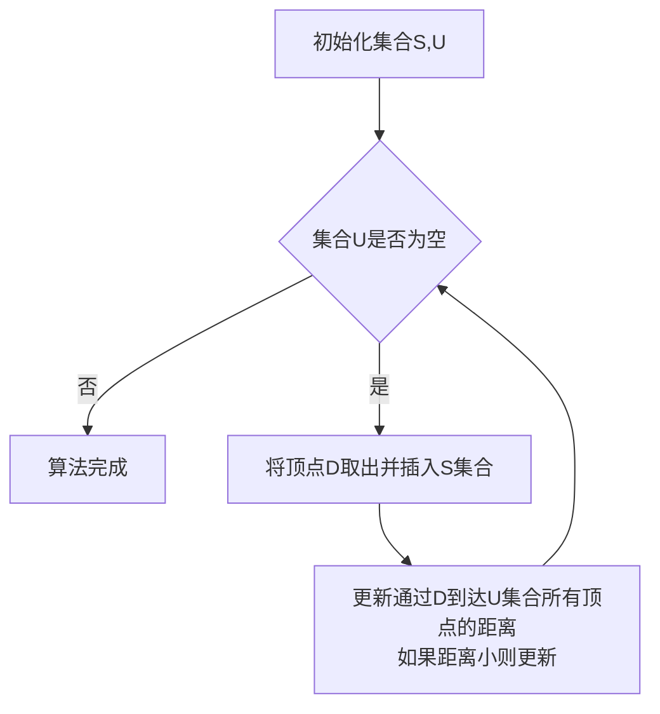
```mermaid
graph TB
初始化集合S,U --> X{集合U是否为空} -- 否 --> 算法完成 
X -- 是 --> 将顶点D取出并插入S集合 --> C["更新通过D到达U集合所有顶点的距离<br>如果距离小则更新"] --> X
```

##### 描述

链路状态{LS}协议

向所有路由器发送消息

消息描述该路由器与相邻路由器的状态 (距离,时延,带宽)

只有链路状态发生变化时,才发送更新消息 (减少通信)

##### OSPF协议过程

定义:

OSPF(Open Shortest Path First开放式最短路径优先）是一个内部网关协议(Interior Gateway Protocol，简称IGP）， 统（autonomous system,AS）内决策路由, 用来在一个网络系统内找到通信的最优路由路径。 所有的OSPF路由器都维护一个相同的描述这个AS结构的数据库, 存放的是路由域中相应链路的状态信息, 计算出其OSPF路由表, 从而在网络传输中路由到最佳路径

具体步骤:

OSPF的简单说就是两个相邻的路由器通过发报文的形式成为邻居关系，邻居再相互发送链路状态信息形成邻接关系，之后各自根据最短路径算法算出路由，放在OSPF路由表，OSPF路由与其他路由比较后优的加入全局路由表。整个过程使用了五种报文、三个阶段、四张表。

区别:

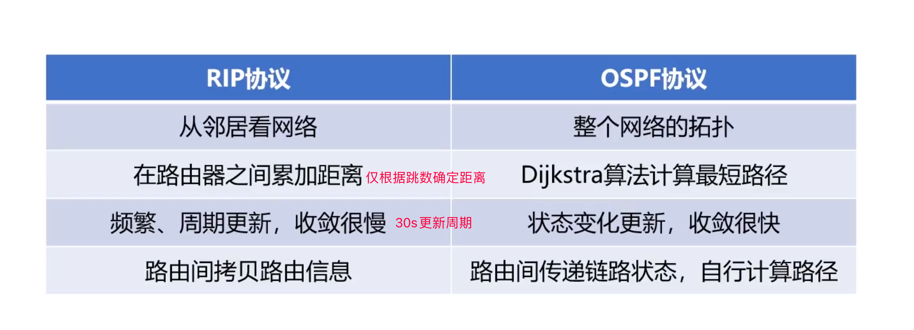

##### 边际网关协议 ~ BGP协议

定义: 

BGP(Border Gateway Protocol: 边际网关协议) , 是运行在AS之间的一种协议,  屏蔽AS内部不同的内部路由协议, 通过BGP发言人交流信息, 可人为配置策略, 能够找到一条到达目的比较好的路由