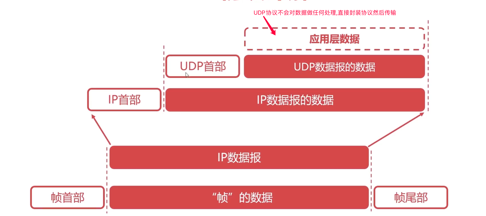
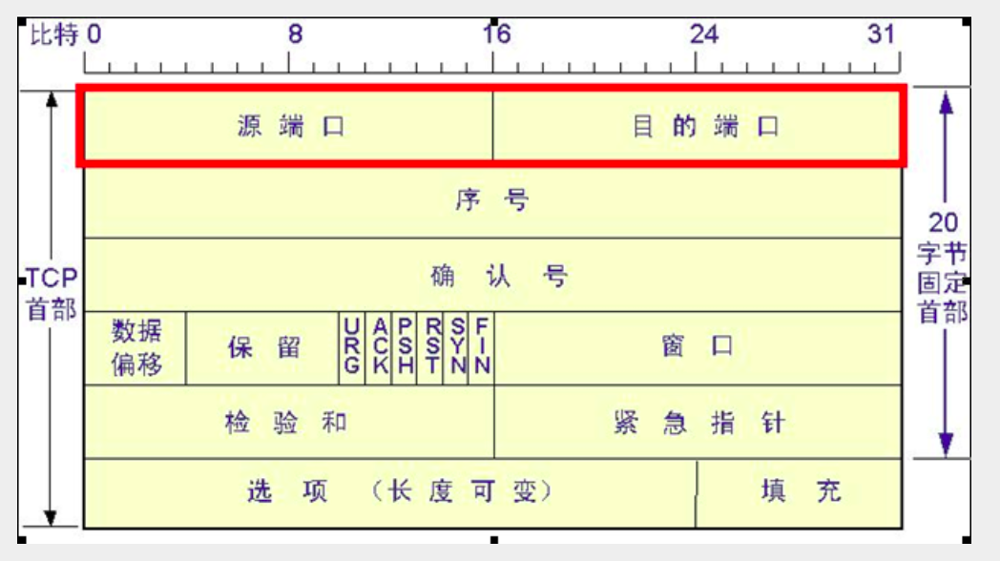
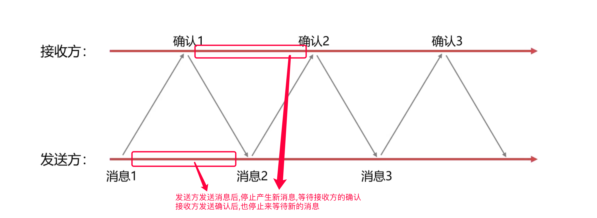
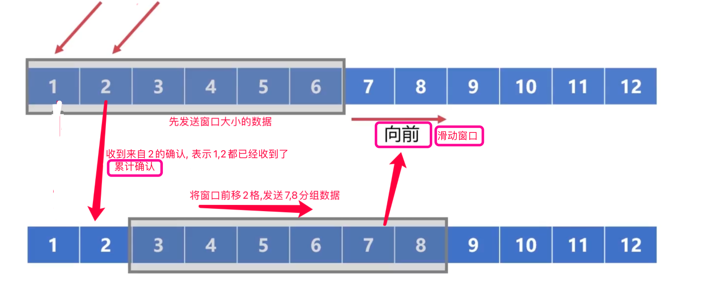
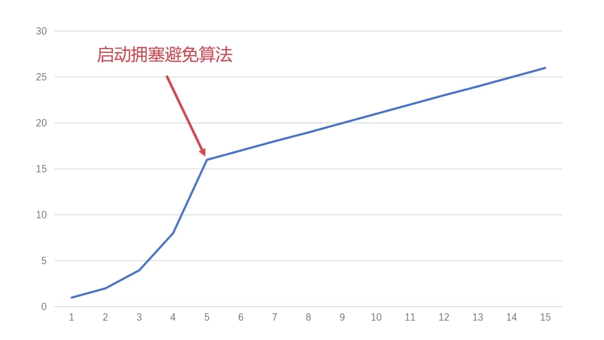
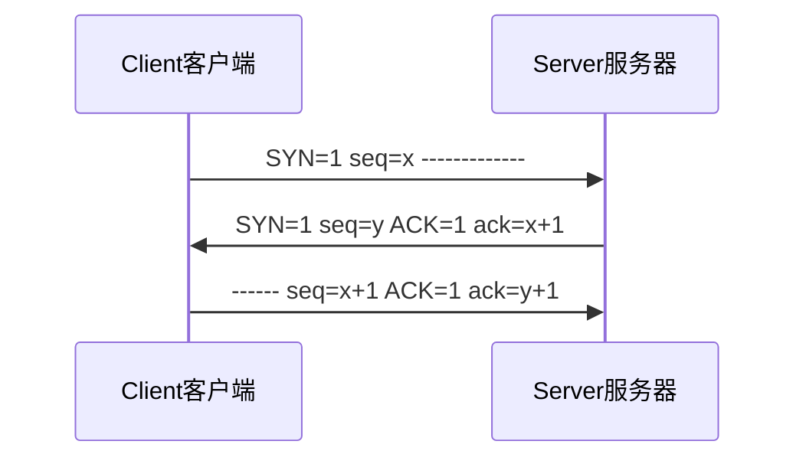
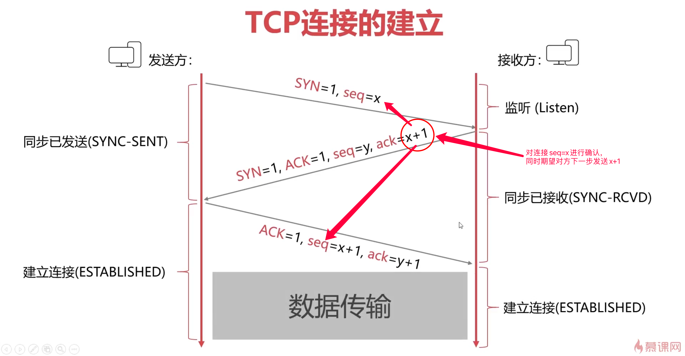
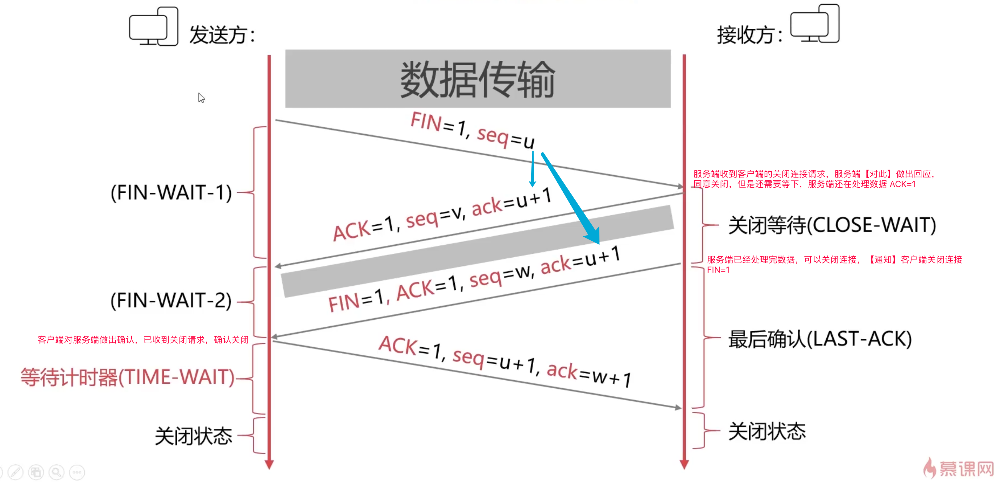
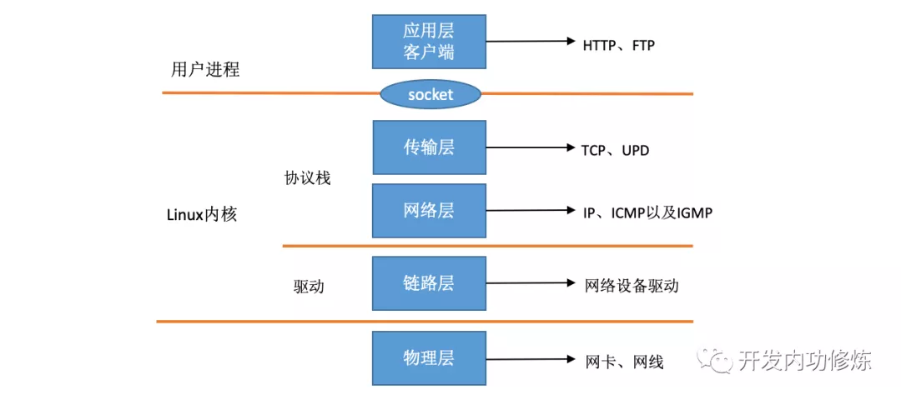

[TOC]

## 传输层

作用: 通过使用端口来实现不同主机间进程与进程之间的通信

### UDP协议

定义:

UDP 是User Datagram Protocol的简称， 中文名是用户数据报协议, 一种无连接的传输层协议，提供面向事务的简单不可靠信息传送服务




特点:

1. 无连接
2. 不可靠
3. 面向报文
4. 没有拥塞控制
5. 首部开销小

### TCP协议

定义:

传输控制协议（TCP，Transmission Control Protocol）是一种面向连接的、可靠的、基于字节流的传输层通信协议, 提供全双工通信

按字节为基本单位进行拆分合并发送，需要在传输层指定端口

TCP首部:




#### 可靠传输

##### 停止等待协议

定义:

依次发送数据,逐个确认数据接收,等待接收到确认后才开始传输下一个数据,如果出错则立即重传,有超时定时器



发送消息未被接受, 确认消息未收到,确认消息很晚后又到达 -> 超时重传  (超时定时器)

最简单的可靠传输协议, 对信道的利用效率不高

##### 连续ARQ协议

定义:

自动重传请求（Automatic Repeat-reQuest，ARQ）, 连续ARQ（Automatic Repeat reQuest）协议, 维持着一个一定大小的发送窗口, 连续发送和积累确认, 当发生错误时, 接收方只对前N个正常的分组做出确认, 发送方重发出错位置后的所有分组

过程:

1. 滑动窗口 (以字节为单位,每小格代表每个字节)
2. 累积确认



##### TCP协议可靠传输

基于连续ARQ协议

滑动窗口小格以字节为单位, TCP一次可以传输1000+个字节, 对数据整体进行编号, 如果某次丢失,则代表此次TCP整个报文丢失, 则重传需要指定丢失的TCP字节编号范围

#### TCP协议流量控制

流量控制是指让发送方的发送速率不要太快, 基于滑动窗口来实现, 考虑到接收方的处理信息速率

坚持定时器⏲, 当接受到窗口为0的报文时,启动坚持定时器,且定时发送窗口探测报文,回应重发窗口大小调整报文

#### TCP协议拥塞控制

拥塞控制是指整个网络的流量阻塞, 从自身发到网络中的角度来考虑的, 一般是指超过了网络中的硬件传输的速率

报文超时则认为时发生了拥塞

拥塞控制算法: 

1. 慢启动算法, 由小到大,指数级增长: 1 2 4 8 16 ..., 慢启动阈值
2. 拥塞避免算法, 维护一个拥塞窗口变量,只要网络不拥塞,就试探着拥塞窗口调大



 指发送方每次向网络中发送多少数据, 根据是否超时来判断是否拥塞, 逐渐增加,找到最大值,尽量发送大的数据

#### 面向连接

##### TCP连接的建立





| 客户端                                                       |                         |                                 | 服务端                                                       |
| ------------------------------------------------------------ | ----------------------- | ------------------------------- | ------------------------------------------------------------ |
| 生成随机序列号seq<br />SYN=1表示期望建立连接                 | SYN=1 seq=x  =>         |                                 |                                                              |
|                                                              |                         | <= SYN=1  seq=y  ACK=1  ack=x+1 | 生成随机序列seq<br />ACK=1,ack=x+1<br />表示同意与x+1建立连接 |
| 在原序列号+1，确认连接<br>同时ack=seq+1, 对其确认<br>此后可以发送数据 | ACK=1 ack=y+1 seq=x+1=> |                                 |                                                              |

为什么要发送第三次确认报文呢？

**已经失效的连接请求报文**传送到接收方，引起错误

2次握手会导致已失效的连接传送到服务端后，服务端就会**直接**建立连接进入**established状态**

3次握手的话，已失效的连接到服务端后，需要客户端再次对服务端的**同意连接做确认**才会进入**established状态**

如果第三次的握手包丢失了，服务器会定时重新发送`SYN+ACK`同意，若客户端同意，则仍会建立连接，若客户端在服务端SYN_REVD状态超时后，再发送报文，则会被服务端rst掉或直接丢弃

##### TCP连接的释放



【问题1】为什么连接的时候是三次握手，关闭的时候却是四次握手？
答：因为当Server端收到Client端的SYN连接请求报文后，可以直接发送SYN+ACK报文。其中ACK报文是用来应答的，SYN报文是用来同步的。但是关闭连接时，当Server端收到FIN报文时，很可能并不会立即关闭SOCKET，所以只能先回复一个ACK报文，告诉Client端，"你发的FIN报文我收到了"。只有等到我Server端所有的报文都发送完了，我才能发送FIN报文，因此不能一起发送。故需要四步握手。

一句话总结：建立连接时，服务端可以**直接同步做出回应**；而断开连接时，服务端由于**数据未处理完**需要**异步通知**client关闭连接

【问题2】为什么TIME_WAIT状态需要经过2MSL(最大报文段生存时间)才能返回到CLOSE状态？

答：虽然按道理，四个报文都发送完毕，我们可以直接进入CLOSE状态了，但是我们必须假象网络是不可靠的，有可能最后一个ACK丢失。所以TIME_WAIT状态就是用来重发可能丢失的ACK报文。

**【注意】** 在TIME_WAIT状态中，如果TCP client端最后一次发送的ACK丢失了，它将重新发送。TIME_WAIT状态中所需要的时间是依赖于实现方法的。典型的值为30秒、1分钟和2分钟。等待之后连接正式关闭，并且所有的资源(包括端口号)都被释放。

【问题3】为什么需要最后一次挥手？

答：如果第三次挥手后，服务端就断开了连接，那服务端就无法再向客户端发送数据，此时，如果第三次的挥手包客户端没有收到，则客户端就一直等待服务端的挥手报文，不能正确关闭连接。

一句话总结： 防止第三次通知关闭的**报文丢失**而使客户端停留在**等待状态**，无法正确关闭连接。

————————————————
版权声明：本文为CSDN博主「whuslei」的原创文章，遵循CC 4.0 BY-SA版权协议，转载请附上原文出处链接及本声明。
原文链接：https://blog.csdn.net/whuslei/article/details/6667471

### 套接字

#### 定义：

使用端口来标记不同的网络进程，端口使用16bit表示(0~65535=2^16)

ip代表主机，port代表网络进程， {ip+port} 表示TCP连接的一端(抽象)， TCP = {socket1:socket2} = { {ip+port} : {ip+port}  }

客户端 =》 TCP =》服务端

##### TCP 客户端和服务器交互流程


#### 实现UDP的server与client

```php
# 服务端
$socket = socket_create(AF_INET, SOCK_DGRAM, SOL_UDP);

socket_bind($socket, SERVER_IP, SERVER_PORT);

socket_recvfrom($socket, $buf, 512, 0, $remote_ip, $remote_port);

socket_sendto($socket, $response, strlen($response), 0, $remote_ip, $remote_port);

socket_close($socket);


# 客户端
$socket = socket_create(AF_INET, SOCK_DGRAM, SOL_UDP);

socket_sendto($socket, $input, strlen($input), 0, SERVER_IP, SERVER_PORT);

socket_recvfrom($socket, $buf, 512, 0, $remote_ip, $remote_port);

socket_close($socket);
```

#### 实现TCP的server与client

```php
# 服务端
$server = new Server();

$server->create();

$server->bind();

$server->listen();

while (true) {
    $socket = $server->accept();

    $request = $server->recv($socket);

    $response = $server->getResponse($request);

    $server->send($socket, $response);

    $server->close($socket);
}


# 客户端
$client = new Client();

$client->create();

$client->connect();

$client->send();

$client->recv();

$client->close();
```


#### 域套接字与本机回环地址套接字

基础知识

[linux操作系统与TCP/IP协议栈](https://mp.weixin.qq.com/s?__biz=MjM5Njg5NDgwNA==&mid=2247484058&idx=1&sn=a2621bc27c74b313528eefbc81ee8c0f "linux操作系统与TCP/IP协议栈")



##### 域套接字

域套接字与网络套接字对比：

1. 域套接字不需要经过协议栈(TCP/IP)，打包拆包校验，不需要维护顺序，不需要保证可靠性，在内存中完成数据通信

域套接字与共享内存相比：

1. 域套接字不用处理进程同步问题
2. 域套接字必须线性读写，而共享内存可以随机读写
3. 共享内存是纯内存操作，而域套接字需要经过传输层

##### 本机回环地址套接字

1. 本机回环地址套接字**不需要经过网卡**，可以无网卡工作
2. **经过TCP/IP协议栈**，走到传输层，网络层，在**数据链路层**走的**虚拟驱动**，然后返回通知上层

