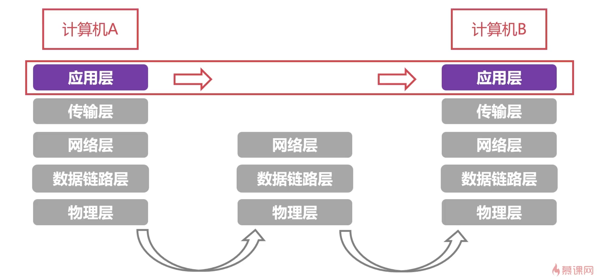

[TOC]

## 应用层

### 概述

| 常用服务  | 协议 | 端口号 |
| --------- | ---- | ------ |
| IMAP      | TCP  | 143    |
| SMTP      | TCP  | 25     |
| Telnet    | TCP  | 23     |
| SSH       | TCP  | 22     |
| HTTP      | TCP  | 80     |
| HTTPS     | TCP  | 443    |
| FTP(控制) | TCP  | 21     |
| FTP(数据) | TCP  | 20     |

> 应用层是面向传输层编程 (TCP/UDP), 定义应用间通信的规则

基础知识:

DNS 服务器(应用层): 主机的本地域名解析服务器, 代理本机的域名解析,从根域名服务器逐级向下查到解析纪录,然后返回给主机

DHCP服务器(应用层): 动态分配IP,网关和DNS配置, 客户端发送[FFF:000]的UDP广播消息,DHCP服务端回应数据报并分配相应配置

子网(网络层): IP分为网络号和主机号,网络号相同的子网下的主机可以进行TCP/IP通信,网络号不相同的消息会直接丢弃

子网掩码(网络层): (subnet mask),将某个IP地址划分成网络地址和主机地址两部分,将一个网络分成**相互隔离**的子网

网关(Gateway)(网络层):  网关的IP地址是具有路由功能的设备的IP地址,用来连接不同子网的主机

### DNS协议

定义: Domain Name Service 域名系统, 域是指网络,名是名字; 将域名和IP地址相互映射的一个分布式数据库, 提供域名和IP的互查

域名: 根域名(cn) > 顶级域名(llqhz) > 二级域名(www)

域名服务器: 根域名服务器(管理根域名->ip映射: com:xxx) -> 顶级域名服务器(管理顶级域名的ip映射)

#### 域名解析过程

1. 主机先向本地域名服务器进行递归查询
2. 本地域名服务器采用迭代查询，从根域名服务器逐级向下查询,并把最后结果高速本机

### DHCP协议

定义: Dynamic Host Configuration Protocol(动态主机配置协议), 集中的管理、分配IP地址，使网络环境中的主机动态的获得IP地址、Gateway地址、DNS服务器地址等信息，并能够提升地址的使用率

### HTTP协议 (HTTP2)

定义:

web服务器:

请求和响应报文格式

请求状态码

Web缓存

正向代理/反向代理

### HTTPS协议

HTTP是明文传输的

对称加密/非对称加密

非对称加密原理: 

原内容: 20 25 30 35 40

秘钥A: 45

A加密: (100 - X - M)  (100-20-45=35)  (100-25-45=30)     => 35 30 25 20 15

秘钥B: 55  (Ma + Mb = 100)

B解密: (100 - X - M = Mb - X) => Y  =>  (Mb - Y = X)   (55-35=20) (55-30=25)  => 20 25 30 35 40

数字证书

SSL

HTTPS过程

### 实践

网卡工作模式

混杂模式: 接受所有到达网卡的数据,无论是否属于本机

非混杂模式: 网卡仅接收属于本机的数据

字节序:

255 = 00000000 11111111

大端字节序: 00000000 11111111

小端字节序: 11111111 00000000 
(将后面一个字节放到前面, 计算机以小端字节序进行运算处理的时候效率高一些,但是返回的时候,转化为大端字节序返回)

