[TOC]

# 计算机网络

## 概述

### 定义

计算机网络主要由一些通用的、可编程的硬件互连而成，通过这些硬件，可以传送不同类型的数据，并且可以支持广泛和日益增长的应用。硬件+信息通信

分类

作用范围:  

1. **广域网(WAN)** 
2. **城域网(MAN)**  
3. **局域网(LAN)**

使用者: 

1. **公用网络**  
2. **专用网络**

内容

概述 -> 物理层 -> 数据链路层

### 发展简史

### 层次结构

分层意义: 将信息交换问题分解到一系列容易控制的软硬件模块层中，而各层可以根据需要独立进行修改或扩充功能

作用: 简化网络传输,不同层次解耦,同时易于扩展

### 基本原则

1. 各层独立 ()
2. 各层灵活 ()
3. 各层解耦 ()

### OSI七层模型


OSI未推行的原因:

1. 模型设计不完全合理,功能在多层中重复
2. OSI标准指定周期长,延后于市场

###  TCP/IP四层模型


## 网络拓扑(构成)

## 网络性能指标

时延:

1. 发送 (数据先全部写入网卡,再由网卡发送, 从写网卡到网卡发出,速率会受网卡发送速率影响,叫发送时延)
2. 传播 (传播路径/传播速率, 传播速率由传输介质决定)
3. 排队 (数据包在网络设备(路由器)中排队等待被处理, 由路由器决定)
4. 处理 (到达目的地机器后,目的机器中被接受处理时间)

> 总时延 = 发送时延 + 传播时延 + 排队时延 + 处理时延

RTT: 端到端通信来回一次所花费的时间 (Route-Trip-Time)  ping

## 物理层

### 概述

#### 作用: 

连接不同的物理设备,传输比特流

#### 示例:

示例: 普通网线, 同轴电缆, 光纤, 无线,  关注机械特性,光学特性,电气学特性

#### 设备:

不理解帧、分组和头的概念，只理解电压值; 将信号放大，使信号能传的更远

* 中继器 负责在两个节点的物理层上按位传递信息,完成信号的复制、放大功能,以此来延长网络的长度
* 集线器 多端口的**中继器**, 实现多台计算机之间的互联

### 信道:

#### 信道定义:

向一个方向传递信息的媒体, 双向通信需要包含接收信道和发送信道

#### 信道类型:

1. 单工信道
2. 半双工信道
3. 全双工信道

#### 信道复用:

多机共享一个线路进行通信,提升信道的利用效率

1. 频分复用
2. 时分复用
3. 波分复用
4. 码分复用

## 数据链路层

### 概述

#### 定义

帧是数据链路层传输数据的基本单位, 发送端在数据两端插入标记位,封装成帧

#### 作用

1. 封装成帧 (加入起始结束标记位,封装成帧)

2. 透明传输 (数据中的标记位需要转义处理,对上层透明)

3. 差错检测 (校验数据出错,出错则直接丢弃,由上层决定是否重传)

   奇偶校验码: 

   循环冗余校验码(CRC): 

#### 示例:

主要有网卡(网络适配器)、网桥和交换机; 使相邻的两个设备可以通信,用来接收帧、寻找通向目的地址的端口、发送帧

能分辨出帧中的源MAC地址和目的MAC地址，可以在任意两个相邻端口间建立临时交换路径**转发数据帧**

#### 最大传输单元

最大传输单元(MTU): Maxinum Transmission Unit, 规定了数据帧的最大数据长度,数据帧一般1500Byte, 太大太小都会影响数据传输速率

路径MTU, 木桶短板效应, 两端传输的最大MTU由链路中最小的MTU决定

### 以太网协议(Ethernet,数据链路层)

#### 定义:

以太网协议是一种应用于数据链路层的协议,用来完成相邻设备的数据帧传输

#### 示例:

MAC地址:(物理设备的硬件地址,身份证) ether 08:00:27:9e:e5:28


#### MAC地址表:

MAC到硬件接口的映射, 在以太网协议(Ethernet)中,用来寻找目的地址的端口,发送数据帧

## 网络层

### 概述

#### 定义:

让源端的数据能够以最佳路径透明地通过通信子网中的多个转接节点到达目的端

#### 作用:

具体功能包括: 分组分片与重组,寻址和路由选择, 流量和拥塞控制,  IP分配,子网划分和管理

示例: 路由器

### 虚拟互联网络

定义: 虚拟互连网络的意思就是互连起来的各种物理网络的异构性本来是客观存在的，但是我们利用IP协议就可以把这些性能各异的网络**在网络层看起来好像是一个统一的网络**。这种使用IP协议的虚拟互连网络可简称为IP网

IP协议解决了在虚拟网络中数据报传输路径的问题

### IP协议

#### 概述

##### 种类和用途

IP用途：标记某个主机所在的位置
种  类：分类编址（早期设计，存在缺陷）和无分类编址（用来代替分类编制）

##### 表示方法


IP地址: 192.128.1.1  => 点分十进制

IP协议:


```sh
版本: ip协议的版本, ipv4/ipv6, 4字节
首部长度: ip首部的长度 多少行(32bit)  最大15(行)x32=60Byte
服务类型(区分服务):xxx
总长度: 该ip数据包的总长度, 最大2^16=65535bit, ip首部+ip数据
标志: 标记是否可以分片
片偏移: 如果传输时,允许分片,此处纪录数据的偏移
TTL(time to live): 数据报在网络中的寿命, 最大值:2^8-1=255, 限制ip报文在有限次传输之后到达目的地或者被丢弃
协议: 8bit,上层协议的类型,TCP,UDP...
首部校验和: 循环冗余校验,校验首部是否出错,出错则直接丢弃
源IP地址: 发送者IP地址(32bit)
目的IP地址: 目的地IP地址(32bit)
```

#### IP协议转发流程

MAC地址表 => 路由表

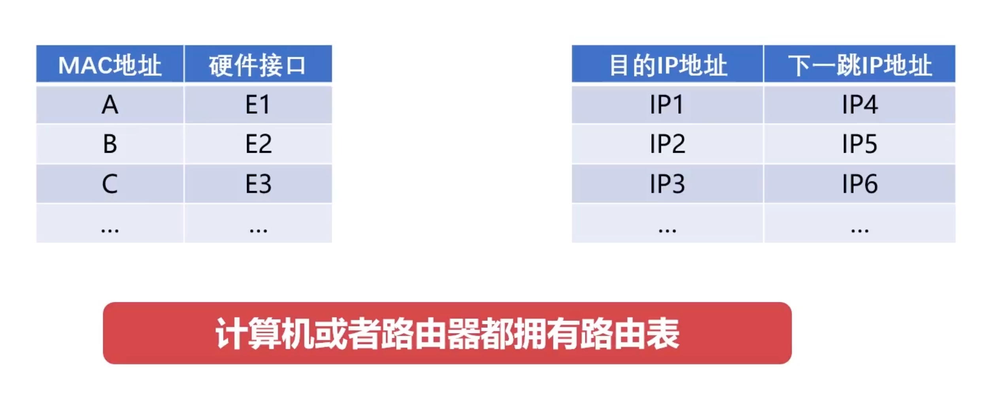

路由器中根据IP地址识别下一跳


```sh
A网卡: [MAC(A)+MAC(E) + IP(A)+IP(C)]   => 
E: [MAC(A)+MAC(E) + IP(A)+IP(C)]  =>  
		[IP(A)+IP(C)] (网络层) => 查路由表得F => [MAC(E)+MAC(F) + IP(A)+IP(C)] =>
F: [MAC(E)+MAC(F) + IP(A)+IP(C)]  =>  
		[IP(A)+IP(C)] (网络层) => 查路由表得B => [MAC(F)+MAC(B) + IP(A)+IP(C)] =>
B: [MAC(F)+MAC(B) + IP(A)+IP(C)] => [IP(A)+IP(C)](网络层) ~ B网卡
```

> 每一跳的MAC地址都在发生改变,IP地址不会变

### ARP协议与RARP协议

#### 概述

ARP(Address resolution Protocol) , 地址解析协议, 将网络层32位**IP地址**转换为数据链路层48位**MAC地址**


ARP缓存表,广播IP地址,只有是IP地址的才应答, 维护IP地址->MAC地址的映射,且定期更新


#### APR广播的数据报格式:


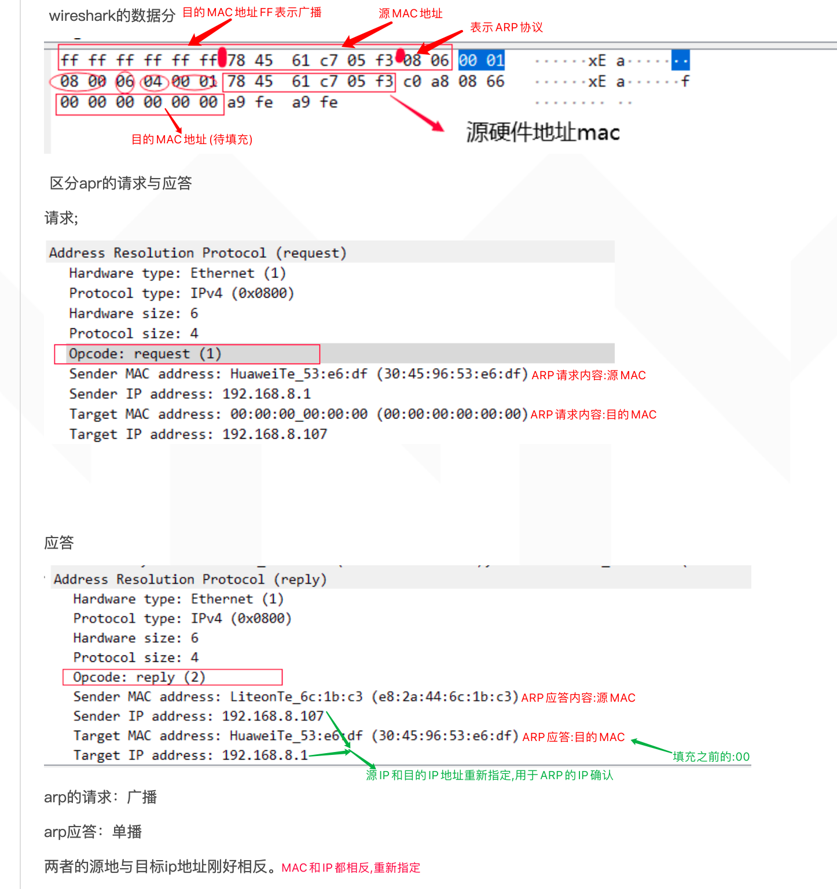

#### RARP协议

RARP：反向地址转换协议（RARP：Reverse Address Resolution Protocol） 反向地址解析协议（RARP）允许局域网的物理机器通过MAD地址从网关服务器的 ARP 表或者缓存上请求其 IP 地址。


### IP地址的子网划分

#### IP地址分类

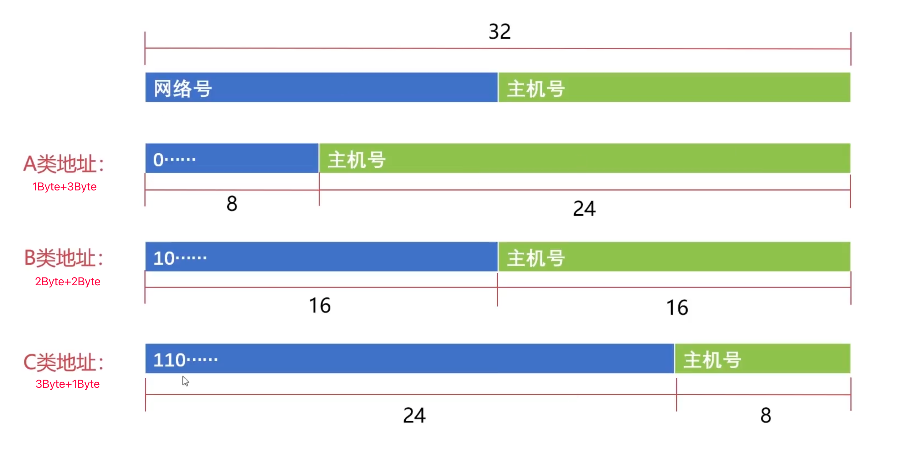

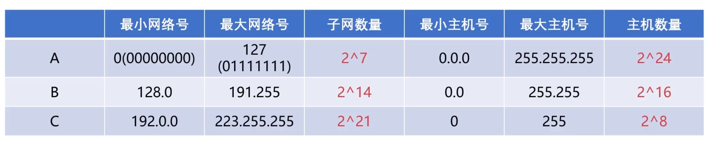

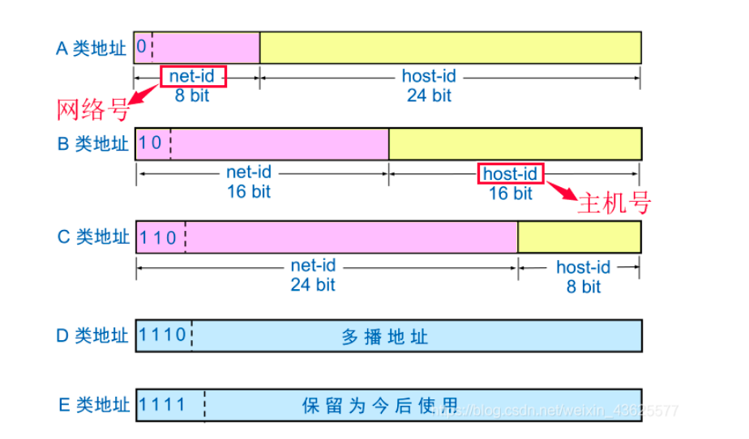

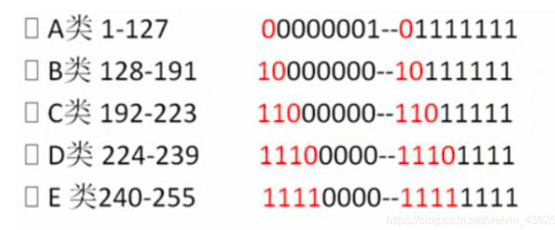

由上图可以看出IP地址由两部分组成，即网络地址和主机地址。网络地址表示其属于互联网的哪一个网络，主机地址表示其属于该网络中的哪一台主机。二者是主从关系。

特殊网络号(网络ID):

网络号后全0不能使用, 根据网络段首位由几个1来确定是几类地址

特殊主机号(主机ID):

1.  全0主机号: 表示当前整个网段,不能分配给特定主机
2. 全1(指bit位)主机号: 表示广播地址, 向当前网段的所有主机发消息

> 示例: 1.2.3.4 => 网段: 1.0.0.0   广播:1.255.255.255, 特殊主机号都不允许分配给具体主机

#### IP子网划分

##### 定义:

子网划分是通过借用IP地址的若干位主机地址来充当子网地址（从左面第一位不是网络号的位开始借，而且借位必须是连续的不能跳跃），从而将原网络划分为若干子网而实现的。划分子网时，随着子网地址借用主机位数的增多，子网的数目随之增加，而每个子网中的可用主机数逐渐减少。


##### 意义: 

> 节约IP地址，避免浪费。

IP地址由网络号和主机号组成, B类地址中,每个网络可连接的主机数高达65534, 一个网络一般不会有这么大,不会直接连接管理这么多主机,也不利于广播和传输管理, 所以需要**将一个网络划分为多个子网络**进行独立地管理; 这么多的主机在单一的网络下，地址空间在实际应用中利用率很低, 从而也节约了IP地址资源

##### 子网掩码

|         | 首部      | 地址范围              | 十进制范围 | 默认子网掩码  |
| ------- | --------- | --------------------- | ---------- | ------------- |
| A类地址 | 0xxx xxxx | 0000 0000 ~ 0111 1111 | 1~127      | 255.0.0.0     |
| B类地址 | 10xx xxxx | 1000 0000 ~ 1011 1111 | 128~191    | 255.255.0.0   |
| C类地址 | 110x xxxx | 1100 0000 ~ 1101 1111 | 192~223    | 255.255.255.0 |
| D类地址 | 1110 xxxx | 1110 0000 ~ 1110 1111 | 224~239    |               |
| E类地址 | 1111 xxxx | 1111 0000 ~ 1111 1111 | 240~255    |               |

通过定义和配置子网掩码, 从主机号借位来表示网络号,从而划分子网

将IP地址与子网掩码求AND逻辑运算,即可得该IP所属的网络号(即所属的子网)


#### 无分类地址CIDR

定义: CIDR主要是一个按位的、基于前缀的，用于解释IP地址的标准, 它通过把多个地址块组合到一个路由表表项而使得路由更加方便, 这些地址块叫做CIDR地址块

意义: 

1. 消除了ABC类地址和子网划分的概念
2. 路由表简化(聚合, 可以多级分配管理), 有效利用地址空间

IP地址={网络号+子网号+主机号}    => IP地址={网络前缀+主机号}

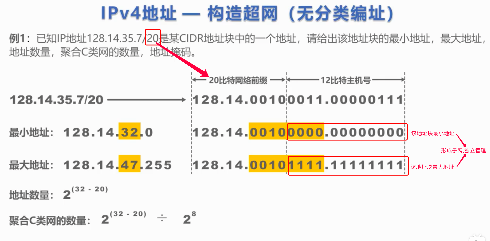

### 网络地址转换NAT技术

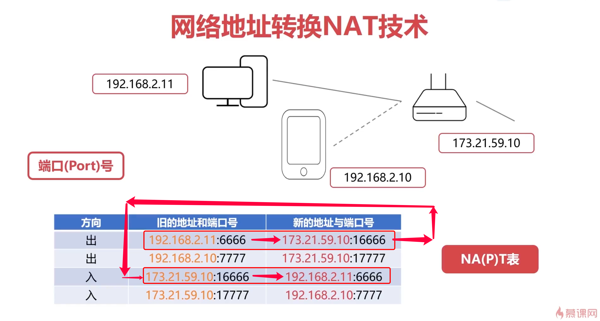


#### 简介

NAPT（Network Address Port Translation），即网络地址端口转换，可将多个内部地址映射为一个合法公网地址，但以不同的协议端口号与不同的内部地址相对应，也就是与之间的转换

> 由一个公网IP来对局域网的设备做代理,通过替换端口来识别映射不同的设备请求

#### 作用:

NAT不仅能解决IP地址不足的问题，而且还能够有效地避免来自网络外部的攻击，隐藏并保护网络内部的计算机。

### ICMP协议

#### 概述

##### 简介:

ICMP（Internet Control Message Protocol）Internet控制报文协议, 用于在IP主机、路由器之间传递控制消息。控制消息是指网络通不通、主机是否可达、路由是否可用等网络本身的消息。

##### 格式:

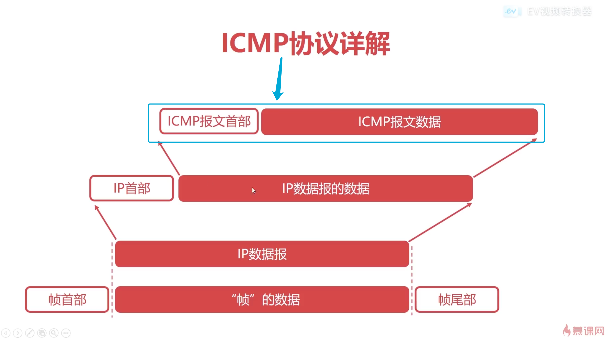


#### 应用

##### ping (ICMP询问报文)

ping  (发送ICMP协议报文, 询问报文)

Ping 本地 -> 网关 -> 外网

##### traceroute  (n*ttl -> ICMP差错报告报文[终点不可达])


tracepath github.com

通过不断增加TTL的值, 来获取应答报文,纪录其IP地址,从而描绘出访问路径

> arp -e 查看ARP映射表 (IP -> MAC)

### 网关协议

#### 内部网关协议RIP

##### 距离矢量算法

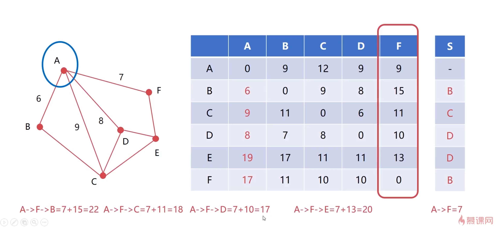

##### 描述:

它以网络中的每个路由器为索引，表中列出了当前已知的路由器到每个目标路由器的最佳距离

每个节点维护到其他节点的距离, 然后根据其他节点上的距离表,来算当前节点,通过其他节点到再下一跳节点的距离,如果小,则更新当前节点到下一跳的最佳路径为经过"其他节点"

##### 定义

RIP(Routing Information Protocol,路由信息协议）是一种分布式的基于距离向量的路由选择协议; RIP协议主要用于一个AS(自治系统)内的**路由信息的传递**，每30s发送一次路由信息更新。

##### RIP协议过程

1. 对当前路由表没有的结点, 直接插入到当前路由表, (更新距离和下一跳)
   

2. 对当前路由表已存在的结点, 如果下一跳为当前发来信息的路由,则以当前发来的信息为准,根据其信息替换 (更新距离和下一跳)
   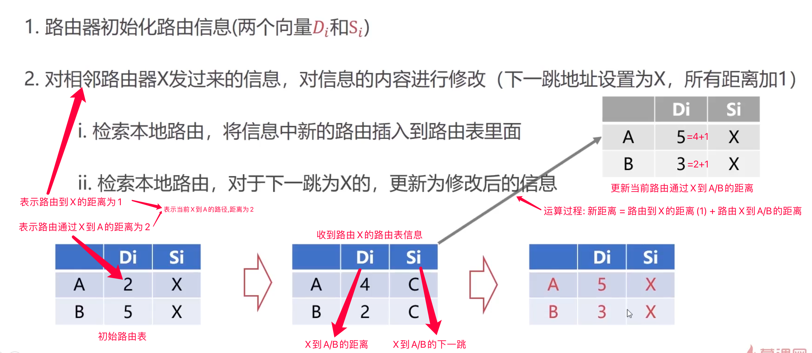

3. 对当前路由表已存在的结点, 如果下一跳不是当前发来信息的路由,则计算取最小距离来更新 (更新距离和下一跳) 即根据距离矢量算法更新
   
   

4. 如果3min未收到来自相邻路由结点的信息, 则把相邻路由设置为不可达(16跳)


##### RIP协议优缺点

优点: 实现简单,开销小

缺点: 

1. 随意相信相邻结点, 视野不够: 造成故障信息传递慢, 当一个结点故障后,需要连续通信至距离=16才会发现不可达

2. 限制了网络的规模,大于16跳就视为不可达,限制了网络结点跳数

#### 内部网关协议OSPF协议

##### **Dijkstra**算法

1. 初始化集合S, U, (S为顶点集合, U为其他点的集合)

2. 如果U不为空, 则对到A的距离进行排序,并取出距离A的最近的一个顶点D

   1. 将顶点D插入S集合,
   2. 更新通过D到达U集合所有顶点的距离, (如果距离小则更新)
   3. 重复2步骤

3. 直到U集合为空,算法完成


##### 描述

链路状态{LS}协议

向所有路由器发送消息

消息描述该路由器与相邻路由器的状态 (距离,时延,带宽)

只有链路状态发生变化时,才发送更新消息 (减少通信)

##### OSPF协议过程

定义:

OSPF(Open Shortest Path First开放式最短路径优先）是一个内部网关协议(Interior Gateway Protocol，简称IGP）， 统（autonomous system,AS）内决策路由, 用来在一个网络系统内找到通信的最优路由路径。 所有的OSPF路由器都维护一个相同的描述这个AS结构的数据库, 存放的是路由域中相应链路的状态信息, 计算出其OSPF路由表, 从而在网络传输中路由到最佳路径

具体步骤:

OSPF的简单说就是两个相邻的路由器通过发报文的形式成为邻居关系，邻居再相互发送链路状态信息形成邻接关系，之后各自根据最短路径算法算出路由，放在OSPF路由表，OSPF路由与其他路由比较后优的加入全局路由表。整个过程使用了五种报文、三个阶段、四张表。

区别:

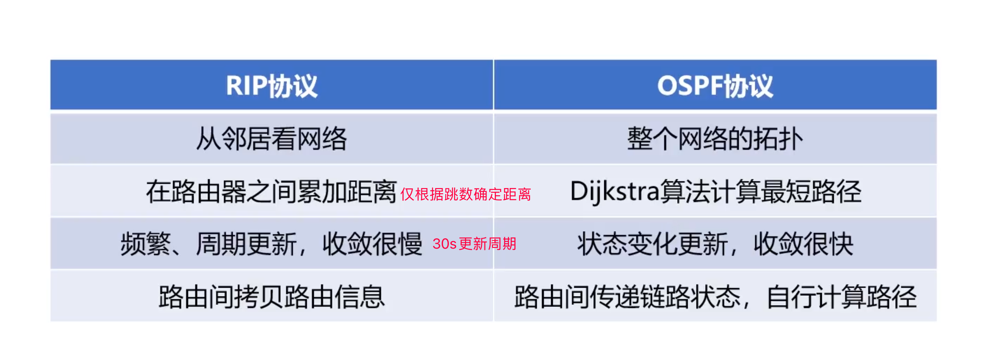

边际网关协议 ~ BGP协议

定义: 

BGP(Border Gateway Protocol: 边际网关协议) , 是运行在AS之间的一种协议,  屏蔽AS内部不同的内部路由协议, 通过BGP发言人交流信息, 可人为配置策略, 能够找到一条到达目的比较好的路由

## 传输层

### UDP协议

定义:

UDP 是User Datagram Protocol的简称， 中文名是用户数据报协议, 一种无连接的传输层协议，提供面向事务的简单不可靠信息传送服务


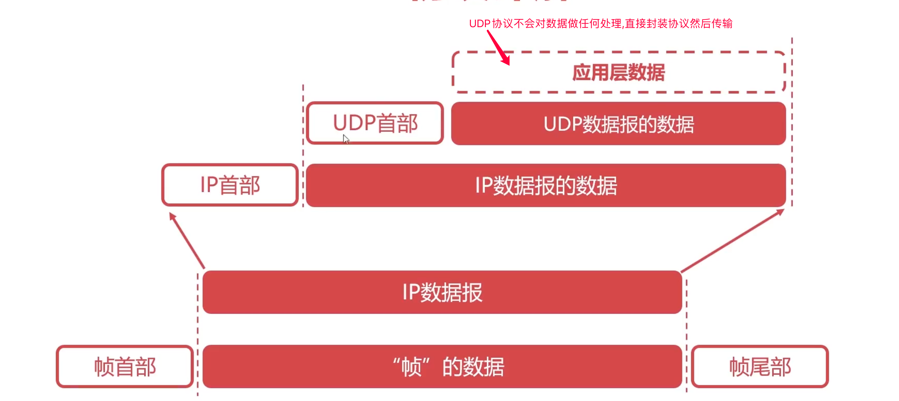

特点:

1. 无连接
2. 不可靠
3. 面向报文
4. 没有拥塞控制
5. 首部开销小

### TCP协议

定义:

传输控制协议（TCP，Transmission Control Protocol）是一种面向连接的、可靠的、基于字节流的传输层通信协议, 提供全双工通信

按字节为基本单位进行拆分合并发送

TCP首部:

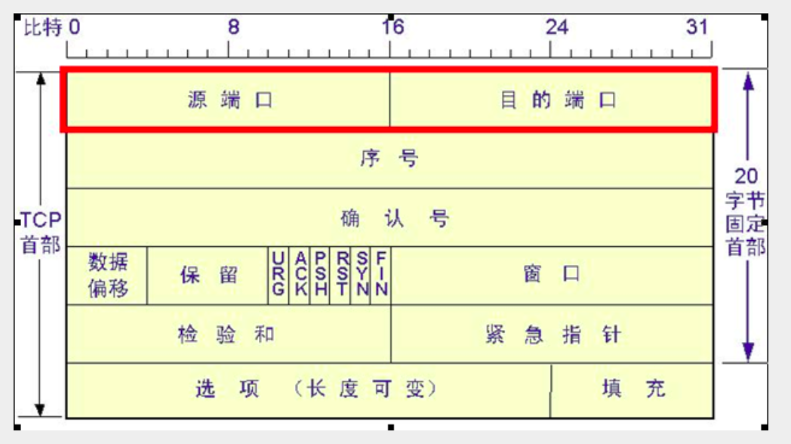

#### 可靠传输

##### 停止等待协议

定义:

依次发送数据,逐个确认数据接收,等待接收到确认后才开始传输下一个数据,如果出错则立即重传,有超时定时器

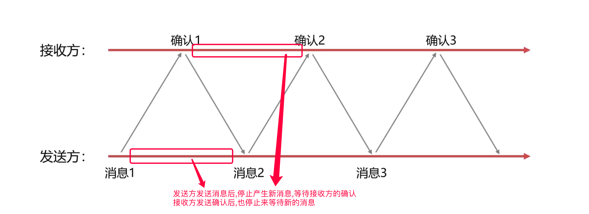

发送消息未被接受, 确认消息未收到,确认消息很晚后又到达 -> 超时重传  (超时定时器)

最简单的可靠传输协议, 对信道的利用效率不高

##### 连续ARQ协议

定义:

自动重传请求（Automatic Repeat-reQuest，ARQ）, 连续ARQ（Automatic Repeat reQuest）协议, 维持着一个一定大小的发送窗口, 连续发送和积累确认, 当发生错误时, 接收方只对前N个正常的分组做出确认, 发送方重发出错位置后的所有分组

过程:

1. 滑动窗口 (以字节为单位,每小格代表每个字节)
2. 累积确认


##### TCP协议可靠传输

基于连续ARQ协议

滑动窗口小格以字节为单位, TCP一次可以传输1000+个字节, 对数据整体进行编号, 如果某次丢失,则代表此次TCP整个报文丢失, 则重传需要指定丢失的TCP字节编号范围

##### TCP协议流量控制

流量控制是指让发送方的发送速率不要太快, 基于滑动窗口来实现, 考虑到接收方的处理信息速率

坚持定时器⏲, 当接受到窗口为0的报文时,启动坚持定时器,且定时发送窗口探测报文,回应重发窗口大小调整报文

##### TCP协议拥塞控制

拥塞控制是指整个网络的流量阻塞, 从自身发到网络中的角度来考虑的, 一般是指超过了网络中的硬件传输的速率

报文超时则认为时发生了拥塞

拥塞控制算法: 

1. 慢启动算法, 由小到大,指数级增长: 1 2 4 8 16 ..., 慢启动阈值
2. 拥塞避免算法, 维护一个拥塞窗口变量,只要网络不拥塞,就试探着拥塞窗口调大


 指发送方每次向网络中发送多少数据, 根据是否超时来判断是否拥塞, 逐渐增加,找到最大值,尽量发送大的数据

##### TCP连接的建立

