[TOC]

# MySQL面试指南

## MySQL版本

### mysql版本的选择

##### MySQL发行版(版本选型)

1. MySQL官方版本: 社区版 + 企业版
2. Percona MySQL, 增加了社区版的**功能**
3. MariaDB, 基于原官方mysql版本开发, 广泛, **开源**(建议)

|                | MySQL                                 | Percona MySQL                         | MariaDB                                 |
| -------------- | ------------------------------------- | ------------------------------------- | --------------------------------------- |
| 服务器特性     | 开源                                  | 开源                                  | 开源                                    |
|                | 支持分区表                            | 支持分区表                            | 支持分区表                              |
|                | InnoDB                                | XtraDB                                | XtraDB                                  |
| 企业版监控工具 | 社区版不提供                          | Percon Monitor 工具                   | Monyog                                  |
| 高可用特性     | 基于日志点复制                        | 基于日志点复制                        | 基于日志点复制                          |
|                | 基于 Gtid 复制                        | 基于 Gtid 复制                        | 基于 Gtid 复制，但 Gtid 同 MySQL 不兼容 |
|                | MGR                                   | MGR & PXC                             | Galera Cluster                          |
|                | MySQL Router                          | Proxy SQL                             | MaxScale                                |
| 安全特性       | 企业级防火墙                          | ProxySQL FireWall                     | MaxScale FireWall                       |
|                | 企业版用户审计                        | 审计日志                              | 审计日志                                |
|                | **用户密码生命周期**                  | 用户密码生命周期                      |                                         |
|                | sha256_password, caching_sha_password | sha256_password,caching_sha_pass_word | ed25519                                 |
| 开发及管理     | 窗口函数(8.0)                         | 窗口函数(8.0)                         | 窗口函数(10.2)                          |
|                | -                                     | -                                     | **支持基于日志回滚**                    |
|                | -                                     | -                                     | 支持记在表中记录修改                    |
|                | Super read_only                       | Super read_only                       |                                         |

>  5.7.18-txsql, TXSQL是腾讯云数据库团队维护的MySQL内核分支, 增加了企业版的功能,对集群做优化

##### MySQL版本升级

对于主从模式, 数据流向时主->从, 所以需要先到"从结点"开始更新

益处: 是否解决业务上的问题, 主从复制延时,基于json的键来判断修改同步

风险: 可能带来的影响, 上下游, 客户端链接驱动, 新版本默认值,性能(查询语句索引解析规则变化)

方案: 步骤, 注意点:先从后主, 测试和验证

    1. 备份slaver
       2. 先升级slaver, 编译安装新版本,执行upgrade更新系统表, 或者 恢复备份再启动新版本mysql(安全)
       3. 主从切换, 将新slaver设置为master,再升级其他机器, 然后检查

后期: 回滚,监控, 回滚业务检查

##### mysql启动

```sh
/usr/sbin/mysqld --daemonize --pid-file=/var/run/mysqld/mysqld.pid
```


### MySQL版本8.0新特性

原数据使用Innodb存储,无frm

支持定义资源管理组, 将资源管理组绑定到线程ID

支持降序索引,支持直方图(根据直方图判断数据分布,来优化查询)

支持窗口函数, 支持在线修改全局参数持久化


密码认证插件更新, 不同用户的密码hash不一样, 支持角色授权, 密码周期限制

Innodb更新: DDL原子操作, 增加视图用于监控

## 用户管理

### MySQL用户授权管理

#### 定义账号

用户名@地址

地址: %, 192.168.1.%, localhost, **精确地址的权限规则优先**

grant建立用户,   create user建立用户

#### 权限种类

|              | 语句                                                  | 说明             |
| ------------ | ----------------------------------------------------- | ---------------- |
| Admin        | Create User / Grant Option                            | 建立新用户和授权 |
|              | Super                                                 | 管理服务器       |
| DDL (Define) | Create/Alter/Drop/Index                               | 开发             |
| DML (Manage) | select/insert/update/delete(要软删)/execute(存储过程) | 程序             |

#### 权限范围

db / table

#### 如何授权

最小权限原则

grant select,update on db.table to user@ip;

revoke select,update on db.table to user@ip;

### 数据库账号安全

#### 数据库用户管理流程规范

1. 最小权限原则, 禁用外网访问,授权精确ip, ssl

2. 密码强度策略: 密码中特殊字符+长度
3. 密码过期+从配置中心自动获取

#### 密码管理策略

### 数据库账号在实例间迁移

1. 备份到新机器恢复
2. 使用工具导出授权语句再新机器上执行

## 服务器配置

### sql_mode作用

| 值                           | 作用                                                         |      |
| ---------------------------- | ------------------------------------------------------------ | ---- |
| ONLY_FULL_GROUP_BY           | 严格检查GROUP BY聚合                                         |      |
| ANSI_QUOTES                  | 禁止双引号表示字符串, (ANSI标准)                             |      |
| REAL_AS_FLOAT                | real类型表示float类型,(默认是double,ANSI标准)                |      |
| PIPES_AS_CONCAT              | 将"\|\|"视为字符串的连接操作符而非或逻辑运算符, (ANSI标准)   |      |
| ANSI                         | 宽松模式 (ANSI标准),  校验弱, warning                        |      |
| TRADITIONAL                  | 传统模式                                                     |      |
| STRICT_TRANS_TABLES          | 事务引擎表上启用严格模式                                     |      |
| STRICT_TRANS_TABLES          | 所有表上启用严格模式, 'error'   (插入值非法)                 |      |
| NO_ZERO_DATE/NO_ZERO_IN_DATE | 严格模式下，不允许整个日期为0, 或者日期中的"月"/"日"部分为0  |      |
| ERROR_FOR_DIVISION_BY_ZERO   | 数据被零除，会产生警告                                       |      |
| NO_AUTO_CREATE_USER          | 禁止GRANT自动创建用户                                        |      |
| NO_ENGINE_SUBSTITUTION       | 存储引擎被禁用或未编译，那么抛出错误, 而不是使用默认引擎替代 |      |

```sql
mysql> select @@sql_mode\G
*************************** 1. row ***************************
@@sql_mode: ONLY_FULL_GROUP_BY,STRICT_TRANS_TABLES,NO_ZERO_IN_DATE,NO_ZERO_DATE,ERROR_FOR_DIVISION_BY_ZERO,NO_AUTO_CREATE_USER,NO_ENGINE_SUBSTITUTION
```

### 比较运行时配置和静态文件配置一致

配置分类: 

1. 只读配置

2. 动态配置: set 配置: set session/global xxx=xxx   (persist[持久化])

pt-config-diff工具对比

### 性能关键配置

#### 服务器配置参数

| 参数                 | 说明                                  | 备注                                                         |
| -------------------- | ------------------------------------- | ------------------------------------------------------------ |
| max_connect          | 允许最大连接数                        | 需要mysql线程维护处理                                        |
| interactive_timeout  | 交互连接的MySQL超时时间               |                                                              |
| wait_timeout         | 非交互连接的MySQL超时时间             | 会占用连接数                                                 |
| max_allowed_packet   | MySQL数据包大小限制                   | 主从架构的配置需要保持一致                                   |
| sync_binlog          | 多少次缓冲才会向磁盘写一次binlog      | 主从架构的Master设为1,保证写操作binlog不丢失                 |
| sort_buffer_size     | 每个session排序的缓冲区大小           | 每个连接的缓冲区大小,不宜过大                                |
| join_buffer_size     | 每个session的每个表join的缓冲区大小   | 每个连接的每个表的join缓冲大小, 不宜过大                     |
| read_buffer_size     | 每个session的MyIsam读缓冲池大小       | 临时表也是MyIsam引擎                                         |
| read_rnd_buffer_size | 每个session的索引表缓冲               | 索引表缓冲                                                   |
| binlog_cache_size    | 每个session的用于未提交事务缓冲的大小 | 设置过小会出现写磁盘的情况(status: {Binlog_cache_use,Binlog_cache_disk_use}) |

#### 存储引擎配置参数

| 参数                           | 说明                                                 | 备注                                                         |
| ------------------------------ | ---------------------------------------------------- | ------------------------------------------------------------ |
| innodb_flush_log_at_trx_commit | 事务提交后, redo_log的buffer写盘策略, 0不安全, 2安全 | 0: 由 InnoDB 的主线程每秒一次buffer强制刷盘<br>1: 提交事务时强制fsync()刷盘,成功时必然刷盘了<br>2: 提交事务时写入操作系统缓冲 |
| sync_binlog                    | 二进制日志写入磁盘的策略                             | 0: 事务提交后将binlog从缓冲写入操作系统缓冲<br>1: 事务提交后将binlog强制刷盘<br>N: 每N次事务执行一次强制刷盘 |
| innodb_buffer_pool_size        | Innodb总缓冲池内存大小(**建议>75%**Mem)              | 缓存索引和数据,表结构,延迟刷盘                               |
| innodb_buffer_pool_instances   | Innodb缓冲池实例个数                                 | 减少资源锁范围                                               |
| innodb_file_per_table          | 为每个表设置单独的表空间                             | 默认启用                                                     |

> 说明: binlog_buffer在内存中, 提交事务时需要确保真正写入到磁盘上, 写入磁盘文件通常有2步, 先 

#### 相关概念

##### innodb事务执行步骤

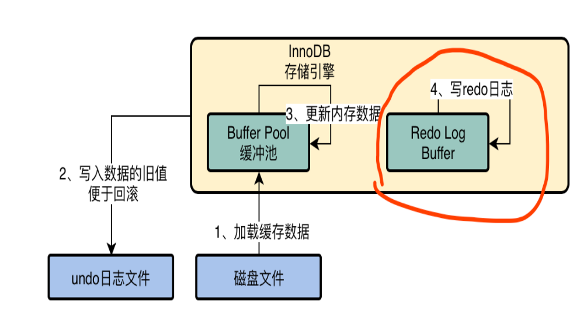

##### 操作系统文件的延迟写

UNIX内核中有缓冲区和输出队列, 当写文件时,先写入缓冲区,缓冲区满后再进入输出队列进行实际的I/O操作, 这种输出方式被称为**延迟写**

对于提供事务支持的数据库，在事务提交时，都要确保事务日志（包含该事务所有的修改操作以及一个提交记录）完全写到硬盘上，才认定事务提交成功并返回给应用层。

解决: UNIX系统提供了sync、fsync和fdatasync三个函数, 

1. sync函数将所有缓冲区全部入队输出队列
2. fsync通过文件描述符将单个文件IO写盘, 包括数据和文件属性
3. fdatasync函数类似于fsync, 但只写文件的数据部分

## 日志

### 日志类型

1. 错误日志(error log)：记录mysql服务的启停时正确和错误的信息，还记录启动、停止、运行过程中的错误信息。
2. 查询日志(general log)：记录建立的客户端连接和所有执行的语句。
3. 二进制日志(bin log)：记录所有更改数据的语句，可用于数据复制。
4. 慢查询日志(slow log)：记录所有执行时间超过long_query_time的所有查询或不使用索引的查询。
5. 中继日志(relay log)：主从复制时使用的日志,从结点在主节点上获取到的日志

```sql
+---------------+-------+
| Variable_name | Value |
+---------------+-------+
| log_output    | FILE  |
+---------------+-------+
# log_output: FILE / TABLE / NONE
```

### 错误日志(error_log)

#### 错误日志配置

```sql
mysql> show variables like 'log_error%';
+---------------------+--------------------------+
| Variable_name       | Value                    |
+---------------------+--------------------------+
| log_error           | /var/log/mysql/error.log |
| log_error_verbosity | 3                        |
+---------------------+--------------------------+
# 1:error,  2:error+warning,  3:error+warning+notice
```

#### 错误日志文件结构

```sh
cat /var/log/mysql/error.log
2021-08-30T07:23:11.958448Z 0 [Note] Server hostname (bind-address): '0.0.0.0'; port: 3306
```

#### 错误日志作用

纪录服务器启动及异常信息

### 常规日志(general_log)

#### 常规日志配置

```sh
mysql> show variables like 'general_log%';
+------------------+------------------------------+
| Variable_name    | Value                        |
+------------------+------------------------------+
| general_log      | OFF                           |
| general_log_file | /var/lib/mysql/homestead.log |
+------------------+------------------------------+
```

#### 常规日志数据表结构

```sh
mysql> show create table mysql.general_log\G
*************************** 1. row ***************************
       Table: general_log
Create Table: CREATE TABLE `general_log` (
  `event_time` timestamp(6) NOT NULL DEFAULT CURRENT_TIMESTAMP(6) ON UPDATE CURRENT_TIMESTAMP(6),
  `user_host` mediumtext NOT NULL,
  `thread_id` bigint(21) unsigned NOT NULL,
  `server_id` int(10) unsigned NOT NULL,
  `command_type` varchar(64) NOT NULL,
  `argument` mediumblob NOT NULL
) ENGINE=CSV DEFAULT CHARSET=utf8 COMMENT='General log'
```

#### 常规日志数据文件结构

```sh
cat /var/lib/mysql/homestead.log
ime                 Id Command    Argument
2021-08-30T08:58:23.919470Z	    2 Query	show databases
2021-08-30T09:32:52.148287Z	    2 Query	select * from student limit 3
```

#### 常规日志作用

纪录客户端连接后的所有操作语句, 调试定位时开启, 会产生很大文件

### 慢查询日志(slow_query_log)

#### 慢查询日志配置

```sh
# 日志开关
mysql> show variables like 'slow_query_log%';
+---------------------+-----------------------------------+
| Variable_name       | Value                             |
+---------------------+-----------------------------------+
| slow_query_log      | OFF                               |
| slow_query_log_file | /var/lib/mysql/homestead-slow.log |
+---------------------+-----------------------------------+
```

```sh
# 日志策略
mysql> show variables like '%g_quer%';
+-------------------------------+-----------+
| Variable_name                 | Value     |
+-------------------------------+-----------+
| log_queries_not_using_indexes | OFF       |  (根据是否使用索引来纪录)
| long_query_time               | 10.000000 |  (根据查询时长来纪录, 单位:秒)
+-------------------------------+-----------+

mysql> show variables like '%log_slow_admin%';
+---------------------------+-------+
| Variable_name             | Value |
+---------------------------+-------+
| log_slow_admin_statements | OFF   |  (是否纪录DML语句)
+---------------------------+-------+
```

#### 慢查询日志文件结构

```sh
# Time: 2021-08-30T10:12:26.056611Z
# User@Host: root[root] @ localhost []  Id:     3
# Query_time: 0.000966  Lock_time: 0.000582 Rows_sent: 1  Rows_examined: 1
SET timestamp=1630318346;
select * from student limit 1;

# Time: 2021-08-30T10:22:55.067765Z
# User@Host: root[root] @ localhost []  Id:     3
# Query_time: 0.003688  Lock_time: 0.000985 Rows_sent: 0  Rows_examined: 1
SET timestamp=1630318975;
update student set score = 65.2 where id = 1 limit 1;
```

#### 慢查询日志作用

执行成功时间慢的操作纪录(查询/修改), 定位慢查询

### 二进制日志(bin_log)

#### 二进制日志作用

1. 纪录了所有的**数据修改**操作: insert/update/delete
2. 基于时间点的备份和恢复和回滚
3. 主从复制

#### 二进制日志配置

```sh
vim /etc/mysql/mysql.conf.d/mysqld.cnf

log_bin                 = /var/log/mysql/mysql-bin.log
binlog_format           = ROW
binlog_row_image        = FULL
expire_logs_days        = 10
max_binlog_size   = 100M
#binlog_do_db           = include_database_name
#binlog_ignore_db       = include_database_name
```

binlog_format:  ROW(纪录行) / STATEMENT(语句) / MIXED(混合)

binlog_row_image: FULL(ROW的所有字段) / MINIMAL(ROW的修改的字段) / NOBLOB(除了blob的字段)

```sh
mysql> show variables like '%bin%';
+--------------------------------------------+--------------------------------+
| Variable_name                              | Value                          |
+--------------------------------------------+--------------------------------+
| log_bin                                    | ON                             | (二进制日志开关)
| log_bin_basename                           | /var/log/mysql/mysql-bin       |
| log_bin_index                              | /var/log/mysql/mysql-bin.index |
| binlog_format                              | MIXED                          | (二进制日志格式)
| binlog_row_image                           | FULL                           | (row格式具体字段内容)
| binlog_rows_query_log_events               | OFF                            | (row格式是否同时包含原生语句)
| max_binlog_size                            | 104857600                      |
+--------------------------------------------+--------------------------------+
```

| 字段名称         | 字段值    | 含义                   | 说明                            |
| ---------------- | --------- | ---------------------- | ------------------------------- |
| binlog_format    | ROW       | 纪录影响数据行具体内容 | 二进制日志文件格式              |
|                  | STATEMENT | 原生SQL语句            | 不安全, 不推荐                  |
|                  | MIXED     | 混合格式               |                                 |
| binlog_row_image | FULL      | 表定义的行的所有字段   | binlog为ROW格式时的数据字段内容 |
|                  | MINIMAL   | 仅纪录修改的字段       |                                 |
|                  | NOBLOB    | 除了blob格式的所有字段 |                                 |

##### 三种binlog格式的特点

1. statement: 记录的是数据库上执行的原生SQL语句,日志量少, 会同时纪录执行语句上下文;  函数、触发器等同步非完全一致
2. ROW：记录的是数据表的纪录修改生效行的具体内容, 日志量大; 同步一致性高
3. MIXED: 前两种模式的结合,分析sql, 优先statement格式, 同步可能不一致时,自动使用ROW格式

##### 主从复制配置

log_slave_updates: log_slave_updates参数用来控制结点是否把所有从其他结点同步过来的数据操作写入到自己的binlog, 多级主从复制需要开启, master -> slave -> sub_slave模型中, 控制master的修改能否递归传递到sub_slave

#### 二进制日志查看

##### statement格式

只纪录具体执行的原生sql语句

```sh
# binlog的row格式内容默认base64编码,配合-v可以解码; -vv可以显示列注释
mysqlbinlog --base64-output=decode-rows -vv mysql-bin.000017

BEGIN
/*!*/;
# at 312
#210831  2:12:34 server id 1  end_log_pos 442 CRC32 0x4de0581d 	Query	thread_id=2	exec_time=0	error_code=0
use `shell_learn`/*!*/;
SET TIMESTAMP=1630375954/*!*/;
update student set score=97 where id > 100
/*!*/;
# at 442
#210831  2:12:34 server id 1  end_log_pos 473 CRC32 0xd65f40e3 	Xid = 33
COMMIT/*!*/;
```

##### row格式

纪录影响的行的**全部字段**内容

```sh
# binlog的row格式内容默认base64编码,配合-v可以解码; -vv可以显示列注释
mysqlbinlog --base64-output=decode-rows -vv mysql-bin.000015

BEGIN
/*!*/;
# at 298
#210831  1:47:32 server id 1  end_log_pos 361 CRC32 0x696e3f07 	Table_map: `shell_learn`.`student` mapped to number 108
# at 361
#210831  1:47:32 server id 1  end_log_pos 441 CRC32 0x2a2deb84 	Update_rows: table id 108 flags: STMT_END_F
### UPDATE `shell_learn`.`student`
### WHERE
###   @1=129 /* LONGINT meta=0 nullable=0 is_null=0 */
###   @2='xiao_long' /* VARSTRING(60) meta=60 nullable=0 is_null=0 */
###   @3=99.00 /* DECIMAL(5,2) meta=1282 nullable=0 is_null=0 */
### SET
###   @1=129 /* LONGINT meta=0 nullable=0 is_null=0 */
###   @2='xiao_long' /* VARSTRING(60) meta=60 nullable=0 is_null=0 */
###   @3=100.00 /* DECIMAL(5,2) meta=1282 nullable=0 is_null=0 */
# at 441
#210831  1:47:32 server id 1  end_log_pos 472 CRC32 0xc3a2e0d4 	Xid = 12
COMMIT/*!*/;
```

##### row格式+minimal格式

纪录影响的行的**修改字段**内容, WHERE部分使用主键, SET部分只纪录修改的字段

```sh
mysql> update student set score=98 where id > 127;
Query OK, 3 rows affected (0.00 sec)
Rows matched: 3  Changed: 3  Warnings: 0

mysqlbinlog --base64-output=decode-rows -vv mysql-bin.000018
BEGIN
/*!*/;
# at 298
#210831  2:21:17 server id 1  end_log_pos 361 CRC32 0xf4b703bb 	Table_map: `shell_learn`.`student` mapped to number 108
# at 361
#210831  2:21:17 server id 1  end_log_pos 436 CRC32 0x89f4285b 	Update_rows: table id 108 flags: STMT_END_F
### UPDATE `shell_learn`.`student`
### WHERE
###   @1=128 /* LONGINT meta=0 nullable=0 is_null=0 */
### SET
###   @3=98.00 /* DECIMAL(5,2) meta=1282 nullable=0 is_null=0 */
### UPDATE `shell_learn`.`student`
### WHERE
###   @1=129 /* LONGINT meta=0 nullable=0 is_null=0 */
### SET
###   @3=98.00 /* DECIMAL(5,2) meta=1282 nullable=0 is_null=0 */
### UPDATE `shell_learn`.`student`
### WHERE
###   @1=130 /* LONGINT meta=0 nullable=0 is_null=0 */
### SET
###   @3=98.00 /* DECIMAL(5,2) meta=1282 nullable=0 is_null=0 */
# at 436
#210831  2:21:17 server id 1  end_log_pos 467 CRC32 0x5c1f5d4d 	Xid = 42
COMMIT/*!*/;
```

##### row格式+minimal格式+rows_query

在row格式下, 同时纪录原生的sql语句便于调试 (Rows_query)

```sh
mysql> update student set score=98.5 where id > 127;
Query OK, 3 rows affected (0.00 sec)
Rows matched: 3  Changed: 3  Warnings: 0

mysqlbinlog --base64-output=decode-rows -vv mysql-bin.000018
BEGIN
/*!*/;
# at 611
#210831  2:28:13 server id 1  end_log_pos 679 CRC32 0x7d8775f8 	Rows_query
# update student set score=98.5 where id > 127
# at 679
#210831  2:28:13 server id 1  end_log_pos 742 CRC32 0xb0e2f67a 	Table_map: `shell_learn`.`student` mapped to number 108
# at 742
#210831  2:28:13 server id 1  end_log_pos 817 CRC32 0x6d47c9f0 	Update_rows: table id 108 flags: STMT_END_F
### UPDATE `shell_learn`.`student`
### WHERE
###   @1=128 /* LONGINT meta=0 nullable=0 is_null=0 */
### SET
###   @3=98.50 /* DECIMAL(5,2) meta=1282 nullable=0 is_null=0 */
### UPDATE `shell_learn`.`student`
### WHERE
###   @1=129 /* LONGINT meta=0 nullable=0 is_null=0 */
### SET
###   @3=98.50 /* DECIMAL(5,2) meta=1282 nullable=0 is_null=0 */
### UPDATE `shell_learn`.`student`
### WHERE
###   @1=130 /* LONGINT meta=0 nullable=0 is_null=0 */
### SET
###   @3=98.50 /* DECIMAL(5,2) meta=1282 nullable=0 is_null=0 */
# at 817
#210831  2:28:13 server id 1  end_log_pos 848 CRC32 0x82d98c93 	Xid = 46
COMMIT/*!*/;
```

#### 二进制日志清理

三种方式

1. config: expire_logs_days        = 10
2. command: purge binary logs to 'mysql-bin.010'; // 清除010以前的日志 (001~009)
3. command: purge binary before '2021-08-31 18:00:00'; // 清除此时间点以前的日志

### 中继日志(relay_log)

#### 中继日志(relay_log)

##### 配置

```sh
relay_log         =  /var/log/mysql/mysql-relay-bin.log   # relay_log位置
relay_log_purge   = ON   # 自动清理
```

##### 作用

主从复制的从结点从主节点获取bin日志时,先临时保存的地方

### 日志审计(监控)

## 存储引擎

### 存储引擎种类

> 插件式的存储引擎, 可以自己开发实现扩展

| 名称    | 简介                                  | 适用场景               |
| ------- | ------------------------------------- | ---------------------- |
| MyISAM  | 不支持事务,外键, 表级锁, **全文索引** | 适合查询多写少, 无事务 |
| InnoDB  | 支持事务,行锁,外键                    | 行锁,事务场景          |
| MEMORY  | Hash索引,存储在内存,用于临时表        |                        |
| CSV     | CSV格式文件                           |                        |
| ARCHIVE | 只查询和新增,不能修改,非事务          |                        |

#### MyISAM存储引擎

##### 特点

1. 不支持事务、外键,  查询快(减少二次索引查询)
2. 表级锁: 写操作代价大, 读写 - 写写互斥
3. 索引多, Btree,空间及**全文索引**

##### 结构

```sh
.frm   ------- Frame, 存储表定义
.MYD  -------- MYData，存储数据
.MYI   -------- MYIndex，存储索引

user_myisam.frm
user_myisam.MYD
user_myisam.MYI
```

##### 操作

###### 修复表数据

MySQL表损坏一般是数据损坏，引起损坏的原因可能是由于磁盘损坏、系统崩溃或者MySQL服务器被崩溃等外部原因。例如有人使用`kill -9`终止进程，导致MySQL进程未能正常关闭，那么就很有可能导致数据损坏。此时需要修复表(repair)

```sh
mysql> check table user_myisam;
+-------------------------+-------+----------+----------+
| Table                   | Op    | Msg_type | Msg_text |
+-------------------------+-------+----------+----------+
| shell_learn.user_myisam | check | status   | OK       |
+-------------------------+-------+----------+----------+

mysql> repair table user_myisam;
+-------------------------+--------+----------+----------+
| Table                   | Op     | Msg_type | Msg_text |
+-------------------------+--------+----------+----------+
| shell_learn.user_myisam | repair | status   | OK       |
+-------------------------+--------+----------+----------+
```

###### 回收闲置的磁盘空间

optimize table用于回收闲置的数据库空间，当表上的数据行被删除时，所占据的磁盘空间并没有立即被回收，使用了optimize table命令后这些空间将被回收，并且对磁盘上的数据行进行重排

```sh
mysql> optimize table user_myisam;
+-------------------------+----------+----------+----------+
| Table                   | Op       | Msg_type | Msg_text |
+-------------------------+----------+----------+----------+
| shell_learn.user_myisam | optimize | status   | OK       |
+-------------------------+----------+----------+----------+
```

###### 表压缩

对于趋于稳定的表可以执行压缩

```sh
# data_dir
myisampack -b user_myisam

Compressing user_myisam.MYD: (0 records)
- Calculating statistics
- Compressing file
Empty file saved in compressed format
Remember to run myisamchk -rq on compressed tables

ls -l user_myisam*
user_myisam.frm
user_myisam.MYD
user_myisam.MYI
user_myisam.OLD  (备份文件)
```

#### CSV存储引擎

##### 特点:  

- csv格式存储, 非事务, 不支持索引, 列不能为null

Insert into user_csv values (1, 'aa', 'bb'), (2, 'cc', 'dd');

##### 结构:

```sh
user_csv.CSM
user_csv.CSV
user_csv.frm

cat user_csv.CSV
1,"aa","bb"
2,"cc","dd"
```

##### 可以外部修改数据:

```sh
echo '3,"ee","ff"' >> user_csv.CSV

mysql> flush tables;
mysql> select * from user_csv;
+----+----+----+
| id | c1 | c2 |
+----+----+----+
|  1 | aa | bb |
|  2 | cc | dd |
|  3 | ee | ff |
+----+----+----+
```

##### 适用场景

 - 不同系统之间的数据交换格式

#### ARCHIVE存储引擎

##### 特点: 

- 非事务, zlib压缩(**空间小**), 只能insert和select, 只允许在自增ID上建索引

##### 适用场景:

1. 日志和数据采集
2. 数据归档存储

#### MEMORY存储引擎

##### 特点: 

- 非事务, 内存中(速度快,易失性), 字段长度固定,不支持大字段类型(blog/text), 支持hash和btree索引

##### 适用场景:

1. 字典映射表的临时缓存
2. 统计数据的缓存 -> (redis)

#### InnoDB存储引擎

##### 特点:

1. 事务性存储引擎(ACID)
2. 主键聚集索引, 主键(最好不变,大小要小, 推荐自增ID)
3. 支持行级锁及MVCC (多版本并发控制)
4. 支持Btree和自适应Hash索引(自维护), 新增了全文索引(5.6),空间索引

##### 表结构

```sh
student.frm
student.ibd
```

##### 适用场景:

- 大多数OLTP场景, 推荐

#### NDB存储引擎

##### 特点:

1. 事务性存储引擎(ACID), 只支持读已提交
2. 存储在内存中,持久化在磁盘上
3. 行级锁
4. 支持高可用集群, 存储过程,函数不能复用
5. 只支持Ttree索引(内存索引)

##### 适用场景:

- NDB高可用集群,数据完全同步;  主从复制,TXC,MGR都不是完全同步

> 参见: MySQL管理及架构设计(实战)

### 修改表结构

#### 在线修改表结构

##### 在线修改表结构限制

| 操作       | 语法                                                 | 说明           |
| ---------- | ---------------------------------------------------- | -------------- |
| 加全文索引 | create fulltext index index_name on table (columns); | 含隐藏列       |
| 加空间索引 | alter table geom_table add spatial index (g);        | 含隐藏列       |
| 删除主键   |                                                      | 表结构重新排列 |
| 增加自增列 |                                                      |                |
| 修改列类型 |                                                      | 重新校验数据   |
| 修改字符集 |                                                      | 重新校验数据   |

注意事项:

1. ddl操作不能并发执行

2. 事务会阻塞ddl操作的执行

3. 长时间的DDL操作会引起严重的主从延迟
4. 无法对DDL操作的资源进行限制, 占用临时空间

#### 非在线修改表结构

##### 使用插件

pt-online-schema-change

##### 原理

先创建一张新表,然后分批拷贝数据, 创建触发器自动拷贝增量数据, 最后再对表进行重命名, 重命名时才会锁表

##### 作用

大表在线操作的理想方式

### 事务原理

#### 事务实现原理

##### 定义

事务（Transaction）指访问并可能更新数据库中各种数据项的一个程序执行单元(unit)

##### 特点

- **原子性（Atomicity）**：事务作为一个**整体**被执行，对数据库的操作要么全部被执行，要么都不执行。
- **一致性（Consistency）**：事务应确保数据库的状态从一个一致状态转变为另一个一致状态。*一致状态*的含义是数据库中的数据应满足完整性约束[[3\]](https://zh.wikipedia.org/wiki/数据库事务#cite_note-acid-3)。
  - 分为数据库保证的一致性和应用层控制的一致性: 也就是最终的结果符合**数据库规则**及**应用逻辑约束**
- **隔离性（Isolation）**：多个事务**并发执行**时，一个事务的执行**不应影响**其他事务的执行[[3\]](https://zh.wikipedia.org/wiki/数据库事务#cite_note-acid-3)。
- **持久性（Durability）**：**已被提交**的事务对数据库的修改应该**永久保存在数据库中**[[3\]](https://zh.wikipedia.org/wiki/数据库事务#cite_note-acid-3)。

##### Innodb实现

###### 日志实现ACID


###### 日志在事务中的过程

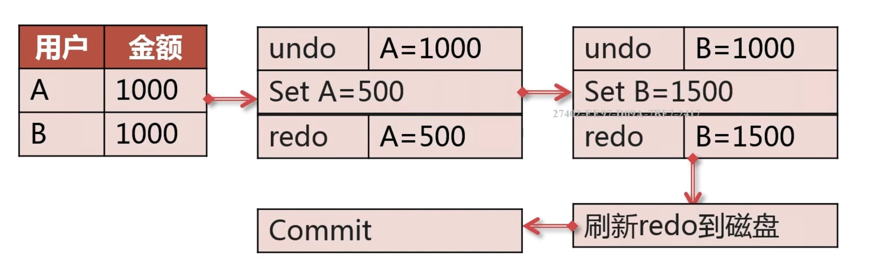

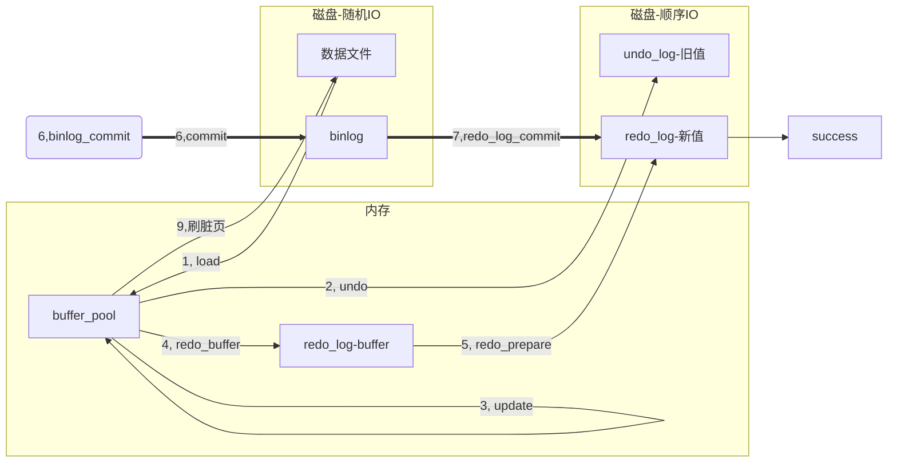

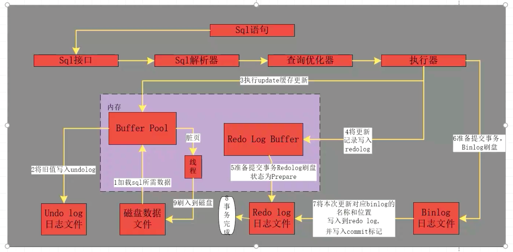

#### 读写阻塞

普通的互斥锁, 读写互斥, 写写互斥

查询需要加共享锁, 修改需要加互斥锁, 互斥锁与共享锁互斥

| 兼容性 | 排他锁 | 共享锁 |
| ------ | ------ | ------ |
| 排他锁 | ❌      | ❌      |
| 共享锁 | ❌      | ✔️      |


##### MVCC(多版本并发控制)

MVCC 的英文全称是 Multiversion Concurrency Control ，中文意思是**多版本**并发控制技术。原理是，通过数据行的多个版本管理来实现数据库的并发控制，简单来说就是保存数据的历史版本。可以通过比较版本号决定数据是否显示出来。读取数据的时候不需要加锁可以保证事务的隔离效果。

MVCC的核心是**多版本**, 本质是**"乐观锁"**

MVCC的基本特征：

- 每行数据都存在一个版本，每次数据更新时都更新该版本。
- 修改时Copy出当前版本随意修改，各个事务之间无干扰。
- 保存时比较版本号，如果成功（commit），则覆盖原记录；失败则放弃copy（rollback）

作用: 解决读写互斥

相关概念:

1. 快照读: 

   读取的是**快照数据**, 不加锁的简单 Select 都属于快照读: eg: 

   ```mysql
   SELECT * FROM table where xxx=xxx;
   ```

2. 当前读: 

   读的是**最新数据**, 加锁的 Select 或者 增删改都属于当前读, eg:
   
   ```mysql
   SELECT * FROM player LOCK IN SHARE MODE;
   SELECT FROM player FOR UPDATE;
   INSERT INTO player values ...
   DELETE FROM player WHERE ...
   UPDATE player SET ...
   ```
   
3. **ReadView**

   就是一个数据结构ReadView{low_trx_id, up_trx_id, trx_ids},  存储**当前正在活跃的事务ID范围**, 通过对比其与数据行的trx_id对比来判断是否**对当前事务可见**, 小于low_trx_id的纪录行表示在当前事务开始时已经提交了,则对当前事务可见.

   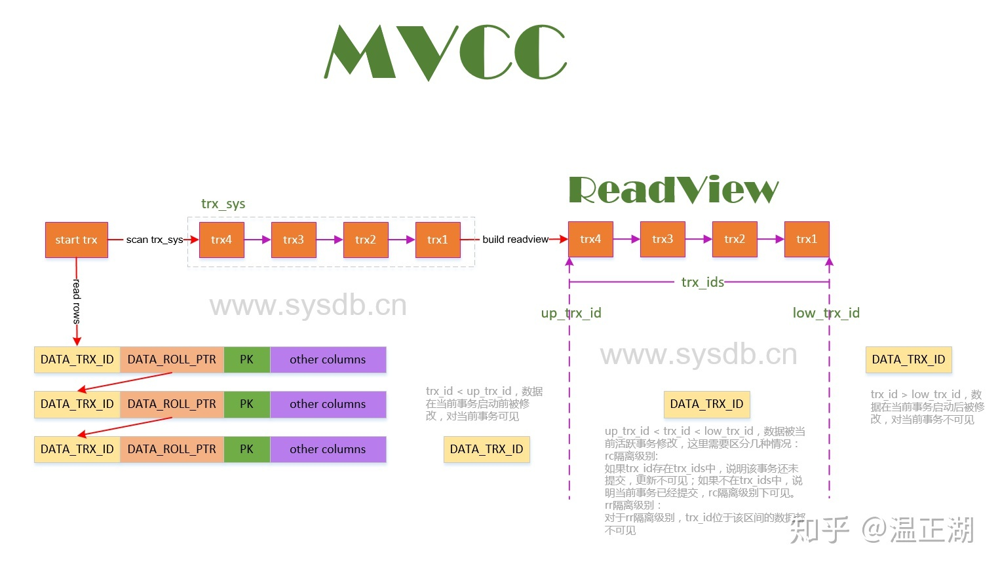

##### Innodb的MVCC实现

在每一行数据中额外保存两个隐藏的列：当前行创建时的版本号和删除时的版本号, 值是其事务版本号, 事务内执行CRUD操作时，通过版本号的比较来达到数据版本控制的目的 .

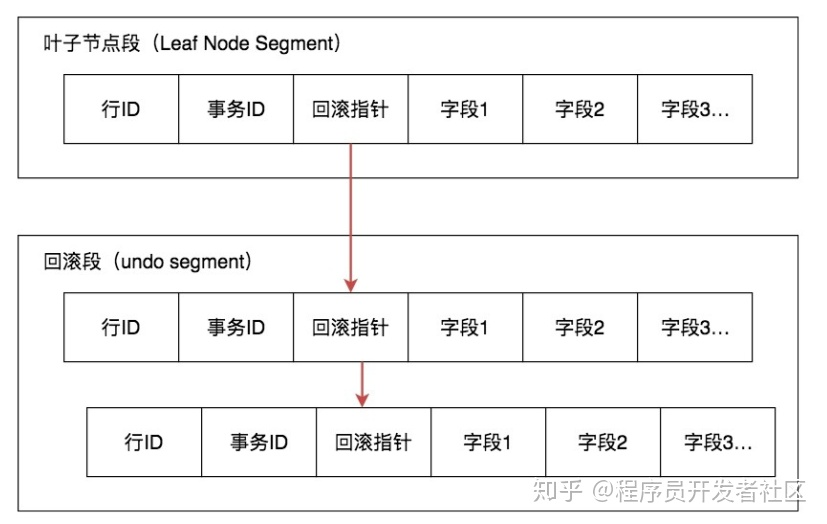

数据行通过快照记录都通过链表的结构的串联了起来，每个快照都保存了 trx_id 事务ID，如果要找到历史快照，就可以通过遍历回滚指针的方式进行查找。

## MySQL架构

### 主从复制原理

#### 示意图

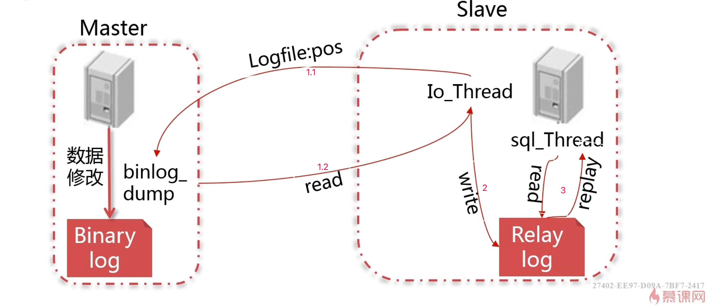

#### 说明

1. slave的io_thread与master的binlog_dump线程建立连接, 然后发送 logfile:pos 请求, 获取master的binlog, 当赶上master的pos后, io_thread进入sleep状态, 等待master的event来唤醒
2. slave的io_thread将从master获取的binlog写入relay_log, 
3. slave使用sql_thread来读取relay_log内容并进行重放, 如果是statement就执行, 如果是row就直接修改数据

### 主从复制实现方式

#### 复制方式分类

**异步复制（Asynchronous replication）**

MySQL默认的复制即是异步的，主库在执行完客户端提交的事务后会立即将结果返给给客户端，并不关心从库是否已经接收并处理，这样就会有一个问题，主如果crash掉了，此时主上已经提交的事务可能并没有传到从上，如果此时，**强行将从提升为主**，可能导致**新主上的数据不完整**。

**全同步复制（Fully synchronous replication）**

指当主库执行完一个事务，所有的从库都执行了该事务才返回给客户端。因为需要等待所有从库执行完该事务才能返回，所以全同步复制的性能必然会收到严重的影响。

**半同步复制（Semisynchronous replication）**

介于异步复制和全同步复制之间，主库在执行完客户端提交的事务后不是立刻返回给客户端，而是等待至少一个从库接收到并写到relay log中才返回给客户端。相对于异步复制，半同步复制提高了数据的安全性，同时它也造成了一定程度的延迟，这个延迟最少是一个TCP/IP往返的时间。所以，半同步复制最好在低延时的网络中使用。

##### 示意图

###### 异步复制

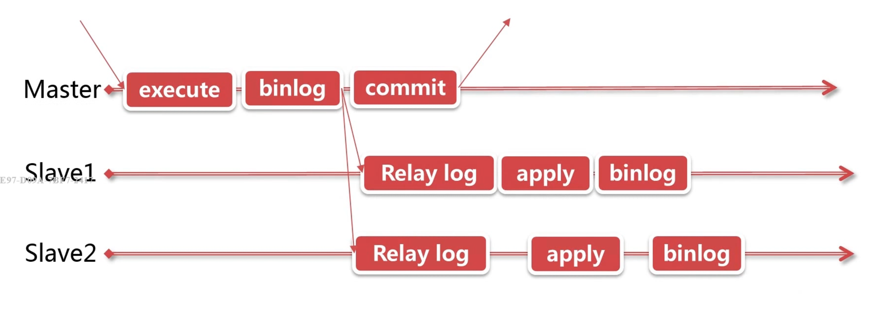

###### 半同步复制

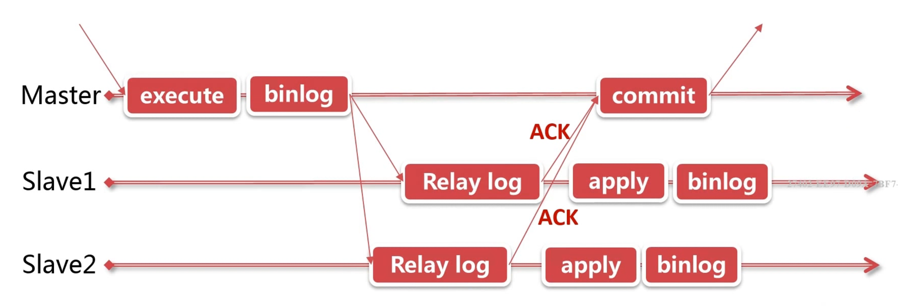

#### 主从复制配置实现

##### 步骤

###### master配置

1. 开启binlog(必须), 开启gtid(可选, 推荐) , 都需要重启
2. 建立同步账号, replication_slaver权限
3. 使用master_data参数备份数据库, 后面slave可以直接接着从备份的pos位置向master寻求同步

###### slave 配置

1. slaver开启binlog(可选) ,gtid(一致), 用于级联复制, 主从替换
2. slaver恢复master上备份的数据, 版本不一致时: mysql upgrade 修复系统表, slaver>master
3. 配置复制链路: change master to: host,position
4. 启动复制: start slave, password

### 主从复制延迟

#### 半同步复制

1. master安装半同步模块并启动（此模块就在/usr/local/mysql/lib/plugin/semisync_master.so）

```sh
mysql> install plugin rpl_semi_sync_master soname 'semisync_master.so';

mysql> set global rpl_semi_sync_master_enabled = 1;
mysql> set global rpl_semi_sync_master_timeout = 2000;
```

2) master配置

```
[root@localhost ~]# cat /etc/my.cnf
[mysqld]
rpl_semi_sync_master_enabled = 1;
rpl_semi_sync_master_timeout = 2000;
```

3 slave安装并启动

```sh
mysql> install plugin rpl_semi_sync_slave soname 'semisync_slave.so';
mysql> set global rpl_semi_sync_slave_enabled = 1;
mysql> show global variables like '%semi%';
+---------------------------------+-------+
| Variable_name          | Value |
+---------------------------------+-------+
| rpl_semi_sync_slave_enabled   | ON  |
| rpl_semi_sync_slave_trace_level | 32  |
+---------------------------------+-------+
2 rows in set (0.00 sec)
```

2）slave重启同步, 从节点需要重新连接主服务器半同步才会生效

```
mysql> stop slave io_thread;
mysql> start slave io_thread;
```

#### 日志复制方式

##### 基于日志点复制

master用户写入数据，生成event记到binary log中. slave接收master上传来的binlog，然后按顺序应用，重现master上的操作。

缺陷:

传统的复制基于(file,pos)，当主从发生宕机，切换的时候有问题, slave保存的是原master上的(file,pos)，**无法直接指向新master**上的(file,pos)

##### 基于GTID复制

GTID即全局事务ID (global transaction identifier), 其保证为每一个在主上提交的事务在复制集群中可以生成一个唯一的ID, GTID实际上是由UUID+TID (即transactionId)组成的。其中UUID(即server_uuid) 产生于auto.conf文件(cat /data/mysql/data/auto.cnf)，是一个MySQL实例的唯一标识。TID代表了该实例上已经提交的事务数量，并且随着事务提交单调递增，所以GTID能够保证每个MySQL实例事务的执行（不会重复执行同一个事务，并且会补全没有执行的事务）。**GTID在一组复制中，全局唯一。**

作用: 基于GTID{UUID+TID}方式来标识每个binlog中的事务, 可以指定GTID变可开始复制, 故障时,可以选取GTID多的作为主来重新同步

仅支持MHA,不支持meriaDB

##### 优缺点对比

| 项目   | 日志点复制                    | GTID复制                         |
| ------ | ----------------------------- | -------------------------------- |
| 兼容性 | 兼容性好                      | 不兼容MariaDB                    |
| 架构   | 支持MMM, 和 MHA               | 仅支持MHA                        |
| 可靠性 | 主备切换后,很难找到新的同步点 | 基于事务ID, 很方便找到未同步的点 |
| 容错性 | skip参数跳过复制错误          | 跳过麻烦, 置入空事务             |

##### 如何选择

兼容老版本MySQL或MariaDB, 使用MMM架构, 时需要使用基于日志点的复制, 其他情况建议使用GTID复制

### 比较下MMM和MHA架构优缺点

#### 作用

数据库中间层:  读写分离,负载均衡, 分库分表

MMM和MHA, 高可用

1. 对主从复制集群中的master的健康进行监控
2. 当master宕机后, 把写操作的vip迁移到新master
3. 启用新master后, 重新配置集群中的其他slave向新master同步

#### MMM

##### 定义

MMM（Master-Master replication manager for MySQL）是一套支持**双主故障切换**和双主日常管理的脚本程序, MMM使用Perl语言开发，主要用来监控和管理MySQL Master-Master（双主）复制.

##### 实施

MMM需要设置两台主服务器,主master和备master,  及多台从服务器, 写操作只在主master, 读操作在多台从slave上, 

- 当slave故障时, 使用读vip将其读操作绑定到其他的slave上
- 当主master故障时, 使用写vip切换备master为新的主master, 其他的slave强制从新maser复制

示意图:

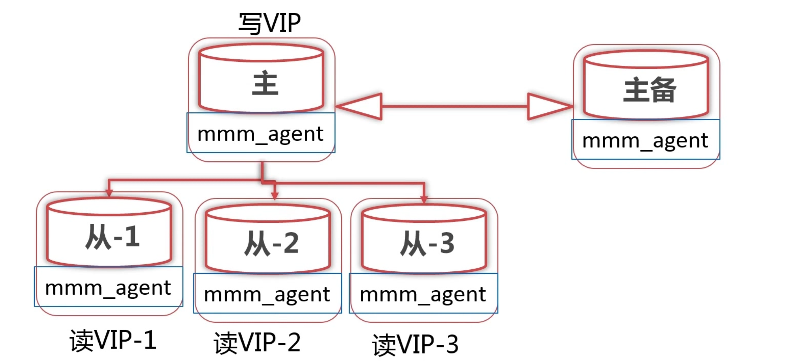


##### 资源配置

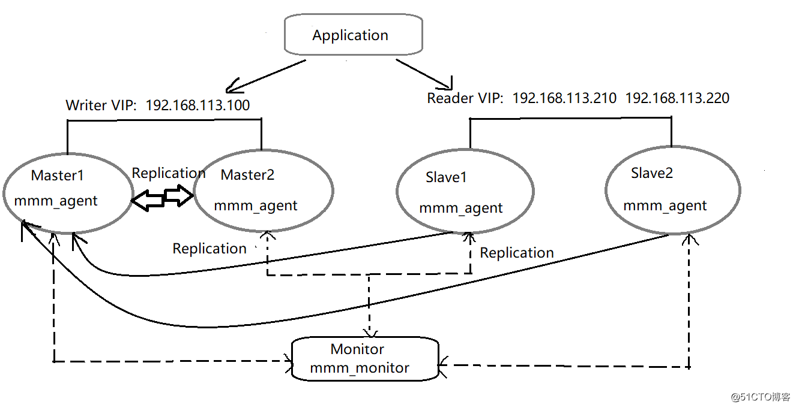

##### 故障转移步骤

> 当主master宕机时, 开始故障转移

1. slave服务器, 完成已经从master复制过来的relay_log
2. slave服务器, change master切换新主来复制
3. 主服务器, 设置新master的read_only=off
4. 迁移写vip到新master

##### 优点

1. 提供了读写vip设置, 读写都可以高可用
2. 不需要开发, 故障转移后仍可以继续监控

##### 缺点

1. 故障切换的备master不一定比slave新,丢事务    =>  对于主master-备master启用半同步复制,使备master更接近主master
2. 不支持GTID复制 => 主备切换丢事务

适用场景: 基于日志点复制, 主主复制, 高可用且一致性低

#### MHA

MHA（Master High Availability）是一套MySQL高可用性环境下**故障切换**和**主从提升**的高可用软件, 由两部分组成：MHA Manager（管理节点）和MHA Node（数据节点）, 当master出现故障时，它可以自动将最新数据的slave提升为新的master，然后将所有其他的slave重新指向新的master

##### 故障转移

1. 移除旧master, 选举最新的slave作为新master
2. 尝试保存master磁盘中的binlog (可能未被slave读取的log)
3. 以自己为标准, 应用中继日志到其他slave(如果有差异)
4. 引用从原master保存的二进制日志
5. 提升此slave为新master
6. 配置其他slave从新master同步

##### 示意图

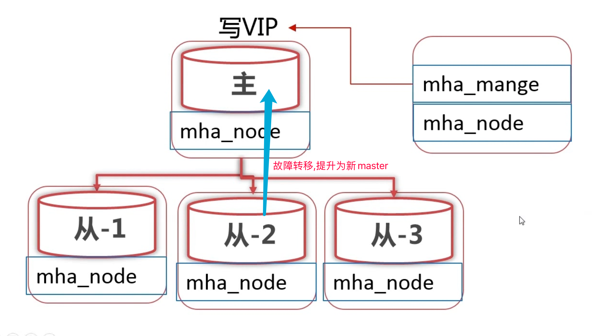

##### 优缺点

1. 支持基于GTID复制
2. 可以选择较新的slave作为master
3. 可以直接从主机拷贝binlog

- 未必能拷贝到binlog => 半同步复制
- 自行开发写vip迁移脚本
- 只监控master, 未监控slave

适用场景: GTID, 一主多从, 希望更少的数据丢失场景

### 主从复制延迟

#### 原因

1. master: 大事务 (数据量大) 
2. 中间: 网络传输时间长
3. slave应用relay_log是单线程消费的, 低于master的多线程生产

#### 解决方案

1. 大事务化小事务 -> 拆分分批修改, 使用插件利用中间表进行DDL操作
2. 网络延迟: 减小单次事务的数据量, 减少slave的数量 (建议<5)
3. 多线程消费: mysql5.7:多线程应用relay_log  => 使用MGR集群

### 对MGR的认识

#### 定义

MySQL Group Replication（MGR）复制组, 多主架构,  是MySQL官方推出的一种基于Paxos协议的状态机复制, 由能够相互通信的多个主master节点组成的,  可以在任意master发起请求, 通过一致性协议层控制数据的最终一致性 , 从而进一步提示数据复制的强一致性。

#### 实施

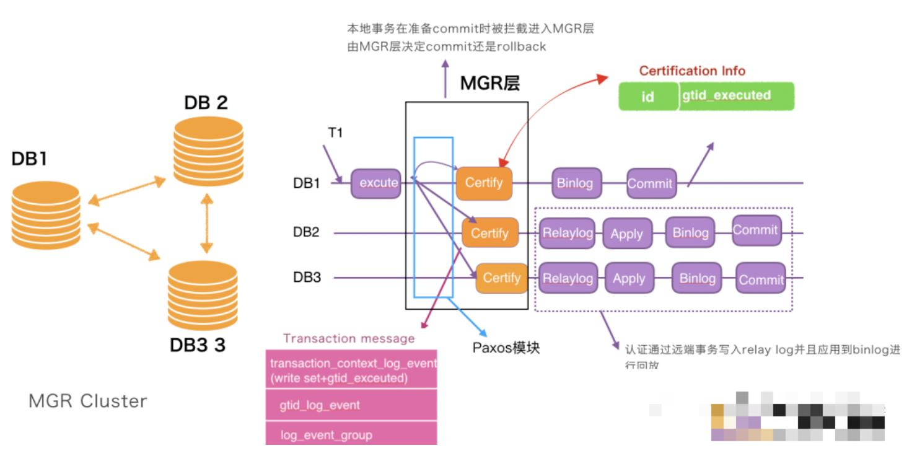

当执行事务时, 由MGR层广播, 通过一致性协议层保证大多数结点都获取到了数据才会进行事务最终的commit .

#### 类型

##### 单主模式

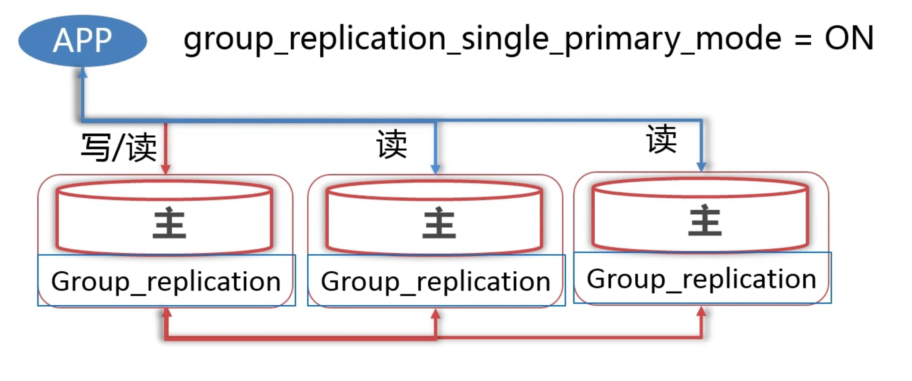

##### 多主模式

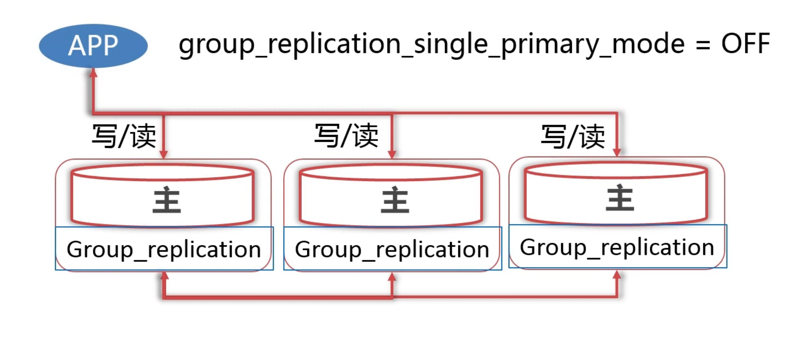

#### 优缺点

1. 组内成员同步基本无延迟
2. 可以支持多写, 读写均为高可用 (MySQL自带, 无需第三方插件)
3. 数据强一致性 (不会丢事务)
4. 只支持Innodb, 必须有主键; 只支持基于GTID复制,且必须为ROW
5. 单主模式很难选择下一个PRIMARY

#### 适用场景

1. 主从延迟低
2. 强一致性场景
3. 读写均高可用 (自带)

### 数据库读写负载大的问题

#### 读负载大

1. 扩展slave, 负载均衡

2. 读写分离: 
   - 应用层  
   - mysql数据库中间层

#### 写负载大

1. 分库分表
   1. 数据库中间层
   2. 应用层

## 备份与恢复

如何备份

如何增量备份和恢复


## 管理及监控

## 优化及异常处理

