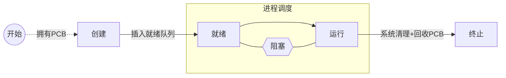
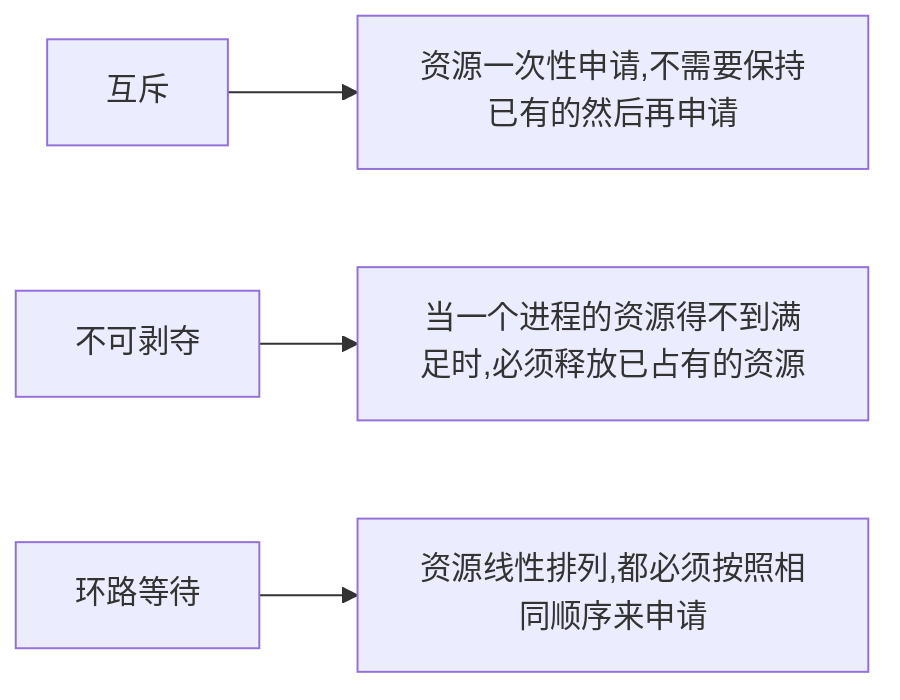
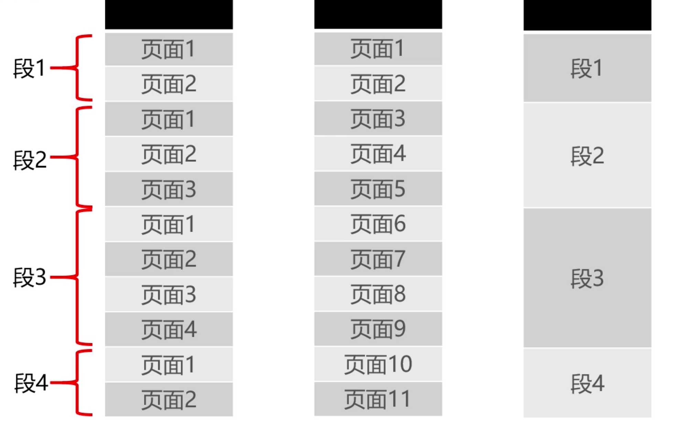
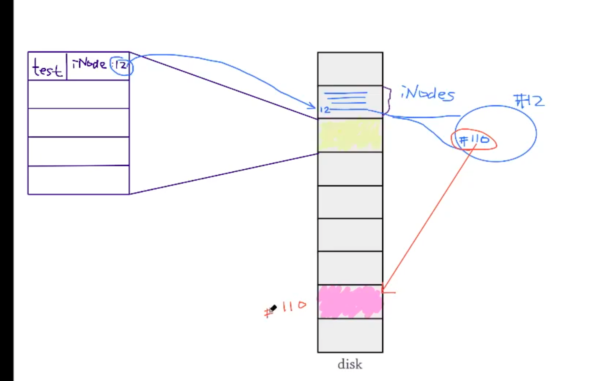
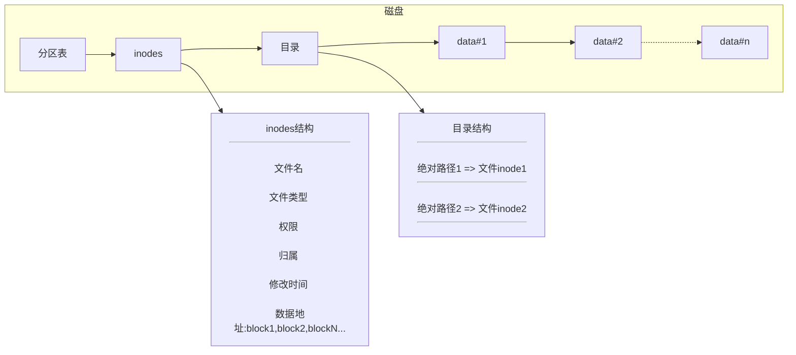
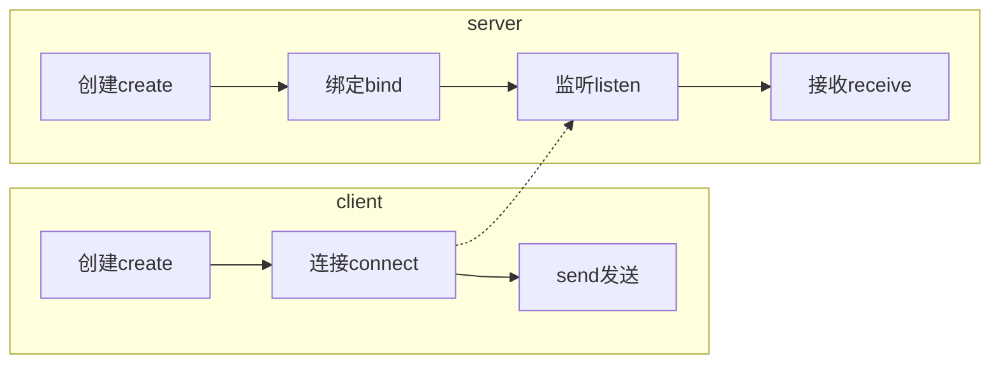

[TOC]
## 操作系统基础

章节导航

1. 进程 (进程实体,五状态模型,进程同步,linux进程管理)
2. 作业 (进程调度, 死锁)
3. 存储 (内存分配与回收, 段页式存储管理, 虚拟内存, linux存储管理)
4. 文件 (文件管理, linux文件系统, 文件基本操作)
5. 设备 (操作系统设备管理)

#### 操作系统概览

##### 定义

操作系统是管理计算机硬件和软件资源的计算机程序,通常提供用户交互

具体管理的是内存,资源调度,控制输入输出

##### 基本功能

1. 统一管理计算机资源: CPU,内存,IO设备,文件

2. 实现了对计算机资源的抽象, 用户无需面向硬件接口编程
3. 提供了用户交互接口

##### 相关概念

1. 并发性 (并发: 时分复用,  并行:多路并行)

2. 共享性 (操作系统中的资源可以被并发使用, 称为`资源共享`, 分为互斥共享和"同时"访问(时分复用))

3. 虚拟性 (把一个物理实体转变为若干个逻辑实体)

   时分复用 (虚拟处理器技术,多个进程时分复用)

   空分复用 (虚拟设备技术, 物理设备虚拟出多个逻辑设备, 如:虚拟磁盘(C/D/E盘),虚拟内存)

4. 异步性 (进程不是一直占用资源运行到结束,而是以不可预知的速度断断续续运行)

#### 进程管理

 (进程实体, 五状态模型, 进程同步, linux进程管理)

定义: 进程是系统进行资源分配的最小单位

没有OS前,资源属于当前正在运行的程序,有了OS后,资源分配给进程,合理隔离资源,多道程序设计下,提高资源利用率

##### 进程实体

>  主要分为: 标识符, 处理器状态, 进程调度信息, 进程控制信息

标识符: 进程PID
进程状态: 运行态 
程序计数器: 进程将要执行的指令地址
内存指针: 程序代码,进程数据的指针 (多个)
上下文数据: 进程执行时,处理器存储的数据(缓存+主存)
IO状态信息: 被进程IO操作占用的文件列表
记账信息: 使用CPU时间,时钟总数(纪录)

##### 进程控制块

PCB, 进程控制块(Process Control Block), 是存放进程的管理和控制信息的数据结构, 保存进程当前状态和控制进程运行的所有信息, 使得进程是能够独立运行的基本单位

存在系统专门开辟的PCB区域内存中, 常驻内存

##### 进程与线程

进程(Process), 线程(Thread)

进程是操作系统进行`资源分配`的最小单位, 线程是操作系统能够进行`调度运行`的最小单位
进程独占cpu,内存,文件等资源, 在不同线程间共享
线程包含在进程中,是实际运行的单位

>  进程间通信需要IPC, 线程由于共享进程的内存,直接读写同一进程数据即可

#### 进程五状态模型

##### 进程生命周期



###### 说明

| 状态 | 说明                                                         | 备注                                        |
| :--- | ------------------------------------------------------------ | ------------------------------------------- |
| 创建 | 已分配PCB,但未被插入到就绪队列                               | 进程创建动作(fork)包含分配PCB和插入就绪队列 |
| 就绪 | 进程分配完所有资源,或所有资源已就绪完成,等待获取CPU使用权执行 | 资源: 内存,PCB,栈空间,堆空间, 有就绪队列    |
| 执行 | 进程获得CPU执行权,正在由CPU执行                              | 同一时刻,CPU里只有一个进程被执行            |
| 阻塞 | 进程由于IO请求而等待IO完成,从而让出CPU使用权,进入阻塞状态    | 有阻塞队列                                  |
| 终止 | 进程结束,由系统清理及回收PCB,此时为系统的终止态              |                                             |

##### 进程切换


#### 进程同步

##### 意义

生产者消费者问题 (并发导致数据最终不确定)
哲学家进餐问题 (并发导致死锁)

都是因为彼此之间没有通信,所以需要进程同步进行次序协调

##### 原则

1. 空闲则进

2. 忙则等待 

3. 有限等待 (避免饿死)

4. 让权等待 (让出CPU)

实现: 消息队列, 共享存储, 信号量

##### 线程同步

实现: 互斥量, 读写锁, 自旋锁, 条件变量

#### Linux进程管理

##### 进程概念

前台进程: 有终端,`独占终端交互`,可以与用户进行交互

后台进程: 没有终端,让出终端的交互占用,但`依然保留信息终端输出`,优先级较低 (以&符号结尾)

守护进程: 随系统启动和关闭, 已经`完全脱离终端`控制台,进程名字通常以“d”结尾


##### 进程命令

ps -ef 进程关系;   ps aux  进程占用   ps -ef --forest 展示进程关系

pstree -ps 进程树

strace -p pid  进程详情

#### 作业管理 - 进程调度

##### 进程调度

定义: 进程调度是指计算机通过决策决定哪个就绪进程可以获得CPU使用权

分类:

抢占式调度: 系统根据策略调度, 通用系统

非抢占式调度: 一旦占用CPU,则让其使用完,或者IO阻塞让出, 专用系统

##### 进程调度算法

先来先服务(队列)

短进程优先(时间短的优先级高, 不公平)

高优先权优先(按优先级, 前台优先级高)

时间片轮转(时间片轮询,未执行完的放入队尾)


#### 作业管理 - 死锁

##### 死锁

定义: 死锁是指两个或两个以上的进程在执行过程中，由于竞争资源或者由于彼此通信而造成的一种阻塞的现象，若无外力作用，它们都将无法推进下去。此时称系统处于`死锁状态`或`系统产生了死锁`，这些永远在互相等待的进程称为死锁进程。

死锁产生原因:

1. 资源竞争 (相互竞争等待)
2. 调度顺序不当 (先申请,先使用完, 后面再申请)

死锁产生的必要条件:

1. 互斥: 进程对资源是排他性使用,其他进程必须等待
2. 请求保持: 至少保持了一个资源,又提出了新的资源请求,遇忙则仍保持等待
3. 不可剥夺: 已获取的资源不能被其他进程或操作系统剥夺,只能由自己释放
4. 环路等待: 发生死锁时,必然存在进程-资源的环形等待链

死锁避免:




#### 存储管理 - 内存分配与回收

##### 内存分配

> 内存使用双向链表来保存空闲内存

单一连续分配

固定分区分配

动态分区分配: 根据实际需要,动态分配进程所需内存

首次适应算法(First Fit)  最先找到匹配的就ok

最佳适应算法(Best Fit)  先排序,再从最小开始匹配

快速适应算法(Worst Fit) 以空间大小为key, 将相同大小的地址连接成list放在key后面

##### 内存回收

使用新的结点代替旧的结点并扩充容量

#### 存储管理 - 段页式存储管理

相对地址: 逻辑地址

绝对地址: 物理地址

##### 页式存储管理

字,字块是物理设备定义

页,页面是逻辑空间的定义

页 => 块; 页大小: 0.5k~8k    页大小固定(可以不连续)

物理地址: 字的地址:  字块的地址+字在字块的地址(块内地址)

逻辑地址:                :  页号地址+页内偏移 (页大小固定,物理页)

##### 段式存储管理

逻辑地址:                :  段号地址+段内偏移 (段大小不固定+段长不固定+段起始地址)

##### 段页式存储管理

逻辑地址:                :  段号地址+段内页号+页内偏移




#### 存储管理 - linux

页内碎片 (已分配但不使用的间隙)

页外碎片 (已分配内存之间的间隙)

##### buddy内存管理算法

内存分配为2的幂次方大小  (计算机处理2的幂次方式速度极快)

伙伴系统: 连续的大小一样的内存

创建一系列的空闲链表:

1k->1k->1k->1k->1k->1k
2k->2k->2k->2k->2k->2k
4k->4k->4k->4k->4k->4k

先找最小满足的,然后再进行尝试递归折半分配, 回收时,尝试合并伙伴回收

内存外碎片 ==转移==> 内存内碎片

##### swap交换空间

swap时操作系统的概念, 解决系统物理内存不足

虚拟内存是进程的概念, 解决进程物理内存空间不足


#### 操作系统的文件管理

##### 文件逻辑结构

有结构: 文本,文档,媒体类型,  定长的格式说明+变长的内容 

无结构: 二进制,链接库, 字节流式文件

顺序存储

索引存储 

##### 辅存的存储空间分配

连续: 存储在连续的空间中

链接: 存储在离散的盘块中

	1. 隐式: 上一块直接存下一块的地址
	2. 显示: 使用表来记录每一块的下一块地址:  File Allocation Table (FAT格式) 

索引: 上一块存下一堆快的地址

##### 目录管理

目录树

#### Linux文件基本操作

linux目录

相对路径.绝对路径

文件常用操作

##### 文件类型

	普通文件/目录/套接字/链接/目录/设备文件/命名管道

#### Linux文件系统

FAT: File Allocation Table (一张表保存整个块)

New Technology File Syetem (新文件系统技术)

Extended File System (扩展文件系统)

##### Ext文件系统

Boot Sector

Block Group



[  分区表  |  inodes  |  目录  |  data   | data   ]
目录 [   /tmp/file1.txt ->  inode_index      |      |      ]

inodes [   文件名,文件类型,权限,归属,修改时间,data[block1,block2,block3...]   |      |      ]


缓冲区

缓冲池

一个block(块) 对应固定个扇区

#### 设备管理

缓冲池 (进程从中取出一个缓冲区独占使用,使用完归还) 进程读写文件的缓冲

SPOOling技术 (虚拟设备技术)

使用队列进行消锋错谷 (同步变异步)




stat 

fdisk

df -T


## 操作系统提升

### 线程同步

#### 互斥锁

1. 定义: 互斥锁是指当线程在获取锁的时候，如果锁已经被其它线程获取，那么该线程将从运行态转为阻塞(sleep)态，当占用锁的线程调用unlock主动解锁时,**会同时将阻塞在该锁上的所有线程全部唤醒**; 线程唤醒顺序取决于优先级和调度策略。默认：先阻塞先唤醒

2. 作用: 用来保证关键指令的原子性 (全部执行/全部不执行), 和共享资源的访问调度问题

过程：线程会从running --> sleep(加锁) --> running(解锁)，过程中有上下文的切换，cpu执行权让出

3. 过程: 所有锁被占用的线程都会进入阻塞队列,线程进入阻塞态,当	解锁后,通知线程都依次进入就绪状态,默认**先阻塞的先唤醒就绪**

```c++
线程锁互斥锁
说明: 互斥锁是排他锁,只允许某个线程独占,其他进程进入睡眠阻塞状态,等待通知唤醒就绪

# 创建锁
pthread_mutex_t mutex = PTHREAD_MUTEX_INITIALIZER;

# 锁定
pthread_mutex_lock(&mutex);

# 释放
pthread_mutex_unlock(&mutex);
```


#### 自旋锁

1. 定义: 自旋锁是指当一个线程在获取锁的时候，如果锁已经被其它线程获取，那么该线程将循环判断，然后不断的判断锁是否能够被成功获取，直到获取到锁才会退出循环

2. 过程：线程一直是running(加锁——>解锁)，死循环检测，不会让出CPU,一种死循环    

优缺点: 避免了上下文切换,不适合单核cpu使用(多线程模式下,需要有其他线程在其他核上轮询), 适用于锁使用者持锁时间比较短的情况

```c++
线程锁自旋锁
说明: 自旋锁一直轮询检测,不会让出cpu执行权

# 创建锁
pthread_spinlock_t spin_lock = PTHREAD_SPIN_LOCK_INITIALIZER;;

# 锁定
pthread_spin_lock(&spin_lock);

# 释放
pthread_spin_unlock(&spin_lock);
```


#### 读写锁

定义: 读写锁是一中特殊的自旋锁,允许共享读,但对同时写情况互斥, 适合`多读少写`的场景

```c++
线程锁读写锁
说明: 读写锁 (对读不加锁,对写加互斥锁)

# 创建锁
pthread_rwlock_t rwlock = PTHREAD_RWLOCK_INITIALIZER;

# 锁定
pthread_rwlock_rdlock(&rwlock);  // 读
pthread_rwlock_wrlock(&rwlock);  // 写

# 释放
pthread_rwlock_unlock(&rwlock);
```

#### 条件变量

定义: 条件变量是一种线程同步方法,允许线程主动睡眠阻塞,让出互斥锁,直到满足某种条件,可以向该线程发送信号,通知其唤醒就绪

```c++
线程同步: 条件变量
说明: 用while循环判断收到通知后是否满足条件
注意: pthread_cond_wait会让出当前线程的互斥锁

# 创建锁
pthread_cond_t cond = PTHREAD_COND_INITIALIZER;
pthread_mutex_t mutex = PTHREAD_MUTEX_INITIALIZER;

# 加锁并进行条件判断
pthread_mutex_lock(&mutex);
while(cond==false) pthread_cond_wait(&cond, &mutex);  // 阻塞等待通知

# 通知并解锁
pthread_cond_signal(&cond);
pthread_mutex_unlock(&mutex);
```


### 进程同步

#### 创建进程(fork)

fork进程的初始化状态与父进程一样,从父进程`copy全部变量`

fork`调用一次,返回两次`, 分别返回**子进程ID**(父进程),和**0**(子进程)

```php
// 1. 创建子进程
$process = new Swoole\Process(function(){
    echo 'sub process';
});

// 2. 唤醒就绪
$process->start();

// 3. 父进程退出
$sub_process_ret = Swoole\Process::wait(true);
// {"code":0,"pid":1447,"signal":0}
```


#### 共享内存

进程间的内存空间是独立的, 共享内存允许不同进程访问同一片内存空间,是两个进程之间`共享和传递数据最快`的方式

步骤:


```php
# 共享内存(SwooleTable)
1. 定义
$table = new Table(1024);
$table->column('id', Table::TYPE_INT);

2. 申请
$table->create();

3. 使用
$table->get('3');
$table->set('3', ['id' => 3]);
```

> 共享内存未提供同步机制,需要自行实现进程安全

#### Unix域套接字

定义

Unix域套接字是在socket的框架上发展出`一种IPC机制`,不需要经过网络协议栈,只是将**应用层数据**在**内存**中从一个进程**拷贝**到另一个进程,也提供面向流和面向数据包两种API接口,类似于TCP和UDP,但本质上是**可靠的通讯**

特点: 

1. 可靠的通信
2. 不需要进程同步机制 

##### Unix域套接字在php-fpm中的作用


##### 步骤:



##### 示例

```php
# server

// create
$socket = socket_create(AF_UNIX, SOCK_STREAM, 0);

// bind
socket_bind($socket, SOCKET_PATH);

// listen
socket_listen($socket);

// receive
while ($message_socket = socket_accept($socket)) {
    socket_recv($message_socket, $message, MESSAGE_LENGTH, MSG_OOB);
}
```

```php
# client

// create
$socket = socket_create(AF_UNIX, SOCK_STREAM, 0);

// connect
socket_connect($socket, SOCKET_PATH);

// send
socket_send($socket, 'hello world', MESSAGE_LENGTH, MSG_OOB);

// close
socket_close($socket);

```


### 操作系统的实践

实现支持异步任务的线程池, 理解原理,自行实现

#### 线程池

定义: 线程池是存放线程的容器,执行后不会被销毁,而是放回线程池复用

作用: 

1. 复用资源: 线程创建和销毁, 有开销; 切换比较费资源
2. 架构解耦: 线程的创建和销毁与业务处理解耦