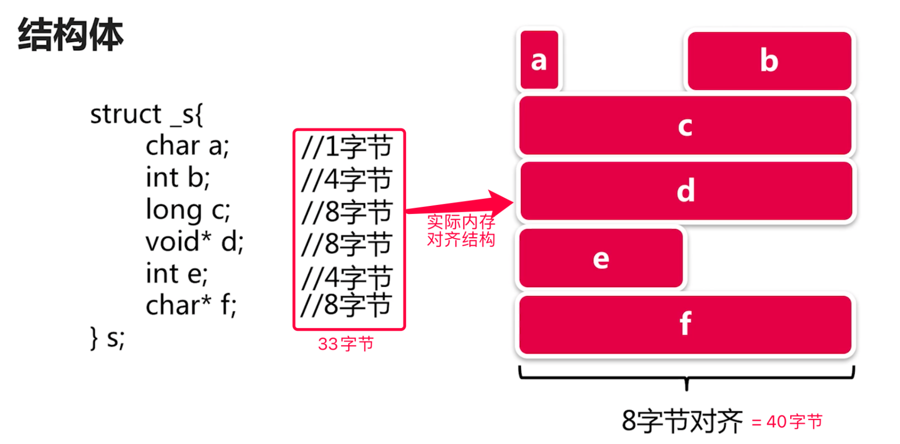
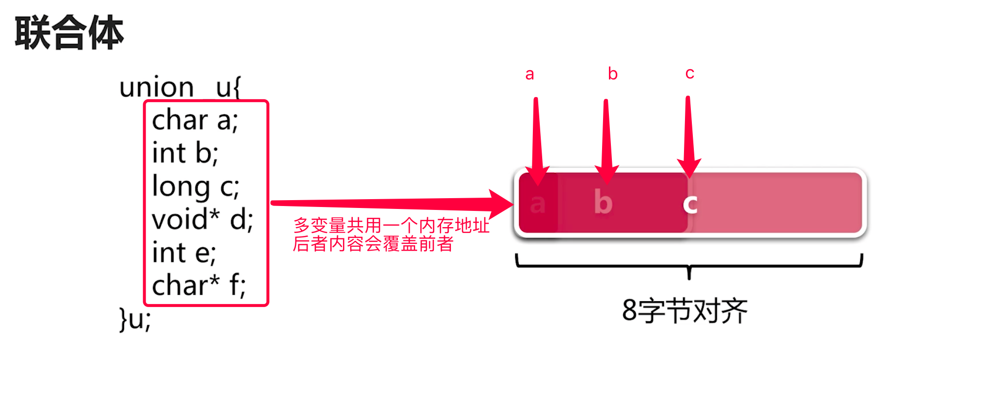
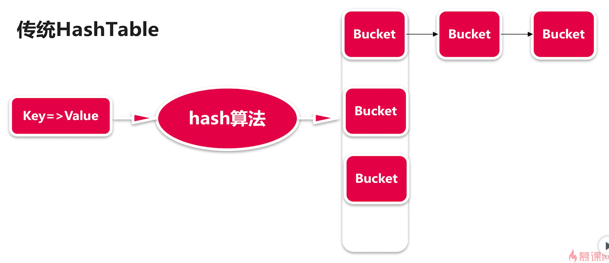

[TOC]

## C语言基础

### 数据类型

#### 数字

#### 字符,

### 变量类型

#### 数据类型

#### 变量类型

### 变量运算

### 流程控制

### 扩展类型

#### 结构体

##### 内存对齐

内存不够分配下一个变量时,直接从下一个地方开始从新划分

#### 共用体

##### 内存结构

#### 指针

#### 柔性数组

### 函数

#### 参数,调用,返回

#### 字符串/数组参数

#### hashTable

#### 函数式

#### 可变参数

#### 命令行参数

