[TOC]

## 基本变量与内存管理

### 基本变量

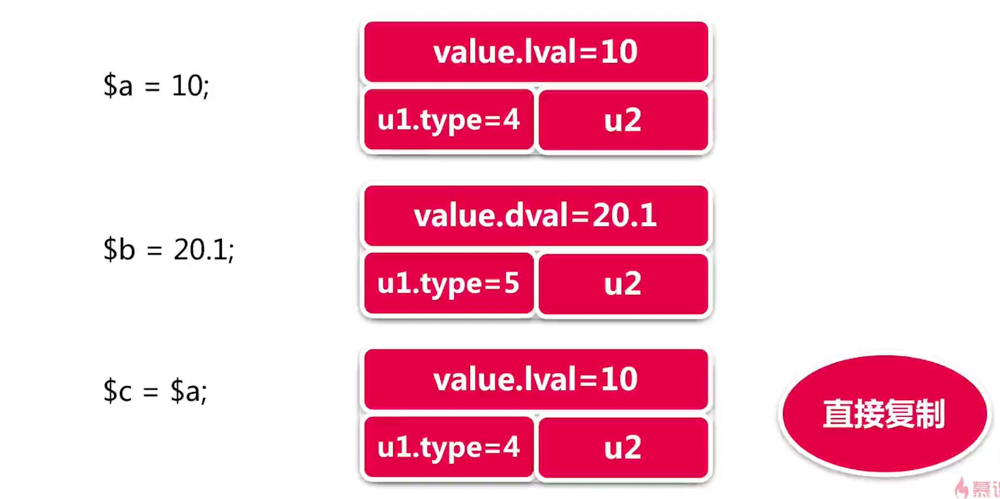

#### zval结构

```c
typedef union _zend_value {
	zend_long         lval;				/* long value */
	double            dval;				/* double value */
	zend_refcounted  *counted;
	zend_string      *str;
	zend_array       *arr;
	zend_object      *obj;
	zend_resource    *res;
	zend_reference   *ref;
	zend_ast_ref     *ast;
	zval             *zv;
	void             *ptr;
	zend_class_entry *ce;
	zend_function    *func;
	struct {
		uint32_t w1;
		uint32_t w2;
	} ww;
} zend_value;

struct _zval_struct {
	zend_value        value;			/* value */
	union {
		struct {
			ZEND_ENDIAN_LOHI_4(
				zend_uchar    type,			/* active type */
				zend_uchar    type_flags,
				zend_uchar    const_flags,
				zend_uchar    reserved)	    /* call info for EX(This) */
		} v;
		uint32_t type_info;
	} u1;
	union {
		uint32_t     next;                 /* hash collision chain */
		uint32_t     cache_slot;           /* literal cache slot */
		uint32_t     lineno;               /* line number (for ast nodes) */
		uint32_t     num_args;             /* arguments number for EX(This) */
		uint32_t     fe_pos;               /* foreach position */
		uint32_t     fe_iter_idx;          /* foreach iterator index */
		uint32_t     access_flags;         /* class constant access flags */
		uint32_t     property_guard;       /* single property guard */
		uint32_t     extra;                /* not further specified */
	} u2;
};
```

说明:

```c
/* 变量结构 */
struct _zval_struct {
    /* 变量值union (8Byte) */
	value: zend_value union {
		zend_long         lval;				/* long value */
        double            dval;				/* double value */
        zend_refcounted  *counted;
        zend_string      *str;
        zend_array       *arr;
        zend_object      *obj;
        zend_resource    *res;
        zend_reference   *ref;
        zend_ast_ref     *ast;
        zval             *zv;
        void             *ptr;
        zend_class_entry *ce;
        zend_function    *func;
        ww: struct {
            uint32_t w1;
            uint32_t w2;
        };
	},
	
    /* 变量类型union (4Byte) */
	u1: union {
		v: struct {
            /* 宏替换,兼容大小字节序 : ZEND_ENDIAN_LOHI_4(xa, xb, xc, xd) => xa; xb; xc; xd;  */
            /* active type: 变量的类型,根据此标记来取zend_value的具体字段 */
            type zend_uchar: {
                /* regular data types */
                #define IS_UNDEF					0
                #define IS_NULL						1
                #define IS_FALSE					2
                #define IS_TRUE						3
                #define IS_LONG						4
                #define IS_DOUBLE					5
                #define IS_STRING					6
                #define IS_ARRAY					7
                #define IS_OBJECT					8
                #define IS_RESOURCE					9
                #define IS_REFERENCE				10

                /* constant expressions */
                #define IS_CONSTANT					11
                #define IS_CONSTANT_AST				12

                /* fake types */
                #define _IS_BOOL					13
                #define IS_CALLABLE					14
                #define IS_ITERABLE					19
                #define IS_VOID						18

                /* internal types */
                #define IS_INDIRECT             	15
                #define IS_PTR						17
                #define _IS_ERROR					20
            },
            /* 变量类型标记 */
            type_flags: zend_uchar {
                /* zval.u1.v.type_flags: 变量类型标记 */
                #define IS_TYPE_CONSTANT			(1<<0)  /* 常量类型 */
                #define IS_TYPE_IMMUTABLE			(1<<1)  /* 不可变类型 */
                #define IS_TYPE_REFCOUNTED			(1<<2)  /* 需要引用计数类型 */
                #define IS_TYPE_COLLECTABLE			(1<<3)  /* 可能包含循环引用的类型: 比如array/object */
                #define IS_TYPE_COPYABLE			(1<<4)  /* 可以当做函数调用 */
            },
            zend_uchar    const_flags,              /* 常量类型标记 */
            zend_uchar    reserved,                 /* call info for EX(This) */
		};
		uint32_t type_info;
	},
	
    /* 变量操作标记union (4Byte) */
	u2: union {
		uint32_t     next;                 /* hash collision chain : 解决hash冲突 */
		uint32_t     cache_slot;           /* literal cache slot : 运行时缓存 */
		uint32_t     lineno;               /* line number (for ast nodes) : 当前所在行 */
		uint32_t     num_args;             /* arguments number for EX(This) : 函数调用时传参的个数 */
		uint32_t     fe_pos;               /* foreach position : foreach遍历时的索引位置 */
		uint32_t     fe_iter_idx;          /* foreach iterator index : 当前遍历游标的位置 */
		uint32_t     access_flags;         /* class constant access flags : class访问修饰符 */
		uint32_t     property_guard;       /* single property guard : 防止类魔术方法的循环引用 */
		uint32_t     extra;                /* not further specified */
	}
}
```

总结:

1. 变量结构: struct{ zend_value union{ ... }, u1 union: { v: struct { type } } }, 通过type从zend_value中读取对应变量值
2. 变量类型: 弱类型是PHP在变量结构上做了透明处理
3. 变量大小: struct(16Byte) = { zend_value(8Byte) + u1(4Byte) + u2(4Byte) }, 变量在内存上是连续存储一片区域
4. struct.u2表示变量操作标记,struct.u2.next用于解决数组中的hash冲突

> 注意: 

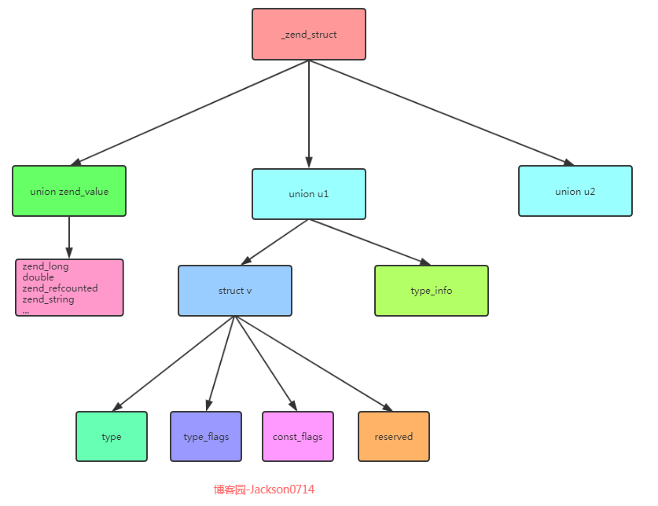


#### int/string变量的实现

##### zend_string变量结构

```c
struct _zend_string {
	zend_refcounted_h gc; 				/* 垃圾回收 */
	zend_ulong        h;                /* hash value : 用来在数组中解决hash冲突 */
	size_t            len;				/* 存储字符串长度,即使字符串中含有"\0"也能完整读出,称为二进制安全 */
	char              val[1];			/* 柔性数组,存放字符串的值 */
};
```

> 通过柔性数组可以实现变长大小的结构体,节省空间, size_t和char[N],可以实现动态改变大小

##### 写时复制:

对于直接存值的int和double, zend_value里面直接存储的是对应值, 当执行 `$a = "xxx"; $b = $a` 时, $b直接重新拷贝一份zend_value, 里面的int/double值也都拷贝, 但是对于string类型, `$b = $a` 也是只拷贝了zend_value, 两个zend_value的zend_string指针是一样的, 都指向共同的一份zend_string结构体, 通过zend_string的gc里面引用计数来表示被几个变量引用;
而当$a或者$b对字符串的内容做出修改时,两个变量就**不能共用一个zend_string结构体**了,此时才会再拷贝一份zend_string结构体做修改

##### 其他相关

1. 常量字符串,比如"Hello", u1.type_flags=CONSTANT,此时的zend_string.gc.refcount=0, 而组合的字符串:比如 `time() . "Hello"` b表示不是常量字符串,u1.type_flags=0,且zend_string.gc.refcount=1
2. 引用类型

##### 引用类型

```c
struct _zend_reference {
	zend_refcounted_h gc;
	zval              val;
};
```

结构示意图:

```json
{
    "_zval_struct": {
        "zend_value": {
            "zend_reference": {
                "zend_refcounted_h": "gc",
                "_zval_struct": "zval",    /* 指向一个完整的zval_struct */
            }
        },
        "u1": {
            "v": {
                "type": "IS_REFERENCE" 
            }
        },
        "u2": {}
    }
}
```

```php
$a = "string";  
$b = &$a;    // 引用赋值, 新建zend_reference指向zval
$b = "string new";    // 引用值修改, 两个值共同指向的zval的修改
unset($a);    // 引用unset, 将其由type=IS_REFERENCE,改为type="IS_UNDEF", 不再取其zend_reference指针
```
说明:
1. 引用赋值: $b = &$a;
    string类型的,通过zval_struct: { zend_value, u1, u2 }表示, 当新建一个引用时, 新建一个zval_struct,其zend_value.zend_reference指向旧string的zval_struct, 引用和被引用的两个变量都通过reference形式指向旧string的zval_struct;
2. 引用值修改: $b = "string new";
    两个变量都是通过zend_reference指向旧的zval_struct, 对其中一个值修改时,修改的是两个共同指向的值zval_struct,所以两个变量的值都会发生改变; 
3. unset引用: unset($a);
    当unset($a)时,$a的zval_struct.type="IS_UNDEF",其他没变,其zend_value.zend_reference仍然指向旧string的zval_struct
    而$b没有变,依然是zend_reference指向旧string, zval_struct.type也没变(IS_REFERENCE);

#### array实现原理

```c
/* PHP数组中的一个{k, v}键值结构体,具体存放的数据 */
typedef struct _Bucket {
	/* 数组key对应的value */
    zval              val; 				/* 对应之前的PHP变量结构_zval_struct:zval */
    
    /* 数组的key */
	zend_ulong        h;                /* hash value (or numeric index) : 字符串key的hash值/数字索引值  */
	zend_string      *key;              /* string key or NULL for numerics : 原字符串key */
} Bucket;

/* _zval_struct.zend_value.zend_array* 指向的zend_array具体结构体内容 */
struct _zend_array {
	zend_refcounted_h gc;				/* 垃圾回收 */
	union {
		struct {
			ZEND_ENDIAN_LOHI_4(
				zend_uchar    flags,
				zend_uchar    nApplyCount,
				zend_uchar    nIteratorsCount,
				zend_uchar    consistency)
		} v;
		uint32_t flags;
	} u;
	uint32_t          nTableMask;		/* nTableSize的掩码,用来计算数组key的hash值 */
	Bucket           *arData;			/* 键值结构体{k, v}数组指针, 指向具体存放的数据 */
	uint32_t          nNumUsed;         /* 已使用的索引 */                               
	uint32_t          nNumOfElements;   /* 数组值的数量 */     
	uint32_t          nTableSize;		/* arData区域的空间大小,初始值为8,自动扩容,按2^N分配 */
	uint32_t          nInternalPointer; 
	zend_long         nNextFreeElement; /* array[]追加值时,使用此值作为追加值的key */ 
	dtor_func_t       pDestructor;
} HashTable;                           /* _zend_array的别名: hashTable */
```

##### 结构示意图:

```json
{
    "_zval_struct": {
        "zend_value": {
            "zend_array": {
                "zend_refcounted_h": "gc",
                
                /* arData地址前面存放的是uint32_t类型的数组 */
                
                /* 键值结构体{k, v}数组指针 */
                "Bucket *arData": {    
                    zval              val;				/* 指向一个完整的zval_struct */
                    zend_ulong        h;                /* hash值    */
                    zend_string      *key;				/* 字符串key  */
                },
            }
        },
        "u1": {
            "v": {
                "type": "IS_ARRAY" 
            }
        },
        "u2": {
            uint32_t next;     /* hash冲突链 */
        }
    }
}
```

##### 索引数组:

zend_array.arData地址前面紧挨着存放的是int类型的索引数组, 存放的是Bucket数组的索引, 具体查找步骤:

1. 当取$a["key"]时, "key"为zval, 其zend_value.zend_string.h存放的是其字符串对应的hash值int, 取出记为h, 
2. 再用 h|array 的 zval.zend_value.zend_array.nTableMask, 取出记为nIndex; (nIndex的范围为: [nTableMask, -1]), nTableMask一般为-nTableSize
3. 通过HT_HASH从arData地址取紧挨着的前面nIndex位置的int索引数组的具体值idx, idx即为"key"对应的Bucket键值结构体在Bucket数组的索引
4. 读取时,直接取zend_array.arData[idx],值为Bucket结构体,判断bucket->key是否为字符串的zend_string.key,如果不是,则取bucket->val.u2.next作为新的idx,再进行取值判断,当相等时,此bucket->val即为php数组对应键的值
5. 存入值时, 用bucket指向,zend_array->arData+idx位置, 为bucket结构体进行赋值, 求出php数组键string在数组中的nIndex, 新值的zval.u2.next指向旧值的idx, 然后再将新值的idx覆盖存入到nIndex位置

```c
// zend_string.c:141

/* zend_string.h的hash值 */
h = zend_string_hash_val(zend_string);    // 从"key"的zend_string中取出或者通过hash计算出h

/* 索引数组的索引 */
nIndex = h | zend_array.nTableMask;    // nTableMask为-nTableSize,用其对h做运算,确保其在[-nTableSize, -1]范围之间

/* 索引数组的值,即Bucket结构体数组的索引 */
// idx = HT_HASH(zend_array, nIndex);
idx = ((uint32_t*)( zend_array.arData ))[(int32_t)(nIndex)];  // 从arData向前读取int索引数组nIndex位置对应的值
```

读取值:

```c
/* 取出Bucket结构体 */
// fun: zend_hash_find_bucket,伪代码
bucket = ((zend_array.arData) + (idx))
while (idx) {
    if (bucket->key == zend_string.key)) {
        return bucket;
    }
    // bucket的key与zend_string的key不相同,则向下遍历next
    idx = bucket->val.u2.next;
}
```

存入值:

```c
// add_to_hash:  zend_string,zend_value

/* Bucket数组位置的idx位置值设为bucket */
bucket = zend_array->arData + idx;

/* 赋值Bucket结构体 */
bucket->key = zend_string.key;
bucket->h = h = zend_string.h;
bucket->val = zend_value;

/* hash值相同时,新旧值的h和nIndex相同 */
nIndex = h | zend_array->nTableMask;
/* 取出当前索引数组中nIndex位置旧的idx, 新值的next指向它 */
bucket->val.u2.next = zend_array.arData[nIndex]; 

/* 当前索引数组中nIndex位置的值被新值的Bucket索引覆盖 */
zend_array.arData[nIndex] = zend_array->nNumUsed++;
```

```php
$a = [];
$a[1] = "string";
echo $a[1];
```

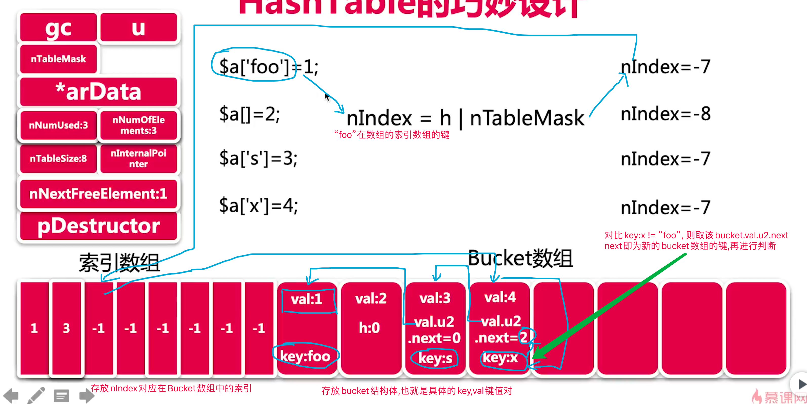

### 内存管理

1.  数组类型: 

   packet_array为索引类型数组,在实现上,不会使用上图中的"索引数组", 而hash_array,需要使用"索引数组"来映射索引,所以会使用"索引数组",因此,hash_array的内存也会多占用一些

2. 数组类型转换

   packet_array跳索引设置值时,不会转换,而当设置string键的值时,会将之前跳的索引重置,然后数组转化为hash_array

3. 数组键unset

   当unset($a["key"])时,只是将$a["key"]对应的zval里面type="IS_UNDEF",表示该值已失效,其他没有改变

#### small/large/huge内存管理

> malloc分配内存时,会在首部放入一个标识内存大小的头部,free的时候,直接free(p)就可以释放掉该块内存

chunk大小2MB, page大小4KB, 内存也是buddy内存算法,以2的幂次来分配 

| 类型  | 大小             | 分配规格 |
| ----- | ---------------- | -------- |
| small | size < 3KB       | 30种规格 |
| large | 3KB ~ (2MB-4KB)  | 4KB * N  |
| Huge  | size > (2MB-4KB) | 2MB * N  |

分配示意图

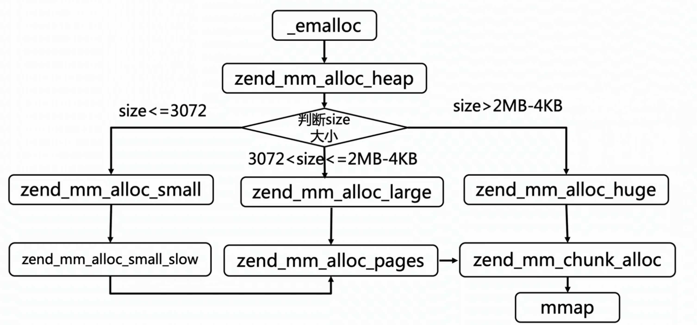

> 内存申请是一次申请大部分,当需要时,直接从已申请的内存里面取

PHP的small内存规格:

```c
/* num, size, count, pages */
#define ZEND_MM_BINS_INFO(_, x, y) \
	_( 0,    8,  512, 1, x, y) \
	_( 1,   16,  256, 1, x, y) \
	_( 2,   24,  170, 1, x, y) \
	_( 3,   32,  128, 1, x, y) \
	_( 4,   40,  102, 1, x, y) \
	_( 5,   48,   85, 1, x, y) \
	_( 6,   56,   73, 1, x, y) \
	_( 7,   64,   64, 1, x, y) \
	_( 8,   80,   51, 1, x, y) \
	_( 9,   96,   42, 1, x, y) \
	_(10,  112,   36, 1, x, y) \
	_(11,  128,   32, 1, x, y) \
	_(12,  160,   25, 1, x, y) \
	_(13,  192,   21, 1, x, y) \
	_(14,  224,   18, 1, x, y) \
	_(15,  256,   16, 1, x, y) \
	_(16,  320,   64, 5, x, y) \
	_(17,  384,   32, 3, x, y) \
	_(18,  448,    9, 1, x, y) \
	_(19,  512,    8, 1, x, y) \
	_(20,  640,   32, 5, x, y) \
	_(21,  768,   16, 3, x, y) \
	_(22,  896,    9, 2, x, y) \
	_(23, 1024,    8, 2, x, y) \
	_(24, 1280,   16, 5, x, y) \
	_(25, 1536,    8, 3, x, y) \
	_(26, 1792,   16, 7, x, y) \
	_(27, 2048,    8, 4, x, y) \
	_(28, 2560,    8, 5, x, y) \
	_(29, 3072,    4, 3, x, y)
```

> 说明: num为编号, size为每块内存大小, count表示当前整个pages共划分成了多少个内存块, pages表示申请了多少page页来划分

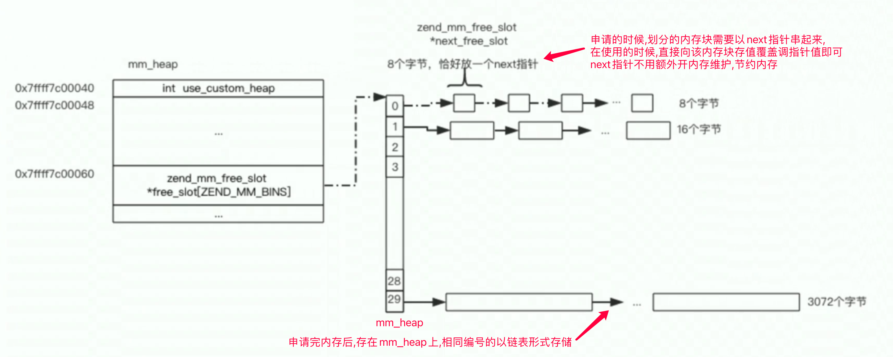

#### 垃圾回收算法

##### 传统垃圾回收

malloc分配内存时,会在首部放入一个标识内存大小的头部(32字节),free的时候,直接free(p)就可以释放掉该块内存

##### 内存对齐

一个chunk块是2M大小, 先申请4K整数倍,覆盖到2M,然后再从中选出对齐的2M,剩下的内存释放掉

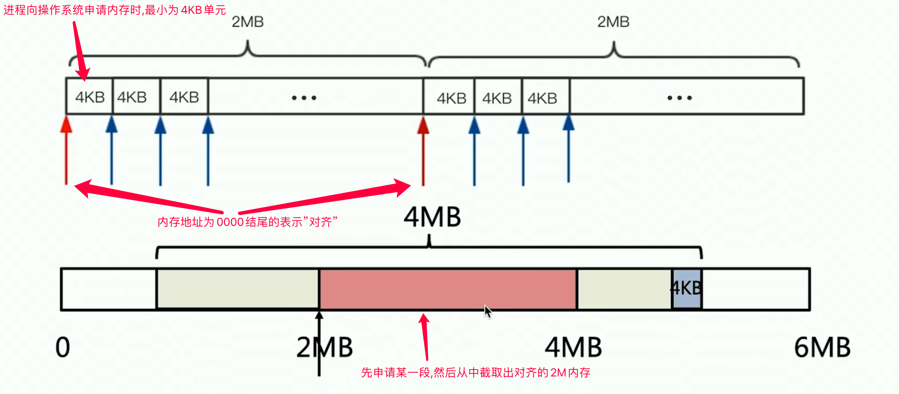

管理内存时,以free_map(bit_map)来记录每小块内存的使用情况; 大小uint_64*8,   0/1标记是否已使用

##### 内存分类标记

以map来标记内存类型, 512个uint_32存储内存块属性, 

| 内存地址             | 标志位                                  | 16进制  | 内存类型            | 内存大小        |
| -------------------- | --------------------------------------- | ------- | ------------------- | --------------- |
| 1000 .... .... xxxxx | 后5位0~4, 代表bin_num: 内存编号         | 0x8.... | small内存           | size < 3KB      |
| 0100 ....            | 后10位0~9表示分配的页数                 | 0x4.... | large内存           | 3KB ~ (2MB-4KB) |
| 1100 ....            | 后5位0~4:bin_num+16~25bit表示page偏移量 | 0xc.... | 多页拆分的small内存 | size < 3KB      |

根据内存地址,查找其内存规格大小
1. huge内存地址是2M对齐,地址一定是2M的整数倍,去huge_list里面查信息释放, 
2. 如果不是2M整数倍, 则是属于根据地址识别其属于哪个chunk,一个chunk是2M整数倍,  然后识别其页偏移,就可以找到其属于哪个page, 
3. 然后再根据page_info的map信息里面查, 其属于small/large内存,根据上表匹配其内存地址就可以知道该内存的规格大小

实例(0xc的偏移):

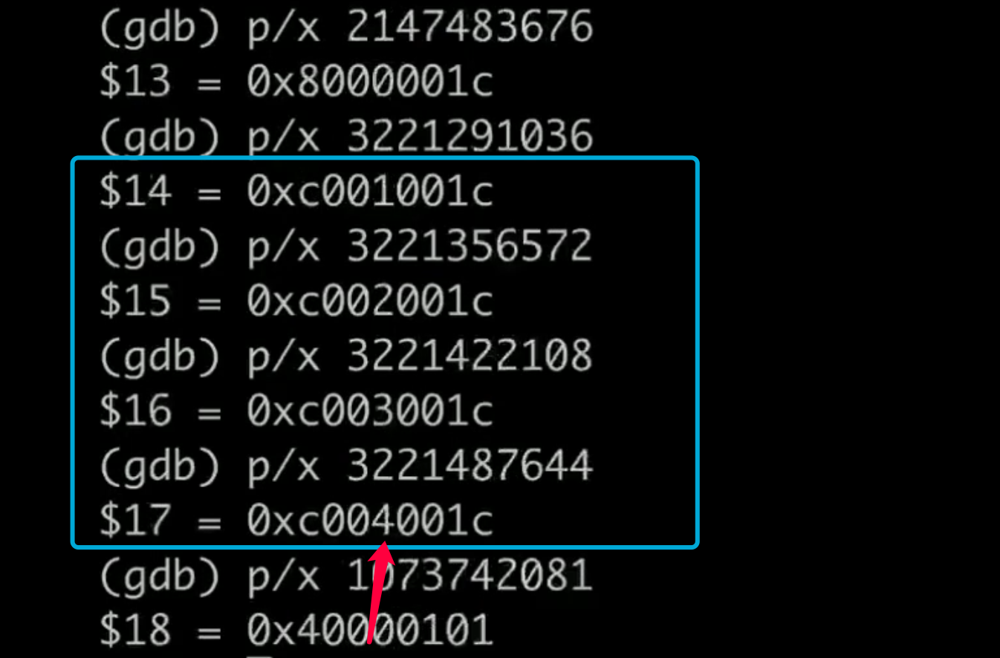

#### 总结: [PHP内存管理机制](https://zhuanlan.zhihu.com/p/41623100)

PHP采用**预分配内存策略**, 提前向操作系统分配2M字节大小内存，称为chunk；并对chunk进行**内存2M对齐**,  同时将内存分配请求根据大小分为**small,huge,large三种**, 并用**内存池**以**链表**形式组织空闲内存的分配与回收, 释放时通过**内存地址**识别内存大小及属于chunk的**页偏移**并释放.

1. 申请内存时: 会向OS要一个大块的内存,按规格等分,把其中的一块分配给申请者,剩下的用链表存起来,后面留着下次直接使用
2. 内存池是代替直接调用malloc/free、new/delete进行内存管理的常用方法；内存池中空闲内存块组织为链表结果，申请内存只需要查找空闲链表即可，释放内存需要将内存块重新插入空闲链表；
3. 释放内存时: 内存地址中有标记内存类型(small/large/huge),和内存的页偏移, 再查map找到内存规格信息,可以正确回收内存

### PHP生命周期

#### PHP运行生命周期

##### CLI模式的生命周期

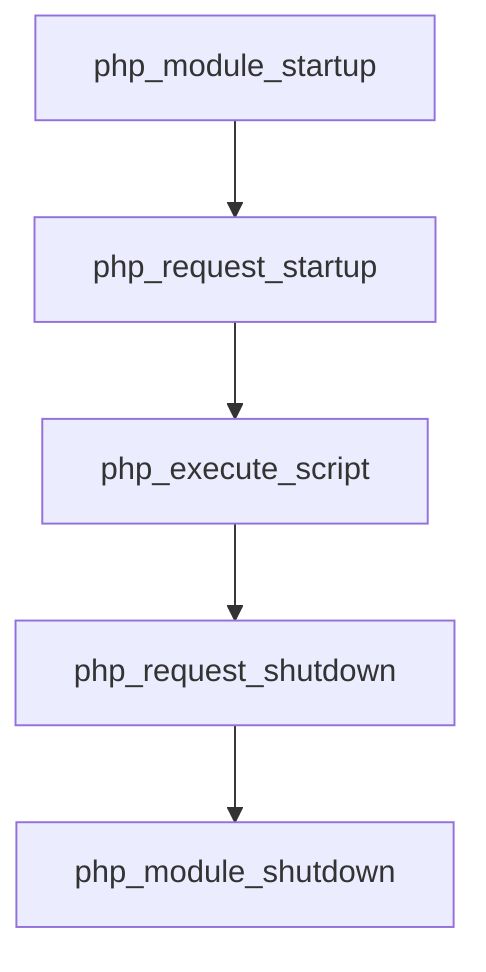


##### PHP-FPM进程模型

1. PHP-FPM采用的是Master/Worker进程模型, master进程负责**管理Worker进程的创建和销毁**, 每个worker都在accept本pool内的监听套接字, 真正监听和处理的是worker进程,master被kill时worker若还在,不影响处理请求; worker被kill后会由master重新拉起
2. worker进程**抢占式**地接受master任务,解析 PHP 脚本,分配资源执行,**处理结束后自动回收所有资源**,并**在适当时候销毁进程**
3. php-fpm有一个1秒定时器,动态增减worker进程数量,**一个worker进程同时只能处理一个请求**,超过请求的则**在master排队等待**

##### PHP-FPM模式的生命周期

[php-fpm的三种模式](https://www.jianshu.com/p/c9a028c834ff)

```ini
# 固定模式: 固定数量的worker进程
pm = static
pm.max_children = 5 # 固定数量

# 动态模式: [最小,最大]
pm = dynamic
pm.max_children = 5  # 最大数量
pm.start_servers = 2
# 空闲进程范围
pm.min_spare_servers = 1
pm.max_spare_servers = 3

# 按需启动: 初始时为0,有请求时再启动
pm = ondemand
pm.max_children = 5  # 最大数量
# 空闲时间 to kill
pm.process_idle_timeout = 10s;
```

说明: 

1. ondemand按需启动,  在php-fpm启动时不启动worker, 当有连接过来才会创建进程并启动, 启动后可复用, 若空闲一段时间时会关闭
2. static静态模式, 固定大小数量的worker, 数量固定不变
3. dynamic动态模式, 初始启动一些worker并通过1s定时器动态调整worker数量

优缺点:

1. 按需启动, 会每个连接到来时再创建worker, 响应慢些, 频繁创建销毁进程导致开销大, 适合小流量或者流量稳定的情况
2. 静态模式, 配置足够的数量,请求来时直接处理,而不是等待定时器新启worker来处理, 一直占用进程资源
3. 动态模式, 根据空闲进程数量动态调整, 由1秒定时器动态调整, 等待调整时会拉长请求处理时间, 请求最大等待周期1s

##### PHP-FPM模式对信号处理

```shell
# 旧版本php5.4 
php-fpm start/stop/reload

# 新版本php5.5+
kill -SIGUSER1 php-fpm  # 平滑重启master
kill -SIGUSER1 php-fpm  # 平滑重启worker
```

PHP-FPM生命周期

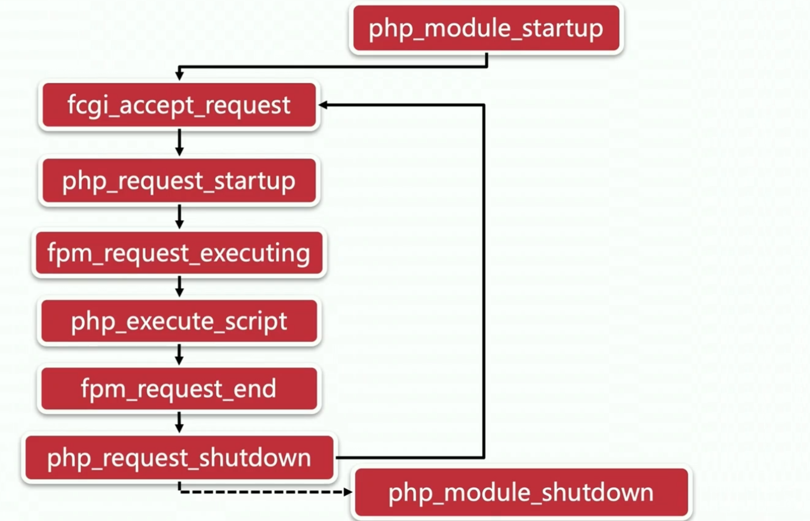

1. worker进程退出时,才会执行module_shutdown,每个请求会复用module初始化过程

对比: cli模式, module_startup -> php_execute_script ->  module_shutdown 

2. fpm启动时,每个worker进程都自己accept socket, 各个worker会根据情况加互斥锁

> 惊群效应就是当一个fd的事件被触发时，所有等待这个fd的线程或进程都被唤醒。
> 处理办法: 新版本linux只会唤醒一个进程/线程,不会出现惊群; 也可以手动加互斥锁解决 

##### fast-cgi协议

CGI（Common Gateway Interface）通用网关接口, Web 服务器与应用服务器交互的一个标准接口, 规定了环境变量,传输格式和交互方式信息, 本质是一个协议规范, 使不同的web_server可以与不同的application_server使用统一的格式来通信, 由Web 服务器负责创建应用程序进程并进行处理和返回, 使用的是`fork-and-execute`模式 使web_appliation可以处理动态语言, 扩展了功能

Fast-cgi **快速通用网关接口**（**Fast** **C**ommon **G**ateway **I**nterface／**FastCGI**）是CGI的增强版本, FastCGI使用持续的进程来处理一连串的请求。这些进程由FastCGI服务器管理, 避免了每个请求进程创建和终止的开销, 进行了**解耦**, 同时增强性能,提高了可扩展性

PHP-CGI：是 PHP对 Web Server 提供的 CGI 协议的接口程序, 是CGI协议的PHP版本实现.

PHP-FPM：PHP FastCGI Process Manager, PHP FastCGI 进程管理器, 是FastCGI协议的PHP版本实现.

##### fast-cgi协议结构


### PHP编译

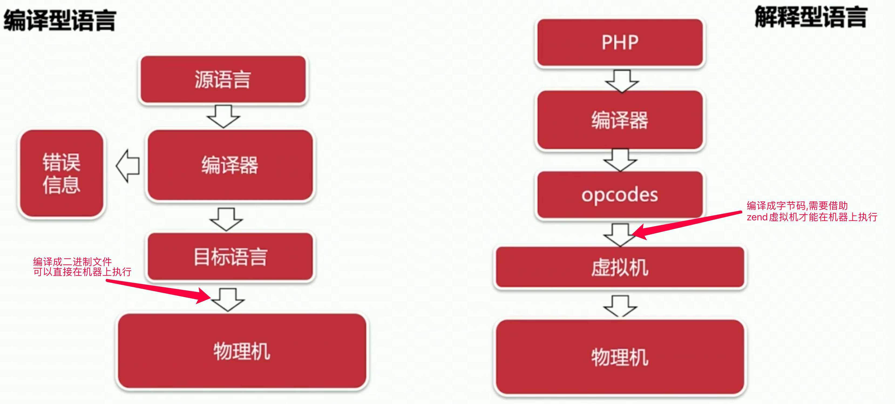


#### 词法分析入门

##### 词法分析

php词法分析: 正则表达式, 分离出"token"(变量或者运算符), `$a=1;  => "$a", "=", "1"`

php语法分析: 将词法分析出的"token"建立语义上的联系, 通过语法分析树, 理解出" $a=1 ";

正则算法: 

1. NFA: 不确定有穷自动机: 下一步状态不确定

2. DFA: 确定有穷自动机: 下一步状态确定

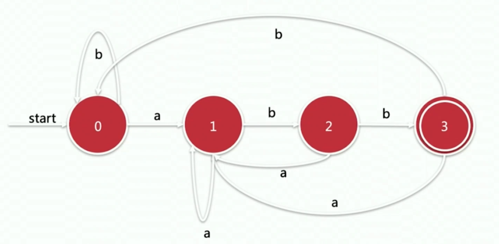

re2c可以生成DFA, 来做正则匹配

##### php语法算法:

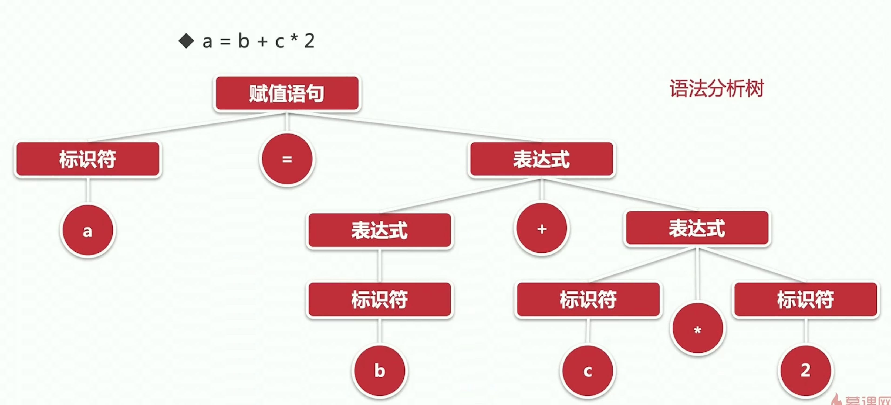

巴克斯范式, bison,bison可以识别巴克斯范式,将其转为对应的算术实现

> 词法分析和语法分析是同时进行的, 分析完后,生成了抽象语法树AST, 然后再将AST编译成opcodes, (op1,op2,&result,handler)由zend虚拟机执行

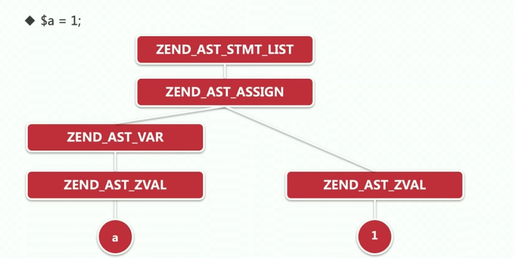

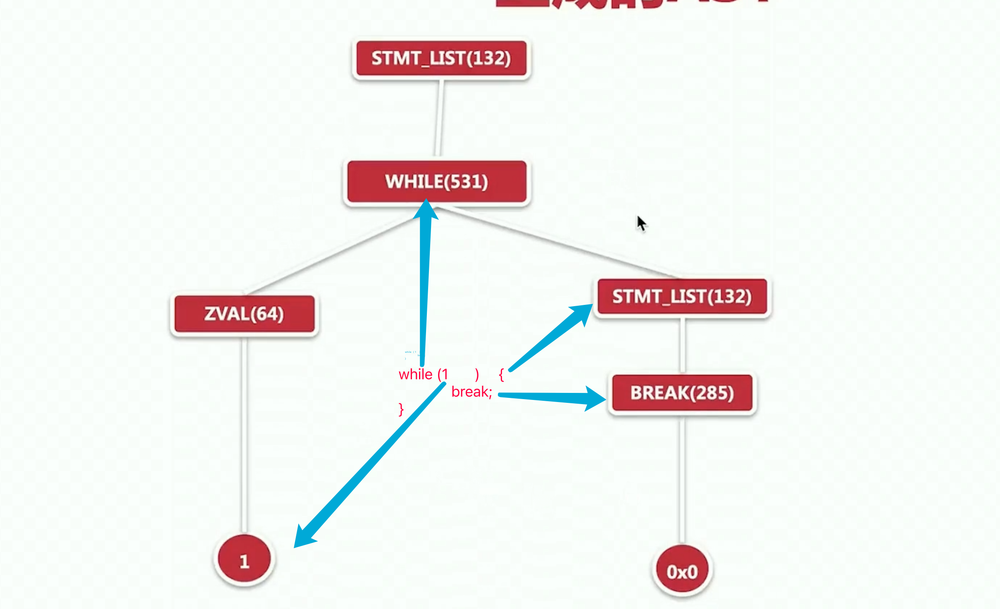

#### zend虚拟机

解析opcodes, 生成中间数据层并执行, 三大要素: 指令集, 符号表, 堆栈

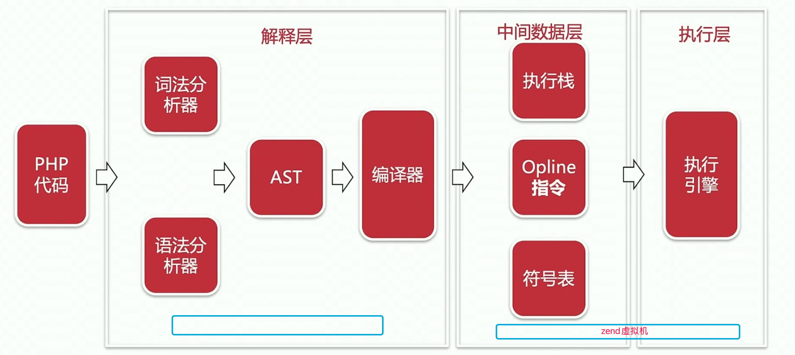

### 基本语法实现

#### zend三要素

##### 符号表 与 堆栈

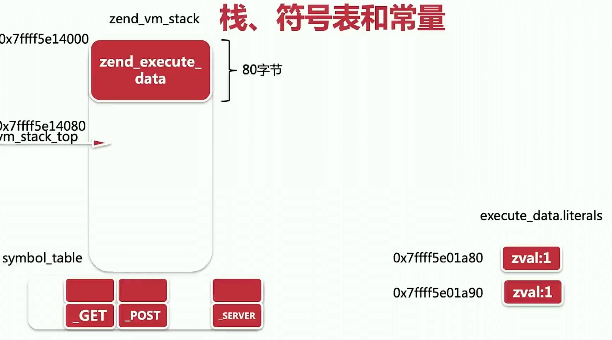

##### 指令集

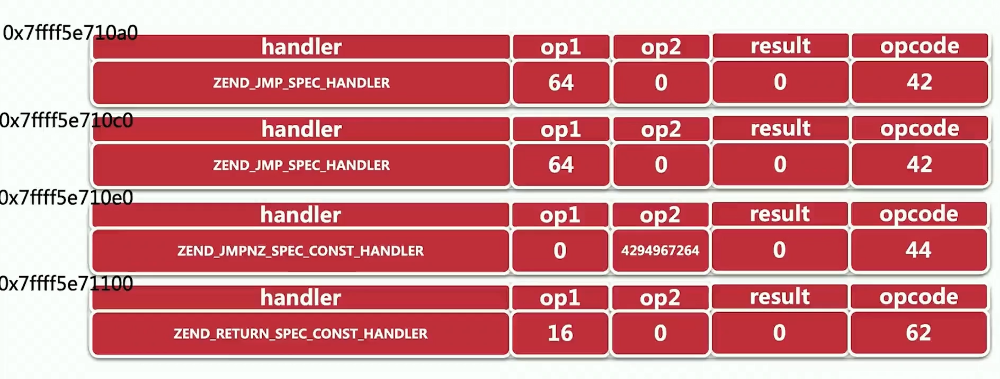

##### include与require区别

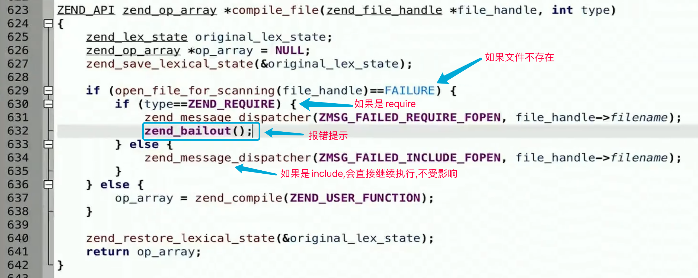

条件判断AST结构

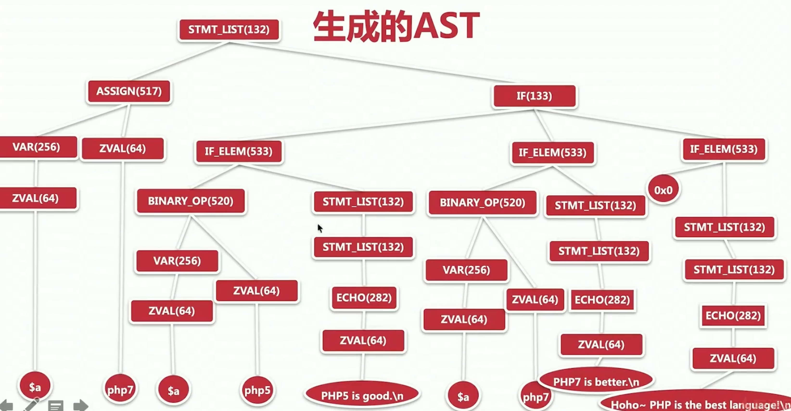

### 扩展编写

#### 步骤

```shell
./ext/ext_skel --extname=module_name

cd module_name
vim config.m4  # dnl是注释语法,去掉编译注释

vim module_name.c # 编写代码实现

# 编译进php
phpize
./configure --with-php-config=xxx
make && make install
# add load to php.ini
```

#### 扩展的生命周期hook钩子函数

```c
// 扩展初始化和销毁
PHP_MINIT(module_name);
PHP_MSHUTDOWN(module_name);

// 请求初始化和销毁
PHP_RINIT(module_name);
PHP_RSHUTDOWN(module_name);

// 自定义展示扩展的版本信息
PHP_MINFO(module_name);
```

#### 内部函数实现分析

```c
// Zend/zend_sort.c:zend_sort
ZEND_API void zend_sort(void *base, size_t nmemb, size_t siz, compare_func_t cmp, swap_func_t swp)
{
	while (1) {
		if (nmemb <= 16) {
			zend_insert_sort(base, nmemb, siz, cmp, swp);
			return;
		} else {
			char *i, *j;
			char *start = (char *)base;
			char *end = start + (nmemb * siz);
			size_t offset = (nmemb >> Z_L(1));
			char *pivot = start + (offset * siz);

			if ((nmemb >> Z_L(10))) {
				size_t delta = (offset >> Z_L(1)) * siz;
				zend_sort_5(start, start + delta, pivot, pivot + delta, end - siz, cmp, swp);
			} else {
				zend_sort_3(start, pivot, end - siz, cmp, swp);
			}
			swp(start + siz, pivot);
			pivot = start + siz;
			i = pivot + siz;
			j = end - siz;
			while (1) {
				while (cmp(pivot, i) > 0) {
					i += siz;
					if (UNEXPECTED(i == j)) {
						goto done;
					}
				}
				j -= siz;
				if (UNEXPECTED(j == i)) {
					goto done;
				}
				while (cmp(j, pivot) > 0) {
					j -= siz;
					if (UNEXPECTED(j == i)) {
						goto done;
					}
				}
				swp(i, j);
				i += siz;
				if (UNEXPECTED(i == j)) {
					goto done;
				}
			}
done:
			swp(pivot, i - siz);
			if ((i - siz) - start < end - i) {
				zend_sort(start, (i - start)/siz - 1, siz, cmp, swp);
				base = i;
				nmemb = (end - i)/siz;
			} else {
				zend_sort(i, (end - i)/siz, siz, cmp, swp);
				nmemb = (i - start)/siz - 1;
			}
		}
	}
}


ZEND_API void zend_insert_sort(void *base, size_t nmemb, size_t siz, compare_func_t cmp, swap_func_t swp) /* {{{ */{
	switch (nmemb) {
		case 0:
		case 1:
			break;
		case 2:
			zend_sort_2(base, (char *)base + siz, cmp, swp);
			break;
		case 3:
			zend_sort_3(base, (char *)base + siz, (char *)base + siz + siz, cmp, swp);
			break;
		case 4:
			{
				size_t siz2 = siz + siz;
				zend_sort_4(base, (char *)base + siz, (char *)base + siz2, (char *)base + siz + siz2, cmp, swp);
			}
			break;
		case 5:
			{
				size_t siz2 = siz + siz;
				zend_sort_5(base, (char *)base + siz, (char *)base + siz2, (char *)base + siz + siz2, (char *)base + siz2 + siz2, cmp, swp);
			}
			break;
		default:
			{
				char *i, *j, *k;
				char *start = (char *)base;
				char *end = start + (nmemb * siz);
				size_t siz2= siz + siz;
				char *sentry = start + (6 * siz);
				for (i = start + siz; i < sentry; i += siz) {
					j = i - siz;
					if (!(cmp(j, i) > 0)) {
						continue;
					}
					while (j != start) {
						j -= siz;
						if (!(cmp(j, i) > 0)) {
							j += siz;
							break;
						}
					}
					for (k = i; k > j; k -= siz) {
						swp(k, k - siz);
					}
				}
				for (i = sentry; i < end; i += siz) {
					j = i - siz;
					if (!(cmp(j, i) > 0)) {
						continue;
					}
					do {
						j -= siz2;
						if (!(cmp(j, i) > 0)) {
							j += siz;
							if (!(cmp(j, i) > 0)) {
								j += siz;
							}
							break;
						}
						if (j == start) {
							break;
						}
						if (j == start + siz) {
							j -= siz;
							if (cmp(i, j) > 0) {
								j += siz;
							}
							break;
						}
					} while (1);
					for (k = i; k > j; k -= siz) {
						swp(k, k - siz);
					}
				}
			}
			break;
	}
}
```

