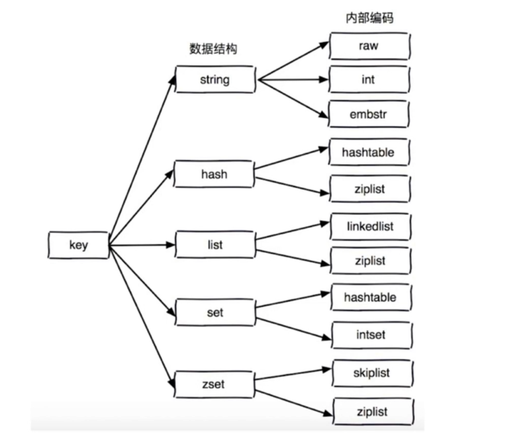

[TOC]

# Redis应用实战

## Redis概念

### 概念

Redis（Remote Dictionary Server )，即远程字典服务, Redis 是一个开源的，内存中的数据结构存储系统，高性能的key-value数据库, 它可以用作数据库、缓存和消息中间件。 

### 特性

#### 速度快

10W, OPS

数据存在内存, C语言, 单线程

#### 持久化

数据存在内存中, 可以持久化到磁盘上

#### 多种数据结构

##### 基本数据结构

字符串

hash

列表

集合

有序集合

##### 其他数据结构

bitmap (位图)  (字符串)

HyperLogLog  (字符串)

GEO                  (集合)

#### 支持多种编程语言

PHP, JAVA

#### 功能丰富

发布订阅, 事务, Lua脚本, pipeline

#### 简单

23000行代码, 不依赖外部库, 单线程

#### 主从复制

主从复制同步, 高可用基础

#### 高可用-分布式

高可用 -> redis-sentinel

分布式 -> redis-cluster

### 应用场景

1. 缓存系统
2. 计数器
3. 消息队列系统
4. 排行榜
5. 社交网络
6. 实时系统

### 单机安装

#### 安装

```sh
wget -> tar -> make -> make install
```

#### 启动

##### 三种启动方式

1. 最简启动

2. 参数启动

3. 配置文件启动

生产环境启动多个redis, 以端口区分

```sh
/usr/bin/redis-server /etc/redis/redis.conf
```

#### 连接

```sh
redis-cli -h 127.0.0.1 -p 6379
```

#### 配置

##### 运行状态查看

```sh
127.0.0.1:6379> info
# Server
redis_version:4.0.9
redis_mode:standalone
os:Linux 4.15.0-64-generic x86_64
arch_bits:64
multiplexing_api:epoll
process_id:935
tcp_port:6379
executable:/usr/bin/redis-server
config_file:/etc/redis/redis.conf

# Clients
connected_clients:1

# Memory
used_memory:841752
used_memory_human:822.02K

# Persistence
loading:0
rdb_bgsave_in_progress:0
aof_enabled:0
aof_rewrite_in_progress:0

# Stats
total_connections_received:4
total_commands_processed:72
instantaneous_ops_per_sec:0

# Replication
role:master
connected_slaves:0

# CPU
used_cpu_sys:25.34
used_cpu_user:9.99

# Cluster
cluster_enabled:0

# Keyspace
db0:keys=10,expires=0,avg_ttl=0
```

##### 配置文件

```ini
grep -E '^[^#]' /etc/redis/redis.conf

################################## NETWORK #####################################
bind 127.0.0.1 ::1
protected-mode yes
port 6379
tcp-backlog 511
timeout 0
tcp-keepalive 300


################################# GENERAL #####################################
daemonize yes
supervised no
pidfile /var/run/redis/redis-server.pid
loglevel notice
logfile /var/log/redis/redis-server.log
databases 16
always-show-logo yes


################################ SNAPSHOTTING  ################################
rdbcompression yes
rdbchecksum yes
dbfilename dump.rdb
dir /var/lib/redis
```

### Redis原理实现

#### Redis进程模型


#### 数据结构实现

##### 策略

1. 时间策略: **空间换取时间** / 时间换空间 

2. 面向接口编程

##### 示意图



#### 单线程架构

##### 简介

同一时间只能处理一条语句, 所有指令都是串行化执行的, 拒绝执行**长/慢**命令

#### redis为什么快

1. 纯内存
2. 非阻塞IO: IO多路复用
3. 单线程避免了切换和资源竞争

## API使用

### 通用命令

#### 通用命令概述

```sh
keys he*
1) "hello"

del key1 key2
(integer) 0

dbsize
(integer) 2

exists hello key
(integer) 1

expire key 10
(integer) 1

type key
string
```

#### 通用命令详解

##### keys

keys 一般不再生产环境使用: 复杂度: O(n), 阻塞其他请求

使用: 在备机或从结点使用,  或使用 scan命令替代

##### dbsize

key的个数, 由redis计数器维护, 线上可使用

##### exists

key是否存在

##### 过期时间(expire/ttl/persist)

```sh
expire key seconds
ttl key
persist key


set hello wordl
OK

expire hello 20
(integer) 1

ttl hello
(integer) 16

get hello
(nil)          (过期则为空)

ttl hello
(integer) -2   (已过期)

persist hello
(integer) 1

ttl hello
(integer) -1   (永久)
```

##### type

```sh
set num 1                =>   string
set str hello            =>   string
hset hash k1 v1 k2 v2    =>   hash
lpush k_list a b c d	 =>   list
sadd k_set a b c d		 =>   set
zadd k_zset 1 2 3 4		 =>   zset
null 				     =>   none   (未定义时返回none)
```

### String类型命令

#### 结构

```sh
key => value
xxx => int
xxx => string
xxx => bitmap
xxx => json      => max 521MB
```

#### 字符串命令

##### 总览

1. get key
2. set key value
3. del key1 key2
4. setnx key value   如果不存在,才会设置
5. set key value xx  如果存在,才会设置 
6. setex  key ttl value 设置key及过期时间
7. mget key1 key2
8. mset key1 value1 key2 value2

```sh
命令: get, set, del, setnx, set xx, setex, mget, mset
```

##### 命令: get, set, del

```sh
127.0.0.1:6379> set key hello
OK
127.0.0.1:6379> get key
"hello"
127.0.0.1:6379> del key
(integer) 1
127.0.0.1:6379> get key
(nil)
```

##### 命令: setnx, set xx, setex

```sh
127.0.0.1:6379> setnx k1 v1
(integer) 1
127.0.0.1:6379> set k1 v11 xx
OK
127.0.0.1:6379> setex k1 20 v1
OK
```

##### 命令: mset, mget

```sh
127.0.0.1:6379> mset key1 value1 key2 value2
OK
127.0.0.1:6379> mget key1 key2
1) "value1"
2) "value2"
```

##### 统计命令:incr, decr, incrby, decrby

```sh
127.0.0.1:6379> get num
(nil)
127.0.0.1:6379> incr num
(integer) 1
127.0.0.1:6379> get num
"1"
127.0.0.1:6379> incrby num 99
(integer) 100
127.0.0.1:6379> decr num
(integer) 99
127.0.0.1:6379> get num
"99"
```

##### 命令: getset, append, strlen

```sh
127.0.0.1:6379> getset k1 30
"v11"
127.0.0.1:6379> append k1 hello
(integer) 7
127.0.0.1:6379> strlen k1
(integer) 7
```

##### 命令: incrbyfloat, get range, set range

```sh
127.0.0.1:6379> incrbyfloat f 3.2
"3.2"

127.0.0.1:6379> get k1
"30hello"
127.0.0.1:6379> setrange k1 0 4
(integer) 7
127.0.0.1:6379> getrange k1 0 5
"40hell"
```

#### 快速实战

```sh
# 用户访问量统计
incr userid:article_id
```

```sh
# 数据缓存
get key
// read from mysql
set key json_data
```

```sh
# 分布式ID生成器
incr REDIS_UUID_KEY => return
```

### Hash类型命令

#### 结构

##### 示意图

```sh
key    =>     fields  =>  values

              field1  =>  value1
key    =>     field2  =>  value2
			  field3  =>  value3
```

##### 示例


##### 特点

1. 直观
2. 节省内存
3. 可部分更新

#### 命令

##### 总览

命令: hget, hset, hdel

命令: hexists, hlen, hsetnx, hstrlen, hincrby,hincrbyfloat

命令: hincy, hset, hdel

命令: hkeys, hvals, hgetall, hscan

##### 命令: hget, hset, hdel

```sh
127.0.0.1:6379> hset user:1 name Tom age 20
(integer) 2
127.0.0.1:6379> hget user:1 name
"Tom"
127.0.0.1:6379> hdel user:1 age
(integer) 1
```

##### 命令: hexists, hlen, hsetnx, hstrlen, hincrby,hincrbyfloat

```sh
127.0.0.1:6379> hexists user:1 age
(integer) 0
127.0.0.1:6379> hlen user:1
(integer) 1

127.0.0.1:6379> hsetnx user:1 score 100
(integer) 1
127.0.0.1:6379> hstrlen user:1 score
(integer) 3

127.0.0.1:6379> hincrby user:1 score 20
(integer) 120
127.0.0.1:6379> hincrbyfloat user:1 score 2.5
"122.5"
```

##### 命令: hmget, hmset
```sh
127.0.0.1:6379> hmset user:1 name Tom age 20 addr beijing
OK
127.0.0.1:6379> hmget user:1 name age addr
1) "Tom"
2) "20"
3) "beijing"
```

##### 命令: hkeys, hvals, hgetall, hscan

```sh
127.0.0.1:6379> hkeys user:1
1) "name"
2) "age"
3) "addr"

127.0.0.1:6379> hvals user:1
1) "Tom"
2) "20"
3) "beijing"

127.0.0.1:6379> hgetall user:1
1) "name"
2) "Tom"
3) "age"
4) "20"
5) "addr"
6) "beijing"

127.0.0.1:6379> hscan user:1 10
1) "0"
2) 1) "name"
   2) "Tom"
   3) "age"
   4) "20"
   5) "addr"
   6) "beijing"
```

#### 实战

##### 用户主页访问量统计

```sh
hincrby user:1 view_count
```

##### 用户数据信息缓存

```sh
hmget user:1 name age address

hmset user:1 name b age 20 address xb
```

### List类型命令

#### 结构

##### 示意图

```sh
key    =>     elements

key    =>     [v1 -> v2 -> v3 -> v4 -> v5 -> v6]
            <-                                  ->
```

##### 特点

1. 用途广泛

#### 命令

##### 总览

命令: lpush, rpush, lpop, rpop

命令: linsert, lrem, ltrim, lset 

命令: lrange, lindex, llen

命令: blpop, brpop

##### 命令: lpush, rpush, lpop, rpop

```sh
127.0.0.1:6379> lpush li l1 l2 l3
(integer) 3
127.0.0.1:6379> rpush li r1 r2 r3
(integer) 6
127.0.0.1:6379> lrange li 0 -1
1) "l3"
2) "l2"
3) "l1"
4) "r1"
5) "r2"
6) "r3"

127.0.0.1:6379> lpop li
"l3"
127.0.0.1:6379> rpop li
"r3"
```

##### 命令: linsert, lrem, ltrim, lset

```sh
127.0.0.1:6379> linsert li before c hello
(integer) 6
127.0.0.1:6379> linsert li after c world
(integer) 7
127.0.0.1:6379> lrem li -2 a
(integer) 1
127.0.0.1:6379> ltrim li 1 5
OK
127.0.0.1:6379> lset li 1 hi
OK
```

##### 命令: lrange, lindex, llen

```sh
127.0.0.1:6379> lrange li 0 -1
1) "a"
2) "b"
3) "c"
4) "d"
5) "e"
127.0.0.1:6379> lindex li 2
"c"
127.0.0.1:6379> llen li
(integer) 5
```

##### 命令: blpop, brpop

```sh
127.0.0.1:6379> brpop que 0
1) "que"
2) "v2"
(67.93s)

127.0.0.1:6379> lpush que v2
(integer) 1
```

#### 实战

##### 微博动态实现

```sh
lpush + lpop  => stack
lpush + rpop  => queue
lposh + brpop => message queue 
lpush + ltrim => capped collection
```

### Set类型命令

#### 结构

##### 示意图

```sh
key    =>          values
 
key    =>     (v1, v2, v3, v4, v5)
```

##### 示例

##### 特点

1. 元素不重复
2. 无序
3. 集合间操作

#### 命令

##### 总览

命令: sadd, srem

命令: scard, sIsMember, sRandMember, sMembers

命令: spop, sscan

命令: sdiff, sinter, sunion

##### 命令: sadd, srem

```sh
127.0.0.1:6379> sadd s1 a b c d e f a b
(integer) 6
127.0.0.1:6379> srem s1 a c
(integer) 2
```

##### 命令: scard, sIsMember, sRandMember, sMembers

```sh
127.0.0.1:6379> scard s1
(integer) 4
127.0.0.1:6379> sIsMember s1 d
(integer) 1
127.0.0.1:6379> sRandMember s1
"e"
127.0.0.1:6379> sMembers s1
1) "d"
2) "e"
3) "b"
4) "f"
```

##### 命令: spop, sscan

```sh
127.0.0.1:6379> spop s1
"d"
127.0.0.1:6379> sscan s1 10
1) "0"
2) 1) "b"
   2) "f"
```

##### 命令: sdiff, sinter, sunion

```sh
127.0.0.1:6379> sdiff s1 s2
1) "f"
127.0.0.1:6379> sinter s1 s2
1) "e"
2) "b"
127.0.0.1:6379> sunion s1 s2
1) "e"
2) "f"
3) "b"
4) "a"
```

#### 实战

```sh
sadd     			=> tags
spop/sRandMemeber   => random
sadd + sinter       => social graph
```

##### 微博随机抽奖

##### 微博点赞数

##### 用户兴趣标签

用户兴趣标签: set,   兴趣标签: set

##### 共同关注好友


### ZSet类型命令

#### 结构

##### 示意图

```sh
key    =>     score   =>  values

              score1  =>  value1
key    =>     score2  =>  value2
			  score3  =>  value3
```

##### 示例

##### 特点

1. 有序

#### 命令

##### 总览

命令: zadd, zrem, zscore, zrank

命令: zincrby, zcard, zrange, zRangeByScore, zcount

命令: zRemRangeByRank, zRemRangeByScore

命令: zrevrank, zrevrange, zrevrangebyscore, zInterStore, zUnionStore

##### 命令:  zadd, zrem, zscore, zrank

```sh
127.0.0.1:6379> zadd z1 1 a 2 b 3 c 4 d 5 a
(integer) 4

# 移除指定元素
127.0.0.1:6379> zrem z1 b
(integer) 1
# 获取指定元素的分数
127.0.0.1:6379> zscore z1 c
"3"
# 获取指定元素的索引
127.0.0.1:6379> zrank z1 c
(integer) 0
```

##### 命令: zincrby, zcard, zrange, zRangeByScore, zcount

```sh
# zincrby 对指定成员的分数加上增量 increment
127.0.0.1:6379> zincrby znums 5 1
"15"
127.0.0.1:6379> zcard znums
(integer) 4

# 通过索引来取值
127.0.0.1:6379> zrange znums 0 -1
1) "1"
2) "2"
3) "3"
4) "4"
127.0.0.1:6379> zrange znums 0 -1 withscores
1) "1"
2) "15"
3) "2"
4) "20"
5) "3"
6) "30"
7) "4"
8) "40"

# 通过分数来计数及取值
127.0.0.1:6379> zcount znums 10 30
(integer) 2
127.0.0.1:6379> zRangeByScore znums 10 30
1) "1"
2) "2"
```

##### 命令: zRemRangeByRank, zRemRangeByScore

```sh
127.0.0.1:6379> zRemRangeByScore znums 10 30
(integer) 2
127.0.0.1:6379> zRemRangeByRank znums 0 1
(integer) 2
```

##### 命令: zrevrank, zrevrange, zrevrangebyscore

```sh
# 反序根据元素获取指定元素的排序值
127.0.0.1:6379> zrank znums 2
(integer) 1
127.0.0.1:6379> zrevrank znums 2
(integer) 2

# 反序根据索引获取元素
127.0.0.1:6379> zrange znums 0 -1
1) "1"
2) "2"
3) "3"
4) "4"
127.0.0.1:6379> zrange znums 0 2
1) "1"
2) "2"
3) "3"
127.0.0.1:6379> zrevrange znums 0 2
1) "4"
2) "3"
3) "2"

# 根据分数范围截取指定范围元素
127.0.0.1:6379> zRangeByScore znums 10 30
1) "1"
2) "2"
3) "3"
127.0.0.1:6379> zRevRangeByScore znums 30 10
1) "3"
2) "2"
3) "1"
```

##### 命令: zInterStore, zUnionStore

```sh
127.0.0.1:6379> zadd z1 10 1 20 2 30 3
(integer) 3
127.0.0.1:6379> zadd z2 10 1 30 3 40 4 50 5
(integer) 4

# 找出相同元素,且分数相加
127.0.0.1:6379> zInterStore inter_res 2 z1 z2
(integer) 2
127.0.0.1:6379> zrange inter_res 0 -1 withscores
1) "1"
2) "20"
3) "3"
4) "60"

# 合并所有元素,元素相同的分数相加
127.0.0.1:6379> zrange union_res 0 -1 withscores
 1) "1"
 2) "20"
 3) "2"
 4) "20"
 5) "4"
 6) "40"
 7) "5"
 8) "50"
 9) "3"
10) "60"
```

#### 实战

##### 排行榜

```sh
# 根据浏览量(分数)来进行排行
zIncrBy key value member
zRevRange key 0 -1
```

## 客户端使用

### php

#### 安装

```sh
pecl install redis

# 或者
phpize
./configure
make && make install
```

#### 使用

```php
$redis = new Redis();
$redis->connect('127.0.0.1', 6379);

$redis->get('key');
$redis->set('key', 'value');

$redis->hSet('map', 'field1', 'value2');
$redis->hSet('map', 'field2', 'value2');

$redis->hMGet('map', ['filed1', 'field2']);

$redis->close();
```

#### Redis连接池


## 其他功能

### 慢查询

#### 生命周期

##### 示意图


##### 原因

1. 慢查询发生在地3阶段

2. 客户端超时不一定是慢查询,还有可能是网络等其他因素

#### 两个配置

##### 配置阈值

```int
# 慢查询日志的阈值 (微秒)
slowlog-log-slower-than 10000

# 慢查询日志队列长度
slowlog-max-len 128
```

##### 动态配置

```sh
127.0.0.1:6379> config get *slow*
1) "slowlog-log-slower-than"
2) "10000"
3) "slowlog-max-len"
4) "128"

config set slowlog-log-slower-than 0
config set slowlog-max-len 128
```

#### 三个命令

##### 命令

```sh
slowlog get N

slowlog len

slowlog reset
```

##### 日志查看

```sh
127.0.0.1:6379> slowlog len
(integer) 7
127.0.0.1:6379> slowlog reset
OK

127.0.0.1:6379> slowlog get 2
1) 1) (integer) 12
   2) (integer) 1630682944
   3) (integer) 20
   4) 1) "keys"
      2) "*"
   5) "127.0.0.1:47850"
   6) ""
2) 1) (integer) 11
   2) (integer) 1630682939
   3) (integer) 5
   4) 1) "hgetall"
      2) "user:2:info"
   5) "127.0.0.1:47850"
   6) ""
```

#### 运维经验

1. slowlog-log-slower-than 不要设置过大, 默认10ms, 1万QPS,平均0.1ms 通常1ms
2. slowlog-max-len 不要设置过小, 默认128, 通常1000
3. 理解命令生命周期, 定期做慢查询持久化

### pipeline流水线

#### redis-cli客户端

```php
echo -en "get key \r\n  get v1" | redis-cli --pipe
```

#### PHP客户端

```php
$redis = new Redis();

# multi方法传入Redis::PIPELINE参数表示pipeline模式
$redis->multi(Redis::PIPELINE);

$v1 = $redis->get('k1');
$v2 = $redis->get('k2');
$user_info = $redis->hMGet('user:1:info', ['id', 'name', 'age']);

$res = $redis->exec();

var_dump(compact('v1', 'v2', 'user_info', 'res'));
/*
 * array(4) {
      ["v1"]=>
        object(Redis)#4 (0) {
      }
      ["v2"]=>
        object(Redis)#4 (0) {
      }
      ["user_info"]=>
        object(Redis)#4 (0) {
      }
      ["res"] =>
          array(3) {
            [0]=>
                string(7) "40hello"
            [1]=>
                bool(false)
            [2]=>
                array(3) {
                  ["id"]=>
                    string(1) "1"
                  ["name"]=>
                    string(1) "a"
                  ["age"]=>
                    string(2) "10"
               }
         }
    }
 *
 */
```

### 发布订阅

#### redis-cli客户端

```sh
127.0.0.1:6379> subscribe chan-1
Reading messages... (press Ctrl-C to quit)
1) "subscribe"
2) "chan-1"
3) (integer) 1


1) "message"
2) "chan-1"
3) "hello"

127.0.0.1:6379> publish chan-1 hello
(integer) 2
```

#### PHP客户端

```php
# 订阅
$redis = new Redis();
$redis->subscribe(
    ['chan-1', 'chan-2', 'chan-3'],
    function (\Redis $redis, string $channel, string $message) use ($client_id) {
        echo "channel:[$channel] consumer [$client_id] get message: [$message]\n";
    }
);

# 发布订阅
$redis = new Redis();
$redis->publish('chan-1', 'hello');
```

### bitmap

#### redis-cli客户端

```sh
27.0.0.1:6379> setbit bs 1 1
(integer) 0
127.0.0.1:6379> getbit bs 1
(integer) 1
127.0.0.1:6379> get bs
"@"
```

#### PHP客户端

```php
$redis = new Redis();
$redis->connect('127.0.0.1', 6379);

public function active($user_id)
{
    $key = 'user_active_count';
    $bit_index = self::getBitIndexFromUserId($user_id);
    $this->redis->setBit($key, $bit_index, 1);
}

public function count()
{
    $key = 'user_active_count';
    return $this->redis->bitCount($key);
}
```

#### 实战

用户总数1亿, 活跃用户数1千万 => bitmap , 活跃用户多,用bitmap省内存

用户总数1亿, 活跃用户数1千 => set , 活跃用户少,用集合省内存

#### 说明

1. type=string,  最大512MB
2. 根据场景使用

### HyperLogLog

#### 估算原理

##### 最长连续0

```sh
只需要纪录最长连续0的个数, 即可推出进行了多少次实验 => 即统计数N

x x x x x x x x x x x x x x x x x x x 1 0      =>   1

x x x x x x x x x x x x x x x x x x 1 0 0      =>   2

x x x x x x x x x x x x x x x x x 1 0 0 0      =>   3

x x x x x x x x x x x x x x 1 0 0 0 0 0 0      =>   6

x x x x x x x x x x x x x x x x x x 1 0 0      =>   6
    :
    :  中间进行了M次实验
    :
x x x x x x x x x x x x x x 1 0 0 0 0 0 0      =>   6
    最后得出结果: 最长连续0的个数时6
    
连续出现6个0个概率是 1/2^6, 推出大概进行了2^6=64次, 也就是说 HyperLogLog 中放了大概64个元素
```

##### 多桶调和平均

误差率: 0.8125%

```sh
一个桶的最长连续0来 估计 会存在误差, 所以需要取多个桶来进行 调和平均

前面的14个bit作为桶编号			后面的50位用来展示最长连续0
x x x x x x x x x x x x x x|x x x x x x x x x x x x x x x x


50位的最长连续0个数据为50, 50<2^6=64, 故用6bit就可以存当前的最长连续0个数

所以用2^14个桶, 每个桶6bit, 就可以满足

总共占用内存:
2^14 * 6 / 8 / 2^10 = 12KB

最大统计值: 
2^50
```

#### 客户端

redis-cli客户端

```sh
127.0.0.1:6379> pfadd hp1 php java mysql php
(integer) 1
127.0.0.1:6379> pfadd hp2 mysql redis nginx
(integer) 1

127.0.0.1:6379> pfcount hp1 hp2
(integer) 5
127.0.0.1:6379>

127.0.0.1:6379> pfmerge hp_res hp1 hp2
OK
127.0.0.1:6379> pfcount hp_res
(integer) 5
```

PHP客户端

```php
$redis = new Redis();
$redis->connect('127.0.0.1', 6379);

$redis->pfAdd(self::HYPER_LOG_KEY_1, range(0, 10000));
$redis->pfAdd(self::HYPER_LOG_KEY_2, range(10000, 20000));

$count = $redis->pfCount([self::HYPER_LOG_KEY_1, self::HYPER_LOG_KEY_2]);
```

### GEO

#### 命令

- geoadd：添加地理位置的坐标。
- geopos：获取地理位置的坐标。
- geodist：计算两个位置之间的距离。
- georadius：根据用户给定的经纬度坐标来获取指定范围内的地理位置集合。
- georadiusbymember：根据储存在位置集合里面的某个地点获取指定范围内的地理位置集合。

> 注: geo基于zset有序集合实现,可以使用集合的API进行查询和删除 (eg: zrange, zrem) 

#### Redis-cli客户端

```sh
城市 经度 纬度 简称 
北京 116.28 39.55 beijing
天津 117.12 39.08 tianjin
石家庄 114.29 38.02 shijiazhuang
唐山 118.01 39.38 tangshan
保定 115.29 38.51 baoding

geoadd city_area 116.28 39.55 beijing
geoadd city_area 117.12 39.08 tianjin
geoadd city_area 114.29 38.02 shijiazhuang
geoadd city_area 118.01 39.38 tangshan
geoadd city_area 115.29 38.51 baoding

# 获取经纬度
127.0.0.1:6379> geopos city_area beijing
1) 1) "116.28000229597091675"
   2) "39.5500007245470826"

# 获取两点距离
127.0.0.1:6379> geodist city_area beijing tianjin km
"89.2061"

# 根据经纬度获取周围的点
127.0.0.1:6379> georadius city_area 116.28 39.55 100 km
1) "beijing"
2) "tianjin"

# 根据地点获取周围的点
127.0.0.1:6379> geoRadiusByMember city_area beijing 100 km withcoord withdist
1) 1) "beijing"
   2) "0.0000"
   3) 1) "116.28000229597091675"
      2) "39.5500007245470826"
2) 1) "tianjin"
   2) "89.2061"
   3) 1) "117.12000042200088501"
      2) "39.0800000535766543"
```

#### PHP客户端

```php
$redis = new Redis();

$redis->geoAdd(self::GEO_AREA_KEY, $longitude, $latitude, $name);

$redis->geoDist(self::GEO_AREA_KEY, $name1, $name2);

$redis->geoPos(self::GEO_AREA_KEY, $name);
/*
array(1) {
    [0]=>
    array(2) {
      [0]=>
      string(21) "116.28000229597091675"
      [1]=>
      string(19) "39.5500007245470826"
    }
  }
*/

$options = [
    'withcoord',
    'withdist',
];
$redis->geoRadius(self::GEO_AREA_KEY, $longitude, $latitude, $radius, $unit, $options);
$redis->geoRadiusByMember(self::GEO_AREA_KEY, $name, $radius, $unit, $options);
/*
array(2) {
    [0]=>
    array(3) {
      [0]=>
      string(7) "beijing"
      [1]=>
      string(6) "0.0002"
      [2]=>
      array(2) {
        [0]=>
        string(21) "116.28000229597091675"
        [1]=>
        string(19) "39.5500007245470826"
      }
    }
 }
*/
```

## 持久化

### 持久化作用

#### 定义

Redis数据保存在内存上, 将内存的数据异步保存到硬盘上

#### 实现方式

##### 分类:

1. 快照  => mysqldump, Redis RDB (Redis DataBase)
2. 写日志 => mysql binlog, Redis AOF (Append Only File)

### RDB

#### 定义

RDB持久化是指在指定的时间间隔内将内存中的**数据集快照**写入磁盘，实际操作过程是fork一个子进程, 先将数据集写入临时文件，写入成功后，再替换之前的文件，用二进制压缩存储。

redis启动时会自动加载此文件, 新生成时,会将新文件替换老文件

```ini
##### SNAPSHOTTING  #####
dbfilename dump.rdb
dir /var/lib/redis
```

#### 触发机制

##### save

SAVE 命令执行一个**同步**保存操作，会阻塞其他客户端, 将当前 Redis 实例的所有数据快照(snapshot)以 RDB 文件的形式保存到硬盘。

##### bgsave

BGSAVE 命令执行之后立即返回 OK ，然后 Redis fork 出一个新子进程， 原来的 Redis 进程(父进程)继续处理客户端请求，而子进程则负责将数据保存到磁盘，然后退出。

fork子进程时,创建进程是在主进程上执行的, 会短暂阻塞, fork某些情况下可能会比较耗时

##### 自动触发

```ini
# save <seconds> <changes>
save 900 1
save 300 10
save 60 10000
在60s内,有10000条更新命令时触发
```

配置说明指导

```ini
save 自动更新关闭
dbfilename dump-port.rdb
stop-writes-on-bgsave-error yes
rdbcompression yes 
```

##### 其他情况触发

1. 全量复制   配置主从同步时,主会生成.rdb文件
2. debug reload, 以debug模式重启
3. shutdown, 关闭的时候会生成

#### 实验

```sh
# save
127.0.0.1:6379> save
OK

# bgsave
127.0.0.1:6379> bgsave
Background saving started

# 子进程
redis-rdb-bgsave

生成临时文件 tmp-xxxxx.rdb, 然后替换
```

### AOF

#### 定义

AOF（append only file）, AOF持久化以日志的形式**记录**服务器所处理的**每一个更新操作命令**，查询操作不会记录，以文本的方式记录，可以打开文件看到详细的操作记录。

增量备份,

```ini
# 是否启用AOF模式
appendonly no

# 文件名称
appendfilename "appendonly.aof"
```

#### AOF重写

将过期的数据, 多条命令的最后生效值, 多次执行命令改成批量参数形式, 来重构AOF文件里面的命令, 从而减小AOF文件大小. 加快恢复速度

##### 实现方式

1. `bgwriteaof` 命令 => fork子进程处理

2. 配置文件中配置

   ```ini
   # 同时满足
   auto-aof-rewrite-percentage 100   // 自动重写的 文件增长比例 阈值
   auto-aof-rewrite-min-size 64mb    // 自动重写的最小文件大小
   
   (corrent_size - last_size) / last_size = percentage   // 增长比例
   ```
   

##### 重写流程


#### 三种策略

```ini
# appendfsync 的三种模式介绍
# no: don't fsync, just let the OS flush the data when it wants. Faster.
# always: fsync after every write to the append only log. Slow, Safest.
# everysec: fsync only one time every second. Compromise.

# appendfsync always   // 每次写入文件时执行fsync
appendfsync everysec   // 每秒定时执行fsync
# appendfsync no       // 不执行fsync,由操作系统自行刷盘
```

always: 每一条命令都直接存磁盘

Everysec: 先写缓存,每隔1s刷新到磁盘

no: 由操作系统控制刷新到磁盘

#### 配置

```ini
no-appendfsync-on-rewrite     no
```

##### 说明

执行bgrewriteaof的时候, 会fork子进程对AOF文件进行重写, 主进程仍然会继续AOF文件, 两个进程读写同一个AOF文件会发生竞争阻塞, 所以fork的子进程会对Redis的主进程的AOF读写进行阻塞, 造成主进程的AOF无法及时写入到AOF文件, 从而造成可能丢失数据的风险

当 no-appendfsync-on-rewrite 设置为yes, 则主进程的AOF文件读写会阻塞,  设置为no时, 主进程和子进程都可写,最安全

#### 实战

##### 日志文件

 ```sh
 > head /var/lib/redis/appendonly.aof
 *2         	// 命令参数个数
 $6			// 第一个参数字节数大小
 SELECT      // 第一个参数
 $1			// 第二个参数字节数大小
 0			// 第二个参数
 *3          // 新的一个命令
 $3
 SET
 $17
 ```

重写

```sh
127.0.0.1:6379> bgrewriteaof
Background append only file rewriting started
```

### 持久化方案选择

| 项目           | RDB(快照)                    | AOF(日志)                     |
| -------------- | ---------------------------- | ----------------------------- |
| 启动加载优先级 | 重量级命令, 启动加载优先级低 | 轻量级命令, 启动加载优先级高  |
| 体积/恢复速度  | **体积小 / 恢复速度快**      | 体积大 / 恢复速度慢           |
| 安全性         | 丢数据                       | **安全性高, 不丢数据,可配置** |

#### 最佳策略

##### RDB

1. 关闭自动RDB, 需要时手动生成
2. 集中管理, 集中管理数据备份RDB
3. 重量级命令, 一般优先在从结点执行

##### AOF

1. 开AOF: 缓存和存储
2. AOF重写集中管理 (内存占用大)
3. AOF刷盘策略: everysec, 每秒刷盘

##### 最佳策略

1. 小分片, 使用max_memory对redis进行规划, 分多个小Redis实例
2. 存储还是缓存,  来决定策略
3. 监控: 硬盘,内存,负载,网络
4. 足够的内存 + 预留空闲

### 开发运维经验

#### 概览

1. fork操作是在主进程执行的, fork会短暂阻塞主进程
2. 进程外开销
3. AOF追加阻塞
4. 单机Redis拆分多实例部署

#### 详解

##### fork

1. 同步操作
2. 执行时间与Redis存储内存大小相关
3. info: last_fork_usec

优化:

1. max_memory限制redis使用的内存
2. 合理配置linux内存分配策略: vm.overcommit_memory=1, 内存不够时阻塞
3. 减少不必要的自动AOF

##### 子进程开销

cpu: redis的RDB和AOF属于CPU密集型;   => 不绑定cpu, 不和cpu密集型部署

内存: fork内存开销,copy-on-write   优化=>echo never 

硬盘: 文件写入: iostat, iotop,   高硬盘负载的区分开

##### AOF追加阻塞

主线程每秒执行fsync时也会阻塞, 同步fsync完成时才返回 => 保证安全性

对比上次fsync时间是否>2s, 可能丢失2s的数据 

```sh
127.0.0.1:6379> info persistence

aof_delayed_fsync:0   => aof发生fsync阻塞的次数
```


### 内存淘汰策略

#### 内存淘汰策略 :

1. noeviction(默认)：不再提供写请求服务，返回错误

2. allkeys-lru：在所有的key中使用LRU算法对数据进行淘汰

3. volatile-lru：在设置了"过期时间 "的过期key中用LRU算法对数据进行淘汰

4. allkeys-random：随机进行数据淘汰

5. volatile-random：在有" 过期时间 "的key中随机进行数据淘汰

6. volatile-ttl：依据key的已经设置的过期时间进行数据淘汰，最早过期的数据最早被淘汰

## 复制原理和优化

### 主从复制

#### 原因

避免单机机器故障 => 高可用

容量瓶颈 => 单机容量

QPS业务瓶颈

#### 方式

1. 一主一从 (备份)

2. 一主多从 (读写分离, 负载均衡)
3. 可以多级,但是**数据流向必须是单向的**

### 复制的实现

#### slaveof 命令同步

##### 同步

```sh
# slaveof ip port, 会先清空当前节点的所有数据
slaveof 127.0.0.1 6379
```

##### 取消同步

```sh
# slaveof no noe, 取消同步后,不会再从master同步,已同步的值仍然保留
slaveof no noe
```

#### 配置同步

```ini
slaveof ip port
slave-read-only yes  # 从结点只读模式
```

#### 实战

##### 命令同步

```sh
127.0.0.1:6379> slaveof 192.168.20.11 6379
OK

127.0.0.1:6379> info replication
# Replication
role:slave
master_host:192.168.20.11
master_port:6379
master_link_status:up

# master
127.0.0.1:6379> info replication
# Replication
role:master
connected_slaves:1
slave0:ip=192.168.20.1,port=6379,state=online,offset=56,lag=1
```

##### 配置同步

```ini
slaveof 192.168.20.11 6379

slave-read-only yes

# 配置为同步, slave新写的key在重启时会保留

127.0.0.1:6379> info replication
# Replication
role:slave
master_host:192.168.20.11
master_port:6379
master_link_status:up
master_last_io_seconds_ago:3
master_sync_in_progress:0
slave_repl_offset:1292
slave_priority:100
slave_read_only:1
```

### 全量复制和部分复制

#### 全量复制

##### 示意图


##### 说明

slave向master请求全量同步,master使用bgsave生成RDB文件及后续的buffer, 然后send给slave同步

时间: 

1. bgsave

2. RDB文件网络传输
3. 从结点清空数据
4. 从结点加载rdb文件
5. 可能的AOF重写

#### 部分复制

解决网络抖动问题修复

当发生网络问题重连后, slave向master 发生偏移量, master发送剩余部分数据给salve同步


### 故障处理

#### 方法

高可用 => 故障转移 => 脚本自动转移

### 开发运维常见问题

主从复制 对 master做副本 => 分布式,高可用的基础  同时提供负载均衡(读写分离)

1. 读写分离
2. 主从复制不一致
3. 规避全量复制
4. 规避复制风暴

#### 读写分离

1. 数据复制延迟
2. 读到过期的数据
3. 从结点故障

#### 主从复制不一致

1. max_memory配置不一致, slave丢数据 => 故障转移时不能作为master
2. 内存结构优化不一致, (hash_max_ziplist_entries) : 内存大小主从不一致

#### 规避全量复制

##### 第一次全量复制

主从复制时,master需要做全量复制,不可避免

优化: 大结点拆分成多个小结点

##### 结点运行ID不匹配

主节点重启, 运行ID变化   =>   psync, 集群或哨兵

##### 复制缓冲区不足

默认1M, slave偏移量在1M以内,可以实行部分复制, 若超过则只能全量复制 

rel_backlog_size=1M

#### 规避复制风暴

##### 单主节点复制风暴

问题: 主节点重启, 多从结点复制

方案: 将master->slave * N 变为 master -> slave * 1 => slave * N , 使用一个slave做中继

单机器复制风暴

问题: 一个机器上部署了多个实例,且都为master, 则该机器重启后,会造成所有实例salve都访问这台机器做同步

方案: master宕机后, 其他slave提升为master角色,而不用再从此master复制

## redis sentinel (哨兵)

### 主从复制高可用

原因:

1. 故障转移手动
2. 写能力取决于master,容量大小取决于master

### 架构说明

#### 说明

一个redis sentinel组 监控每个redis实例, 当发生故障时,自动进行故障转移


### 安装配置

配置并启动redis-sentinel


```ini
protected-mode no

port 26379
daemonize yes

dir "/var/lib/redis/sentinel"
logfile "/var/log/redis/redis-sentinel.log"

# 配置监听的主服务器，这里sentinel monitor代表监控，mymaster代表服务器的名称，可以自定义，192.168.11.128代表监控的主服务器，6379代表端口，2代表只有两个或两个以上的哨兵认为主服务器不可用的时候，才会进行failover操作。
sentinel monitor mymaster 127.0.0.1 6379 2
```

```sh
redis-server /etc/redis/sentinel.conf --sentinel --protected-mode no

127.0.0.1:26379> info
# Sentinel
sentinel_masters:1
sentinel_tilt:0
sentinel_running_scripts:0
sentinel_scripts_queue_length:0
sentinel_simulate_failure_flags:0
master0:name=mymaster,status=ok,address=127.0.0.1:6379,slaves=1,sentinels=1
```

### 实现原理

#### 步骤

1. client获取所有的sentinel, 知道master_name, 找到一个可用的sentinel
2. 通过master_name在sentinel获取master_id/port, 
3. client连接获取到的master, 执行role/role appliation确认是否master
4. master结点发生变化时通知client (subscribe)

#### 客户端接入流程

sentinel地址集合, master_name, 客户端通过sentinel实时获取master和slave

#### 客户端连接

```php
const SENTINELS = [
    [
        'ip' => '192.168.20.11',
        'port' => 26379,
    ],
    [
        'ip' => '192.168.10.12',
        'port' => 26379,
    ],
];

const MASTER_NAME = 'mymaster';

$sentinel = new Redis();
$sentinel->connect($sentinel['ip'], $sentinel['port']);

$master = $sentinel->rawCommand('sentinel', 'masters', self::MASTER_NAME);
$slave = $this->sentinel->rawCommand('sentinel', 'slaves', self::MASTER_NAME);
```

### 原理说明

#### 主观下线、客观下线

默认30s无法正常连接旧判断下线， 个数为 N/2+1 （最好奇数）

对旧master标记为-down

主观线下 -> 客观下线 -> 投票 -> switch-master -> new-replication -> mark-old-master

#### 定时任务

每10ssentinel对master、slave执行info，发现master，连接判断

每2s，通过master的channel进行交换信息（发布订阅模式）：`__sentinel__:hello`

每秒，每个sentinel对其他sentinel和redis执行ping操作

#### 领导者选举：raft

每个做主观下线的sentinel向其他的发送投票请求， 如果某个sentinel没有投过同意票，则会同意他

超过配置的个数，则会成为master， 如果有多个master，则重新投票

实现算法： raft算法

##### 其他影响值

1. slave-priority 配置的优先级
2. 数据偏移量最多
3. 选择run_id最小的结点，启动时间最早的slave

### 常见开发运维问题

多slave同时复制时，可以配置是否并行和串行（根据性能和要求）， master生成的aof和rdb只有一份，所有slave共享

1. 结点运维
   1. 机器下线 sentinel failover master_name => 手动故障转移下线master
   2. 结点上线：直接slave_of-master就可以
2. 读写分离
   1. 客户端如何实现master故障转移=》订阅switch-master的频道，实现重连新master

#### 三个消息（slave的检测，客户端高可用）

1. +switch-master
2. +convert-to-slave （原主节点降级为slave）
3. +sdonw：（slave主管下线）

### 总结

#### redis高可用实现：

1. 故障发现
2. 故障自动转移
3. 配置中心 => 客户端的master、slave结点是通过sentinel来获取的
4. 客户端通知

sentinel只是配置中心，而不是代理

## redis cluster

### 呼唤集群

为什么要集群

1. 并发量
2. 数据量
3. 网络带宽

=> 单机性能瓶颈

#### redis cluster

> 那什么是Redis Cluster呢？

很简单，你就可以理解为n个主从架构组合在一起对外服务。Redis Cluster要求至少需要3个master才能组成一个集群，同时每个master至少需要有一个slave节点。

虽然每个master下都挂载了一个slave节点，但是在Redis Cluster中的读、写请求其实都是在**master**上完成的。

slave节点只是充当了一个**数据备份**的角色，当master发生了宕机，就会将对应的slave节点**提拔为master**，来重新对外提供服务。


这么多的master节点。我存储的时候，到底该选择哪个节点呢？一般这种负载均衡算法，会选择**哈希算法**

#### 寻址方案:

##### 普通hash

##### 一致性hash : crc32, 虚拟地址

### 数据分布

#### 顺序分区

根据主键ID范围来分区

#### hash分区

hash之后取模

##### 分区算法

1. 结点取余

   hash(key)%N => 落在哪儿就从哪儿存取

   如果结点宕机，会发生**大量数据迁移，且影响已有的机器正常值的迁移**  =》 翻倍扩容迁移（**机器数量**多，迁移会少）

2. 一致性hash

   1. 通过虚拟节点映射物理结点，实现结点**数据分布均匀**， 实现宕机后，新机器的**压力均摊**，也实现了负载均衡

3. 虚拟槽分区（redis-cluster）

   不会出现迁移数据的情况

   

   

#### 两者对比

|      | 顺序分区                 | Hash分区                             |
| ---- | ------------------------ | ------------------------------------ |
|      | 数据分布不均，可顺序访问 | 数据分布均匀，顺序访问需要碎片化读取 |
|      | 键值业务关联             | 键值业务无关                         |

### 搭建集群

#### 单机架构

单机架构： 一主多从， 读写分离，数据由master决定

分布式架构： 每个节点都负责一部分数据，节点间相互通信，由客户端自行路由

#### 集群架构

##### 实现 

1. 节点
2. meet（节点相互通信，posix协议通信）
3. 指派槽
4. 从结点>1

##### 配置

```ini
cluster-enabled yes
```

##### 客户端

```php
$hash_key = hash($key);
$slot = $hash_key % 16383
```

##### 特性

1. 主从复制 1主1/多从
2. 高可用：从=》主
3. 分片：主节点都能读写

#### 安装

```ini
# 配置
cluster-enable yes 
cluster-config-file
```

```sh
# 集群相互通信
redis-cli cluster meet 127.0.0.1 7001
redis-cli cluster meet 127.0.0.1 7002
redis-cli cluster meet 127.0.0.1 7003
redis-cli cluster meet 127.0.0.1 7004
redis-cli cluster meet 127.0.0.1 7005
redis-cli cluster meet 127.0.0.1 7006

# 分配槽(自动)
redis-cli -p 7001 cluster meet addslots {0...5000}
redis-cli -p 7002 cluster meet addslots {5001...10000}
redis-cli -p 7003 cluster meet addslots {10001...16383}

# 设置主从
redis-cli -p 7004 cluster relicate node_id_7001
redis-cli -p 7005 cluster relicate node_id_7002
redis-cli -p 7006 cluster relicate node_id_7003
```

#### 插件安装

使用官方ruby工具命令

其他 =》 可视化部署

### 集群伸缩

伸缩原理：

1. 加入

2. 下线

   槽个数据在结点间迁移

扩容

​	加入集群(meet)，迁移槽和数据(redis-trib.rb)，配置从

缩容

​	下线迁移槽，忘记结点(cluster forget，60s)，（下线主节点）关闭结点

### 客户端路由

#### moved重定向

未命中会回复moved slot ip:port，结点不存在迁移中的情况， 客户端自己实现重定向

​	cluster keyslot key => 算出槽位置

​	redis-cli -c 集群模式，自动重定向 （不加-c就返回error）

```php
127.0.0.1:6379> set hello world
(error) MOVED 9422 127.0.0.1:7002
    
# -c
127.0.0.1:6379> set hello world
->redirect
OK  
```

ask重定向

​	当两个结点正在进行slot迁移的时候，先请求旧结点，如果旧结点不存在，返回ask，然后client请求新结点，返回数据

区别：moved表示已经迁移过，ask表示迁移中

#### smart客户端

##### 追求性能

client缓存slot的结点映射， client自己算出hash值及slot结点， 

如果连接出错/moved异常，则随机选取一个活跃结点，重试初始化slot_映射

##### scan，多结点名

手动获取每个节点的master，然后自己判断slot执行命令

##### 批量的命令怎么实现（mset，hmset）

1. 串行mget: 直接转化为get，每次执行get，然后再合并 

2. 串行IO：先hash根据结点分组，然后转化为mget/pipeline在每个节点执行
3. 并行IO：在串行的基础上，优化为多线程并行执行mget/pipeline，总时长为1次网络IO
4. hash_tag: “{}”包裹的str才会用来做hash，{user:info}:10001 这种方式会造成数据分布在固定一个槽上

### 故障转移

#### 故障发现

##### 依赖节点之间的ping/pong实现故障发现

##### 主观下线、客观下线

主观下线： 多次ping不通，超时后

客观下线： 半数以上slot主节点 （故障列表-2倍timeout时间内有效）

#### 故障恢复

master下的slave宕机

资格检查 选举投票 ， 变为master，替换主节点的槽 => 广播

#### 实战

大概恢复时间20s

### 集群原理


### 开发运维常见问题

##### 集群完整性

​	**是否**集群里所有的槽完整才能提供对外提供服务

##### 带宽消耗

   1. 消息发送频率

   2. slot槽数组+集群状态

   3. 结点越多，结点分布均匀，带宽占用低

      

优化：

1. 避免多业务共同使用一个集群，大业务可以多集群
2. 结点故障转移时间： cluster-node-timeout，如果断线时长超过此值则认为已宕机
3. key尽量均匀分配到多机器上，保证高可用带宽

##### pub/sub广播

pub会在每个结点广播，造成集群间带宽消耗 =》 单独开一套redis-sentinel用来pub/sub

##### 数据倾斜

数据倾斜 （内存不均）

​	结点->槽  槽->数据key量不一致  存在bigkey  内存配置不一致(优化)

​	解决： reblance工具，redis-cli --bigkeys， 定期检查配置， 

请求倾斜（热点数据）

    1. 避免bigkey
       2. 热键不用hash_tag
       3. 一致性不高时，用本地缓存+异步MQ

#### 读写分离

集群模式的从结点不接受任何读写请求，仅作为maser的备份

读slave时会重定向到其master上， 当在与slave建立连接时，执行readonly后，可以对slave进行读请求

##### 读slave的问题：

	1. 复制延迟
	2. 读到过期数据
	3. 从结点故障

方法： 自行实现客户端路由（槽）

#### 数据迁移

redis官方工具： 只能单机迁移到集群，单机需要停机再迁移 -> 在线的话，新增的数据不会被同步

其他工具：在线迁移，方案：新建一个实例，作为sorce的slave，然后以slave去同步到集群 （在线方式，完全同步）

#### 集群、单机

##### 集群的限制

批量操作的key要在同一个slot，mget,mset

事务的key必须在一个slot上

key是分区的最小粒度

不支持多个数据库

集群只支持复制一层，不支持多层级 a=>b=c>的复制

##### 分布式Redis不一定好

1. 容量和性能的扩展性，很多业务不需要
2. 无法支持keys，以及跨节点的mset,mget，pipeline
3. 事务不能跨节点，客户端维护复杂

Redis Sentinel已经足够

### 缓存使用与设计

#### 缓存的收益与成本

##### 收益

加速读写，降低后端负载(缓存结果，不再计算)，大量写合并为累积DB

##### 成本

缓存层与数据层不一致

代码维护成本

运维成本

#### 更新策略

##### max-memory-policy

LRU, LFU, FIFO

超时踢出

低一致性：最大内存淘汰

高一致性：**超时踢出+主动更新**   配置最大内存

#### 粒度控制

##### 三个角度

1. 通用性：缓存全量属性
2. 占用空间：部分属性好
3. 代码维护：全量

#### 穿透优化

##### 定义

redis不存在、mysql也不存在的数据，会一直访问mysql

##### 原因

1. 代码自身
2. 恶意攻击，排重

##### 优化

响应时间，监控

解决：

1. 为空也缓存(增加过期时间) => 占用空间，数据短期不一致
2. 布隆过滤器拦截：先过布隆过滤器，通过后才认为是可靠的请求，再访问缓存层

#### 无底洞问题

##### 定义

一个机器，只需要一次网络IO，而分布式多太机器，则需要多次并行IO，增加了网络带宽

更多的机器！=更多的性能

业务量大 => 更多的结点

##### 优化：

优化IO：1key优化，2减少网络次数，3降低接入成本

#### 雪崩优化

1. 缓存高可用
2. 客户端降级

#### 热点key重建优化

​	缓存重建优化，查mysql -> 存cache

1. 互斥锁
2. 用不过期 （定时脚本更新/redis加锁再建新线程更新）

